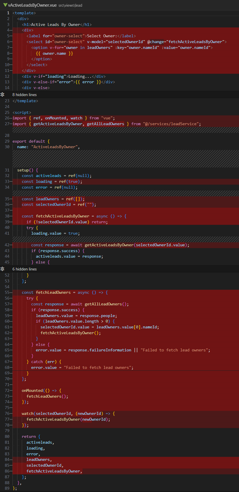
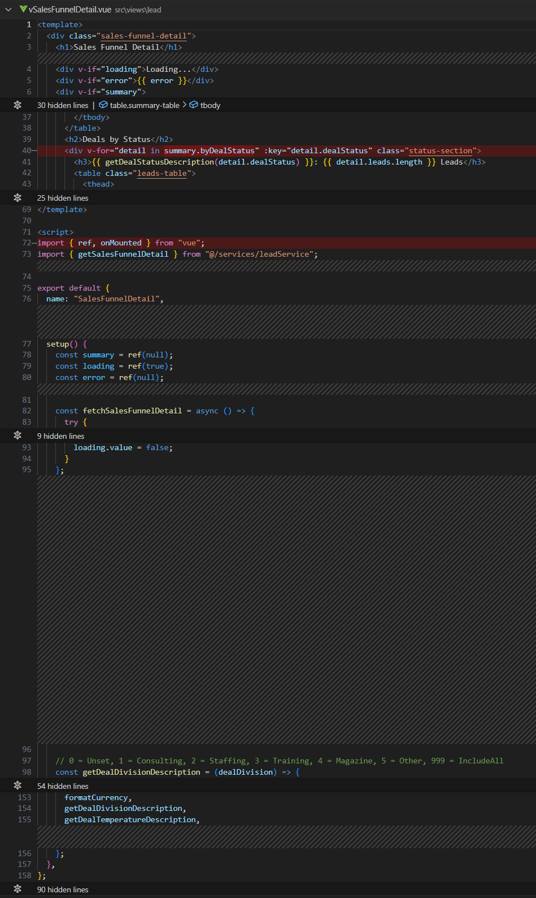
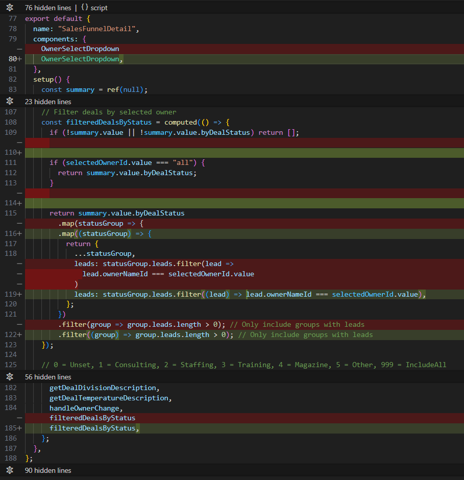

# Developing User Interfaces with GitHub Copilot, Part 2

This is the second installment of my series on using Copilot to implement user interfaces. It does build on the topics discussed in part one, so if you missed it you can check it out [here](https://blog.pdata.com/UIAI).

In this article, I (well, Copilot) will expand on the implementation of the `owner-select` drop-down by encapsulating the drop-down logic into a new vue component and then replacing the implementation on the `Active Leads by Owner` vue with the new component.

<!--more-->

 I'll also add the new component to a different vue that could benefit from this feature.

The two vues will share the same component and any changes to the component will be reflected in both vues.

## Copilot Edits

I'll use the new **Copilot Edits** multi-file feature that allows developers to apply AI-powered suggestions across multiple files within a project, streamlining workflows for large-scale changes and refactoring. Edits can identify patterns and dependencies across files, enabling consistent updates such as renaming variables, restructuring code, or updating logic across related files.

Copilot Edits is a separate interface from Copilot Chat and while the interfaces are similar, there are some notable differences. For example, in Chat the `@` brings up a list of extensions while Edits does not.

I'm using Edits because I want to make changes to multiple files in a consistent manner. Here is the `Claude 3.7 Sonnet` prompt I used:

1. **Create a component from the owner select drop-down on the Active Leads by Owners vue, so that it can be used by other vues. Include the data fetching logic in the new component.**
2. **Update the Active Leads by Owners vue to use the new component. Remove the data fetching logic from the Active Leads vue as it is redundant.**
3. **Add the new component to the Sales Funnel Detail vue and filter the data in Leads tables by the selected owners OwnerNameId.**

This is a complicated multi-step action that I'm requesting. Edits is designed to handle these kinds of prompts.

Here is the response, my comments are in italics:

## Solution: Create Owner Select drop-down Component and Update Views

I'll create a reusable OwnerSelectdrop-down component, update both views to use it, and add filtering to the Sales Funnel Detail view.

### Step 1: Create the Owner Select drop-down Component

#### OwnerSelectdrop-down.vue

_This is the new component created from the original drop-down. It contains all of the presentation and functional logic from the original implementation. A small nit is that Edits didn't pickup on the convention that vue components in this project all begin with a lower case 'c'._



```html
<template>
  <div>
    <label for="owner-select">Select Owner:</label>
    <select
      id="owner-select"
      v-model="selectedOwnerId"
      @change="handleOwnerChange"
    >
      <option v-if="includeAllOption" value="all">All Owners</option>
      <option
        v-for="owner in leadOwners"
        :key="owner.nameId"
        :value="owner.nameId"
      >
        {{ owner.name }}
      </option>
    </select>
    <div v-if="loading">Loading owners...</div>
  </div>
</template>

<script>
  import { ref, onMounted } from "vue";
  import { getAllLeadOwners } from "@/services/leadService";

  export default {
    name: "OwnerSelectdrop-down",
    props: {
      includeAllOption: {
        type: Boolean,
        default: false,
      },
    },
    emits: ["owner-changed"],
    setup(props, { emit }) {
      const leadOwners = ref([]);
      const loading = ref(true);
      const selectedOwnerId = ref("");

      const fetchLeadOwners = async () => {
        try {
          loading.value = true;
          const response = await getAllLeadOwners();
          if (response.success) {
            leadOwners.value = response.people;
            if (leadOwners.value.length > 0) {
              selectedOwnerId.value = props.includeAllOption
                ? "all"
                : leadOwners.value[0].nameId;
              emit("owner-changed", selectedOwnerId.value);
            }
          } else {
            console.error(
              "Failed to fetch lead owners:",
              response.failureInformation,
            );
          }
        } catch (err) {
          console.error("Error fetching lead owners:", err);
        } finally {
          loading.value = false;
        }
      };

      const handleOwnerChange = () => {
        emit("owner-changed", selectedOwnerId.value);
      };

      onMounted(() => {
        fetchLeadOwners();
      });

      return {
        leadOwners,
        loading,
        selectedOwnerId,
        handleOwnerChange,
      };
    },
  };
</script>

<style scoped>
  select {
    margin-left: 8px;
    padding: 4px;
    border-radius: 4px;
    border: 1px solid #ddd;
  }
</style>
```



_Looking Good!_

### Step 2: Update Active Leads by Owner Vue

#### vActiveLeadsByOwner.vue

Made changes.



```html
<template>
  <div>
    <h1>Active Leads By Owner</h1>
    <owner-select-drop-down @owner-changed="handleOwnerChange" />
    <div v-if="loading">Loading...</div>
    <div v-else-if="error">{{ error }}</div>
    <div v-else>
      <div v-if="activeleads.success">
        <p>Total Count: {{ activeleads.totalCount }}</p>
      </div>
      <div v-else>
        <p>
          Error: {{ activeleads ? activeleads.failureInformation : "No data
          available" }}
        </p>
      </div>
    </div>
  </div>
</template>

<script>
  import { ref } from "vue";
  import { getActiveLeadsByOwner } from "@/services/leadService";
  import OwnerSelectdrop-down from "@/components/lead/OwnerSelectdrop-down.vue";

  export default {
    name: "ActiveLeadsByOwner",
    components: {
      OwnerSelectdrop-down
    },
    setup() {
      const activeleads = ref(null);
      const loading = ref(false);
      const error = ref(null);

      const fetchActiveLeadsByOwner = async (ownerId) => {
        if (!ownerId || ownerId === "all") return;

        try {
          loading.value = true;
          error.value = null;
          const response = await getActiveLeadsByOwner(ownerId);
          if (response.success) {
            activeleads.value = response;
          } else {
            error.value = response.failureInformation || "Failed to fetch active leads by owner";
          }
        } catch (err) {
          error.value = "Failed to fetch active leads by owner";
        } finally {
          loading.value = false;
        }
      };

      const handleOwnerChange = (ownerId) => {
        fetchActiveLeadsByOwner(ownerId);
      };

      return {
        activeleads,
        loading,
        error,
        handleOwnerChange
      };
    },
  };
</script>

<style scoped>
  h1 {
    font-size: 24px;
    margin-bottom: 20px;
  }
</style>
```



Below you can see that the `div` containing the owner drop-down and it's label are gone along with an error message. Copilot deleted the imports related to the drop-down as well as the code related to fetching the data.


"C:\git\ai-practitioner\ai-practitioner-blog\jekyll-src\assets\images\2025-03-29\Active-Leads-By-Owner-1.png

##### Active Leads by Owner Deletetions

Copilot added the new owner drop-down component and refactored the fetch logic to not fetch Owners. The `newOwnerId` renamed simply ownerId. Which is a nice bit of craftmansship.


##### Active Leads by Owner Additions

### Step 3: Update Sales Funnel Detail Vue

I asked that the new drop-down component be added to the Sales Funnel Detail vue. This makes sense as users often want to focus on their leads, or the leads of others.

#### vSalesFunnelDetail.vue



```html
<template>
  <div class="sales-funnel-detail">
    <h1>Sales Funnel Detail</h1>
    <owner-select-drop-down
      :includeAllOption="true"
      @owner-changed="handleOwnerChange"
    />
    <div v-if="loading">Loading...</div>
    <div v-if="error">{{ error }}</div>
    <div v-if="summary">
      <table class="summary-table">
        // ...existing code...
      </table>
      <h2>Deals by Status</h2>
      <div
        v-for="detail in filteredDealsByStatus"
        :key="detail.dealStatus"
        class="status-section"
      >
        <h3>
          {{ getDealStatusDescription(detail.dealStatus) }}: {{
          detail.leads.length }} Leads
        </h3>
        <table class="leads-table">
          <thead>
            <tr>
              // ...existing code...
            </tr>
          </thead>
          <tbody>
            <tr v-for="lead in detail.leads" :key="lead.id">
              // ...existing code...
            </tr>
          </tbody>
        </table>
      </div>
    </div>
  </div>
</template>

<script>
  import { ref, onMounted, computed } from "vue";
  import { getSalesFunnelDetail } from "@/services/leadService";
  import OwnerSelectdrop-down from "@/components/lead/OwnerSelectdrop-down.vue";

  export default {
    name: "SalesFunnelDetail",
    components: {
      OwnerSelectdrop-down
    },
    setup() {
      const summary = ref(null);
      const loading = ref(true);
      const error = ref(null);
      const selectedOwnerId = ref("all");

      const fetchSalesFunnelDetail = async () => {
        // ...existing code...
      };

      const handleOwnerChange = (ownerId) => {
        selectedOwnerId.value = ownerId;
      };

      // Filter deals by selected owner
      const filteredDealsByStatus = computed(() => {
        if (!summary.value || !summary.value.byDealStatus) return [];

        if (selectedOwnerId.value === "all") {
          return summary.value.byDealStatus;
        }

        return summary.value.byDealStatus
          .map(statusGroup => {
            return {
              ...statusGroup,
              leads: statusGroup.leads.filter(lead =>
                lead.ownerNameId === selectedOwnerId.value
              )
            };
          })
          .filter(group => group.leads.length > 0); // Only include groups with leads
      });

      // ...existing code...

      onMounted(() => {
        fetchSalesFunnelDetail();
      });

      return {
        summary,
        loading,
        error,
        getDealStatusDescription,
        formatCurrency,
        getDealDivisionDescription,
        getDealTemperatureDescription,
        handleOwnerChange,
        filteredDealsByStatus
      };
    },
  };
</script>

// ...existing style...
```



##### Sales Funnel Detail Deletions



##### Sales Funnel Detail Additions


## Uh oh...

While the refactored Sales Funnel Details vue worked great (Woohoo!), the refactored Active Leads by Owner vue showed this error immediately on rendering the vue:

`ERROR Cannot read properties of null (reading 'success') TypeError: Cannot read properties of null (reading 'success') `

Something was missed when the drop-down was remove from the view. A good first way to resolve an error like this is to use the error message as the next prompt to `Claude 3.7 Sonnet`. Copilot responded with this:

## Solution: Fix Null Reference Error in Active Leads by Owner Vue

The error occurs because we're trying to access the `success` property on `activeleads` when it might be null. Let's fix the Active Leads by Owner Vue to properly handle the null case.

#### vActiveLeadsByOwner.vue



```html
<template>
  <div>
    <h1>Active Leads By Owner</h1>
    <owner-select-drop-down @owner-changed="handleOwnerChange" />
    <div v-if="loading">Loading...</div>
    <div v-else-if="error">{{ error }}</div>
    <div v-else-if="activeleads">
      <div v-if="activeleads.success">
        <p>Total Count: {{ activeleads.totalCount }}</p>
      </div>
      <div v-else>
        <p>
          Error: {{ activeleads.failureInformation || "No data available" }}
        </p>
      </div>
    </div>
    <div v-else>
      <p>Select an owner to view their active leads</p>
    </div>
  </div>
</template>

<script>
  import { ref } from "vue";
  import { getActiveLeadsByOwner } from "@/services/leadService";
  import OwnerSelectdrop-down from "@/components/lead/OwnerSelectdrop-down.vue";

  export default {
    name: "ActiveLeadsByOwner",
    components: {
      OwnerSelectdrop-down,
    },
    setup() {
      const activeleads = ref(null);
      const loading = ref(false);
      const error = ref(null);

      const fetchActiveLeadsByOwner = async (ownerId) => {
        if (!ownerId || ownerId === "all") {
          activeleads.value = null;
          return;
        }

        try {
          loading.value = true;
          error.value = null;
          const response = await getActiveLeadsByOwner(ownerId);
          if (response.success) {
            activeleads.value = response;
          } else {
            error.value = response.failureInformation || "Failed to fetch active leads by owner";
            activeleads.value = null;
          }
        } catch (err) {
          error.value = "Failed to fetch active leads by owner";
          activeleads.value = null;
        } finally {
          loading.value = false;
        }
      };

      const handleOwnerChange = (ownerId) => {
        fetchActiveLeadsByOwner(ownerId);
      };

      return {
        activeleads,
        loading,
        error,
        handleOwnerChange,
      };
    },
  };
</script>

<style scoped>
  h1 {
    font-size: 24px;
    margin-bottom: 20px;
  }
</style>
```



This update:

1. Adds a guard condition with `v-else-if="activeleads"` to avoid trying to access properties on a null object.
2. Adds a message to display when no owner is selected or "All" is selected.
3. Explicitly sets `activeleads.value = null` in error cases and when "All" is selected.
4. Improves error handling to make sure activeleads is null when there's an error.

These changes prevent the "Cannot read properties of null" error by ensuring we only try to access properties like `success` when `activeleads` actually exists.

_This ends the Copilot response._

### Active Leads by Owner Vue Changes

As documented by Copilot at the end of the response, to fix the error, Copilot added code to handle the case when there are no active leads to show.


### Sales Funnel Details Vue Changes

Of interest is that Copilot also made some changes to the Sale Funnel Detail vue to tighten up the syntax.



### Success!

When running the revised version of the vues, the Active Leads by Owner and Sales Funnel Details vues are working as expected and are utilizing the new component which is working on both vues.

A key point is that I did not change any of the code produced by Copilot. Copilot was able to determine what code needed to change in order to achieve the results and implemented the changes.

You wouldn't be wrong to think that if Copilot can implement features like these, what is the future for coders? Consider that I had to give clear and accurate context and direction to Copilot in order to get working results.

Copilot is not a developer. It does not understand the code in the same way that a compiler or interpretor does. Copilot, more accurately the model you choose, is predicting what code might work, given it's vast knowledge of previous code. It can't run the code or test the code for errors. But given an error, it was able to correct the code.

In fact, the prompt I used for this excersise was not my first attempt to implement this feature. It was an iterative process of adjusting the prompt, testing the results, undoing the changes and trying again. Once the prompt was close to producing fully working code, I switched tactics and chose to give Copilot the error and move forward.

What Copilot does well is deal with the syntax. While this is coding, it's not the most valuble, or enjoyable, part of coding. There has been a steady improvement in the tools to help coders deal with the syntax. Autocomplete, Intellisense, etc. The real value you and I add is in knowning what code is needed, how it should be implemented and verifying that code is up to our standards.

Finally, the demand for software will likely continue to exceed our ability to produce it, even with AI assistance. AI is going to make it much more feasible to take on projects that have been often off the table. One example is legacy rewrites. The demand for developers who can leverage the tools effectively will continue to grow and the demand for developers who don't, won't.

In part three I'll use Copilot to create data visualizations.

### Feedback Loop

Feedback is always welcome. Please direct it to <a href="mailto:AIP@pdata.com" target="_blank">AIP@pdata.com</a>

#### Disclaimer

AI contributed to the writing to this blog post, but humans reviewed it, refined it, enhanced it and gave it soul.

AI Contributions:

| Model     | Prompt                                                                                  |
| --------- | --------------------------------------------------------------------------------------- |
| ChatGPT4o | @github Explain GitHub Copilot Edits multi-file features in one paragraph               |
| ChatGPT4o | @github what are the significant UI differences between Copilot Edits and Copilot Chat? |

<small><small><small>Original [post](https://www.codemag.com/blog/AIPractitioner/UIAI2)</small></small></small>
