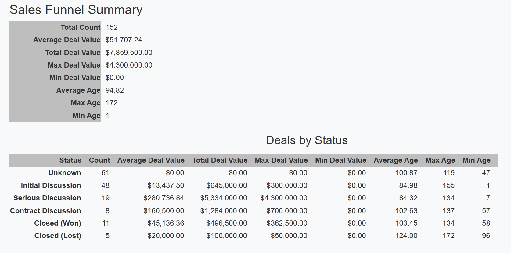
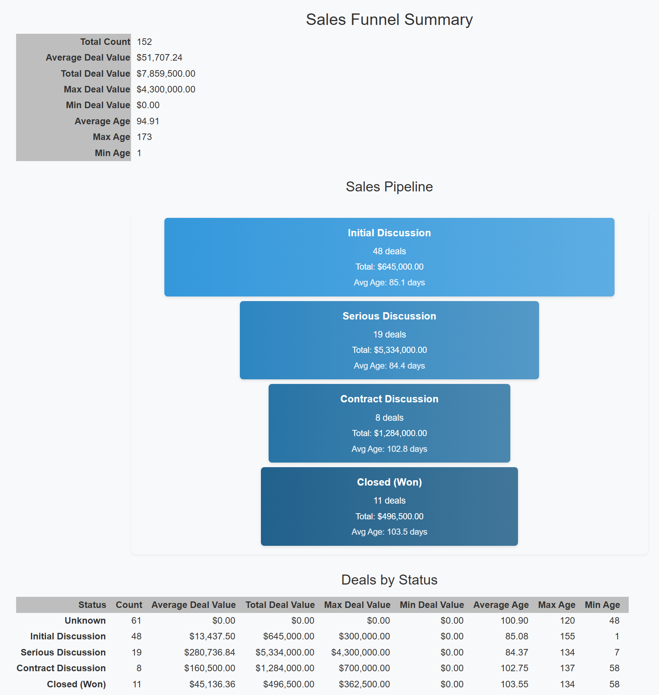
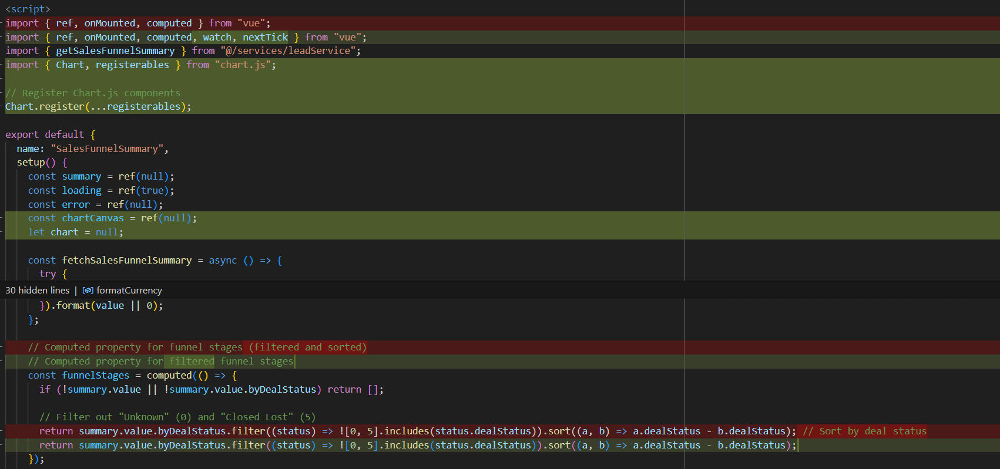
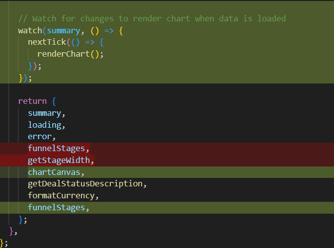
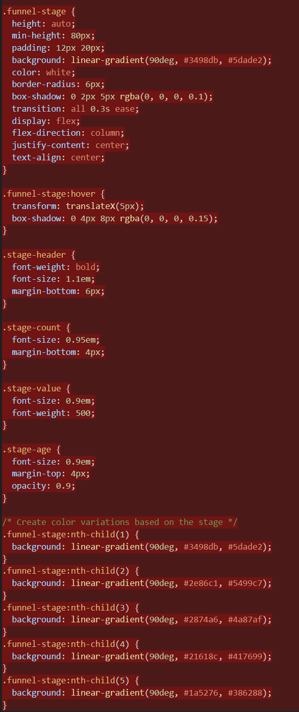
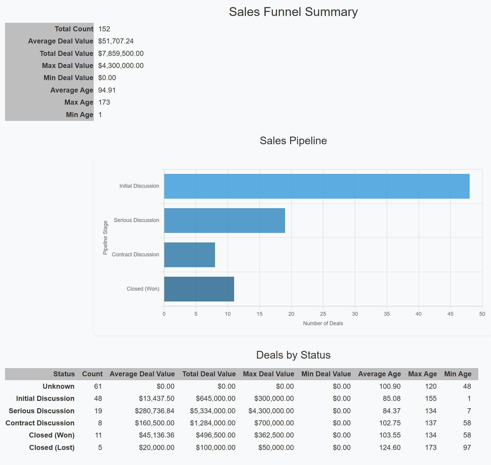

This post is the third installment in the series on AI assisted UI development. While this post is largely stand-alone, consider reading parts <a href="https://www.codemag.com/blog/AIPractitioner/UIAI" target="_blank">1</a> and <a href="https://www.codemag.com/Blog/AIPractitioner/UIAI2" target="_blank">2</a> before reading this post.

## Have AI Add a Data Visualization

We've looked at using AI to create and add UI components in prior posts. In this post I'll add a data visualization to a page.

This figure shows a rendered Sales Funnel Summary page before making any changes:



The goal in this post is to have AI add a data visualization of the sales funnel to the page.

**Prompt: Using css, add a Sales Funnel graphic from the data in the detail-table. Include the total value and the average age. Don't include 'unknown' or 'closed lost'.**

Below is the response from the Claude 3.7 Sonnet Thinking model.

*Begin Response*

*I'll add a CSS-based Sales Funnel visualization between your summary table and the details table. Here's how to implement it:*

```html
<template>
  <div class="sales-funnel-summary">
    <h1>Sales Funnel Summary</h1>
    <div v-if="loading">Loading...</div>
    <div v-else-if="error">{{ error }}</div>
    <div v-else>
      <table class="summary-table">
        <!-- ...existing summary table content... -->
      </table>

      <!-- Sales Funnel Visualization -->
      <h2>Sales Pipeline</h2>
      <div class="funnel-container">
        <div v-for="stage in funnelStages" :key="stage.dealStatus"
             class="funnel-stage" :style="{ width: getStageWidth(stage) + '%' }">
          <div class="stage-header">{{ getDealStatusDescription(stage.dealStatus) }}</div>
          <div class="stage-count">{{ stage.count }} deals</div>
          <div class="stage-value">Total: {{ formatCurrency(stage.totalDealValue) }}</div>
          <div class="stage-age">Avg Age: {{ stage.averageAge.toFixed(1) }} days</div>
        </div>
      </div>

      <h2>Deals by Status</h2>
      <table class="detail-table">
        <!-- ...existing detail table content... -->
      </table>
    </div>
  </div>
</template>

<script>
import { ref, onMounted, computed } from "vue";
import { getSalesFunnelSummary } from "@/services/leadService";

export default {
  name: "SalesFunnelSummary",
  setup() {
    const summary = ref(null);
    const loading = ref(true);
    const error = ref(null);

    // ...existing functions...

    // Computed property for funnel stages (filtered and sorted)
    const funnelStages = computed(() => {
      if (!summary.value || !summary.value.byDealStatus) return [];

      // Filter out "Unknown" (0) and "Closed Lost" (5)
      return summary.value.byDealStatus
        .filter(status => ![0, 5].includes(status.dealStatus))
        .sort((a, b) => a.dealStatus - b.dealStatus); // Sort by deal status
    });

    // Calculate the width for each stage based on count
    const getStageWidth = (stage) => {
      if (!funnelStages.value.length) return 0;

      const maxCount = Math.max(...funnelStages.value.map(s => s.count));
      // Scale width from 40% to 90% for better visibility
      return 40 + ((stage.count / maxCount) * 50);
    };

    onMounted(() => {
      fetchSalesFunnelSummary();
    });

    return {
      summary,
      loading,
      error,
      funnelStages,
      getStageWidth,
      getDealStatusDescription,
      formatCurrency,
    };
  },
};
</script>

<style scoped>
/* ...existing styles... */

/* Funnel Visualization */
.funnel-container {
  display: flex;
  flex-direction: column;
  align-items: center;
  gap: 8px;
  max-width: 900px;
  margin: 25px auto;
  padding: 15px;
  background-color: #f8f9fa;
  border-radius: 8px;
  box-shadow: 0 2px 4px rgba(0, 0, 0, 0.05);
}

.funnel-stage {
  height: auto;
  min-height: 80px;
  padding: 12px 20px;
  background: linear-gradient(90deg, #3498db, #5dade2);
  color: white;
  border-radius: 6px;
  box-shadow: 0 2px 5px rgba(0, 0, 0, 0.1);
  transition: all 0.3s ease;
  display: flex;
  flex-direction: column;
  justify-content: center;
  text-align: center;
}

.funnel-stage:hover {
  transform: translateX(5px);
  box-shadow: 0 4px 8px rgba(0, 0, 0, 0.15);
}

.stage-header {
  font-weight: bold;
  font-size: 1.1em;
  margin-bottom: 6px;
}

.stage-count {
  font-size: 0.95em;
  margin-bottom: 4px;
}

.stage-value {
  font-size: 0.9em;
  font-weight: 500;
}

.stage-age {
  font-size: 0.9em;
  margin-top: 4px;
  opacity: 0.9;
}

/* Create color variations based on the stage */
.funnel-stage:nth-child(1) { background: linear-gradient(90deg, #3498db, #5dade2); }
.funnel-stage:nth-child(2) { background: linear-gradient(90deg, #2e86c1, #5499c7); }
.funnel-stage:nth-child(3) { background: linear-gradient(90deg, #2874a6, #4a87af); }
.funnel-stage:nth-child(4) { background: linear-gradient(90deg, #21618c, #417699); }
.funnel-stage:nth-child(5) { background: linear-gradient(90deg, #1a5276, #386288); }

h2 {
  margin-top: 30px;
  margin-bottom: 15px;
  font-size: 150%;
  text-align: center;
}

h1 {
  font-size: 175%;
  padding-top: 2%;
  text-align: center;
}
</style>
```

<br/>

This implementation:

1. Adds a new funnel visualization between your summary table and details table
1. Filters the data to exclude "Unknown" (status 0) and "Closed Lost" (status 5)
1. Sorts the stages by deal status for a logical progression
1. Dynamic sizing - Each stage's width is calculated based on the number of deals relative to the maximum count
1. Includes key metrics - Each stage shows:
    * The stage name
    * Number of deals
    * Total deal value
    * Average age
1. Visually appealing design with:
    * Gradient backgrounds that vary by stage
    * Hover effects for interactivity
    * Smooth transitions
    * Consistent spacing and alignment
    * Box shadows for depth

*The funnel provides a clear visual representation of your sales pipeline, showing how deals progress through different stages while highlighting the total value and average age at each stage.*

*End Response*

Here's a breakdown of the changes:

Add the `funnel-container` `div` that contains a `div` for each stage being rendered, which in turn, contains divs for the data elements.


Add stage filtering and width calculation. Import `computed` in order to filter out the unknown and closed won stages and define a function that does the filtering. Also define a function to calculate the stage width based on the number of leads. Finally, return the new function so that it can be called elsewhere.


Because I asked for a CSS implementation, most of the work in rendering sales funnel visualization is done with CSS styles. These styles define the backgrounds of each stage and change to the headings. The linear gradient is a nice touch!


The remainder of the CSS sales funnel visualization styles define the appearance of the stages and the appearance of the text in each stage. Including a nice hover effect.


Here is the page rendered with the CSS data visualization:



This is a workable implementation of the Sales Funnel visualization. It certainly could be improved by altering the styles or even have Copilot alter the styles. As is, it does the job without manual coding.

Now I'll ask Copilot to remove the CSS implementation and replace it with an implementation built with chart.js.

## Replace the CSS Implementation with a chart.js Implementation

<a href="https://www.chartjs.org/" target="_blank">chart.js</a> is a flexible and widely-used open-source JavaScript library for creating interactive, responsive data visualizations in web applications. It provides a simple yet powerful API that enables developers to render various chart types (including bar, line, pie, radar, and many others) using HTML5 Canvas elements. chart.js offers extensive customization options for colors, animations, legends, tooltips, and scales, while maintaining excellent performance even with large datasets. The library automatically handles responsiveness across different screen sizes, supports accessibility features, and integrates seamlessly with modern JavaScript frameworks like Vue, React, and Angular.

Here is how I used Copilot to implement the chart.js visualization:

**Prompt: Replace the CSS chart with a similar chart using chart.js**

Below is the response from the Claude 3.7 Sonnet Thinking model. As it was generated:

*Begin Response*

*To replace the CSS-based chart with a chart.js implementation, you'll need to:*

1. Install chart.js
1. Replace the CSS funnel visualization with a canvas element
1. Add the chart.js initialization code

*Here's how to implement it:*

### Step 1: Install chart.js

```bash
npm install chart.js
```

### Step 2: Update Your Component

```html
<template>
  <div class="sales-funnel-summary">
    <h1>Sales Funnel Summary</h1>
    <div v-if="loading">Loading...</div>
    <div v-else-if="error">{{ error }}</div>
    <div v-else>
      <table class="summary-table">
        <!-- existing summary table content -->
      </table>

      <!-- Replace CSS Funnel with chart.js Canvas -->
      <h2>Sales Pipeline</h2>
      <div class="chart-container">
        <canvas ref="chartCanvas"></canvas>
      </div>

      <h2>Deals by Status</h2>
      <table class="detail-table">
        <!-- existing detail table content -->
      </table>
    </div>
  </div>
</template>

<script>
import { ref, onMounted, computed, watch, nextTick } from "vue";
import { getSalesFunnelSummary } from "@/services/leadService";
import { Chart, registerables } from 'chart.js';
```

### Step 3: Add the chart.js initialization code

```js
// Register chart.js components
Chart.register(...registerables);

export default {
  name: "SalesFunnelSummary",
  setup() {
    const summary = ref(null);
    const loading = ref(true);
    const error = ref(null);
    const chartCanvas = ref(null);
    let chart = null;

    const fetchSalesFunnelSummary = async () => {
      try {
        const response = await getSalesFunnelSummary();
        if (response.success) {
          summary.value = response;
        } else {
          error.value = response.failureInformation || "Failed to fetch sales funnel summary";
        }
      } catch (err) {
        error.value = "Failed to fetch sales funnel summary";
      } finally {
        loading.value = false;
      }
    };

    const getDealStatusDescription = (dealStatus) => {
      const statusMap = {
        0: "Unknown",
        1: "Initial Discussion",
        2: "Serious Discussion",
        3: "Contract Discussion",
        4: "Closed (Won)",
        5: "Closed (Lost)",
        6: "Closed (Abandoned)",
      };
      return statusMap[dealStatus] || `Status ${dealStatus}`;
    };

    const formatCurrency = (value) => {
      return new Intl.NumberFormat("en-US", {
        style: "currency",
        currency: "USD",
      }).format(value || 0);
    };

    // Computed property for filtered funnel stages
    const funnelStages = computed(() => {
      if (!summary.value || !summary.value.byDealStatus) return [];

      // Filter out "Unknown" (0) and "Closed Lost" (5)
      return summary.value.byDealStatus
        .filter((status) => ![0, 5].includes(status.dealStatus))
        .sort((a, b) => a.dealStatus - b.dealStatus);
    });

    // Render the chart.js chart
    const renderChart = () => {
      if (!chartCanvas.value || !funnelStages.value.length) return;

      // Destroy existing chart if it exists
      if (chart) {
        chart.destroy();
      }

      const ctx = chartCanvas.value.getContext('2d');

      // Prepare data for chart
      const labels = funnelStages.value.map(stage => getDealStatusDescription(stage.dealStatus));
      const counts = funnelStages.value.map(stage => stage.count);

      // Color palette for chart bars
      const colors = [
        'rgba(52, 152, 219, 0.8)',
        'rgba(46, 134, 193, 0.8)',
        'rgba(40, 116, 166, 0.8)',
        'rgba(33, 97, 140, 0.8)',
        'rgba(26, 82, 118, 0.8)'
      ];

      const borderColors = [
        'rgb(52, 152, 219)',
        'rgb(46, 134, 193)',
        'rgb(40, 116, 166)',
        'rgb(33, 97, 140)',
        'rgb(26, 82, 118)'
      ];

      // Create the chart
      chart = new Chart(ctx, {
        type: 'bar',
        data: {
          labels: labels,
          datasets: [{
            label: 'Number of Deals',
            data: counts,
            backgroundColor: colors,
            borderColor: borderColors,
            borderWidth: 1
          }]
        },
        options: {
          indexAxis: 'y',  // Horizontal bar chart
          responsive: true,
          maintainAspectRatio: false,
          plugins: {
            tooltip: {
              callbacks: {
                label: (context) => {
                  const index = context.dataIndex;
                  const stage = funnelStages.value[index];
                  return `Count: ${stage.count} deals`;
                },
                afterLabel: (context) => {
                  const index = context.dataIndex;
                  const stage = funnelStages.value[index];
                  return [
                    `Total: ${formatCurrency(stage.totalDealValue)}`,
                    `Avg Age: ${stage.averageAge.toFixed(1)} days`
                  ];
                }
              }
            },
            legend: {
              display: false // Hide legend
            }
          },
          scales: {
            x: {
              beginAtZero: true,
              title: {
                display: true,
                text: 'Number of Deals'
              }
            },
            y: {
              title: {
                display: true,
                text: 'Pipeline Stage'
              }
            }
          }
        }
      });
    };

    onMounted(() => {
      fetchSalesFunnelSummary();
    });

    // Watch for changes to render chart when data is loaded
    watch(summary, () => {
      nextTick(() => {
        renderChart();
      });
    });

    return {
      summary,
      loading,
      error,
      chartCanvas,
      getDealStatusDescription,
      formatCurrency,
      funnelStages
    };
  },
};
</script>

<style scoped>
.summary-table th {
  width: fit-content;
  text-align: right;
}

.summary-table td {
  padding-left: 10px;
}

.detail-table th {
  text-align: right;
  padding-right: 15px;
  width: fit-content;
}

.detail-table td {
  text-align: right;
  padding-right: 16px;
  width: fit-content;
}

/* Chart Container */
.chart-container {
  height: 400px;
  max-width: 900px;
  margin: 25px auto;
  padding: 15px;
  background-color: #f8f9fa;
  border-radius: 8px;
  box-shadow: 0 2px 4px rgba(0, 0, 0, 0.05);
}

h2 {
  margin-top: 30px;
  margin-bottom: 15px;
  font-size: 150%;
  text-align: center;
}

h1 {
  font-size: 175%;
  padding-top: 2%;
  text-align: center;
}
</style>
```
<br/>

*End Response*

Here is a breakdown of the changes:

1. Replace the `funnel-container` div with the `chart-container` div.


<br/><br/>


2. The `Chart` and `registrables` functions are imported from the chart.js library, along with the associated `watch` and `nextTick` triggers.



<br/><br/>

3. The stage width calculation is no longer needed and is removed.

<br/>


<br/>

4. Add the `renderChart` function that defines the chart.js data visualization.

<br/>


<br/><br/>

5. Wire up triggers and drop `getStageWidth` from return in favor of `chartCanvas`.

<br/>


<br/><br/>

6. Replace `.funnel-container` style with the `.chart-container` style.

<br/>


<br/><br/>

7. Remove the styles used by the CSS Sales Funnel visualization implementation.

<br/>


<br/><br/>


8. Here is the page rendered with the chart.js data visualization.

<br/>


This is also a workable implementation. It's lost the "funnel" appearance from the CSS implementation but adds the Number of Deals axis. Also the data is hidden in a tool tip:


As you can see creating data visualizations using Copilot is surprisingly easy. Even to the point of being able to remove an existing implementation and replacing it with a new implementation. Also important is that no manual code changes were needed and both implementations worked the first time.

### Feedback Loop

Feedback is always welcome. Please direct it to <a href="mailto:AIP@pdata.com" target="_blank">AIP@pdata.com</a>

#### Disclaimer

AI contributed to the writing to this blog post, but humans reviewed it, refined it, enhanced it and gave it soul.

* **Prompts:** Give a one paragraph description of the chart.js library.

<small><small><small>Original [post](https://www.codemag.com/blog/AIPractitioner/UIAI3)</small></small></small>
