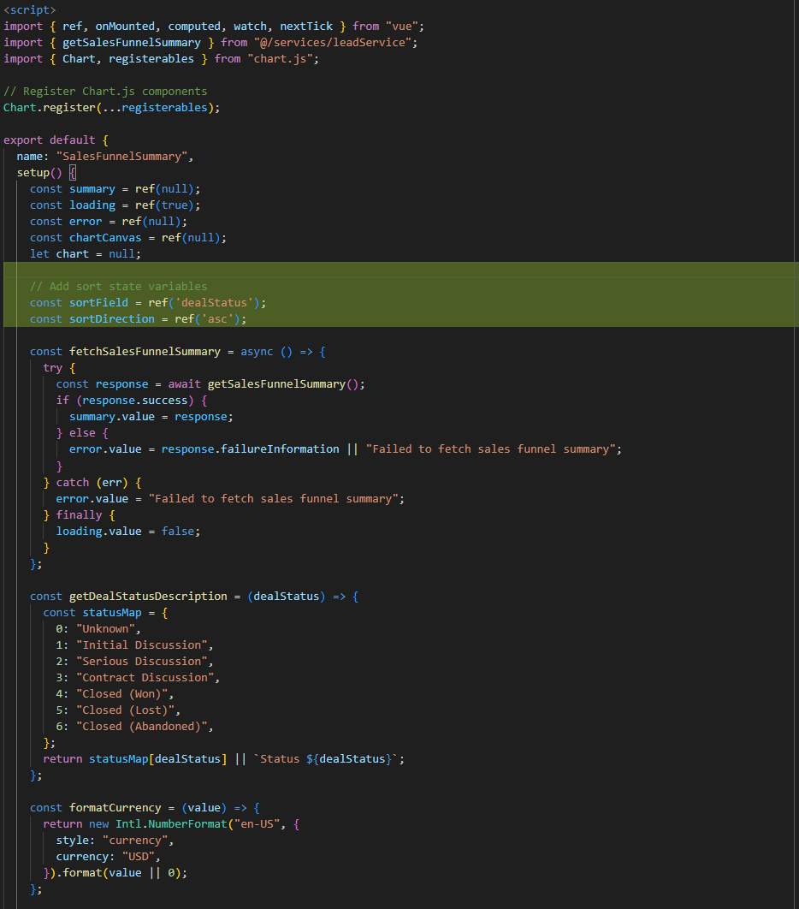
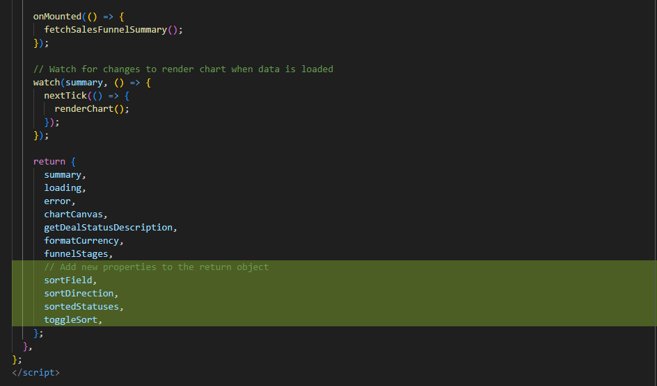
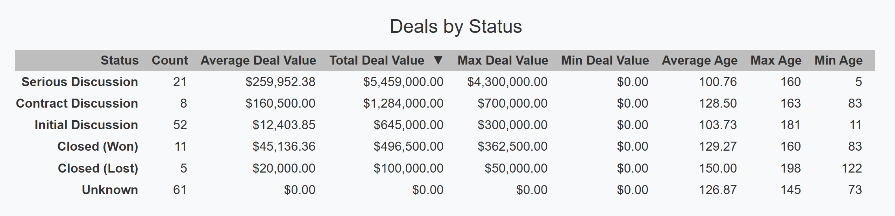

In the conclusion to this series on AI assisted UI development, I'll have GitHub Copilot (GHC) add client-side sorting to a data table. If you missed any of the previous posts, you can find them here: <a href="https://www.codemag.com/Blog/AIPractitioner/UIAI1" target="_blank">Part 1</a>, <a href="https://www.codemag.com/Blog/AIPractitioner/UIAI2" target="_blank">Part 2</a>, and <a href="https://www.codemag.com/Blog/AIPractitioner/UIAI3" target="_blank">Part 3</a>.

<!--more-->


Whenever data is rendered in a table, users often find it useful to sort the table by the data in one column. Modern UIs often let a user click on a column header to sort. Typically this requires changes to the HTML to trigger the sorting, code changes to sort the data, control the sort direction, and render the sorted data. Style changes are needed to provide user feedback. Sorting by more than one column complicates the implementation.

Rather than hand-coding the changes it could be more effective to ask GHC to attempt the implementation as it will likely be faster and hopefully with good quality. The prompt to GHC and it's response are enclosed in horizontal lines.

---

Here is the prompt I gave Claude 3.7 Sonnet with the context of the `vSalesFunnelSummary.vue`.

> Prompt: Add the ability to sort the detail-table by Status, Total Deal Value, or Average Age.

Here is the Copilot response:

> GHC: # Adding Sorting Functionality to the Sales Funnel Summary Table.
> I'll add the ability to sort the details table by implementing sort functionality on the table headers.

## Step-by-Step Solution:

1. Add state variables to track the sort field and direction
2. Create a computed property that returns the sorted data
3. Implement a toggle sort function
4. Update the table headers to be clickable and show sort indicators
5. Use the sorted data in the table rendering

---

GHC generated a new version of the Vue with several modifications. I'll talk through what GHC's modification rather than the entire code listing. If you interested in the rest of the code, it's included as <a href="#Listing1">Listing 1</a> at the end of the post.
<a id="Back2Article1"> </a>

### Update the Table Headers to be Clickable and Show Sort Indicators

First up are the HTML changes. GHC updated the Status, Total Deal Value, and Average Age column header cells to add the UI and triggers needed to implement the sorting.

The column header cell is interactive: it uses the `@click` directive to call a method named `toggleSort` with an argument associated with the sorted column (`dealStatus`, `totalDealValue` and `averageAge`) whenever the header is clicked. This suggests that clicking the header will sort the table rows based on the associated field.

The `class="sortable"` adds a CSS class to visually indicate that the column can be sorted by adding a hover effect.

Inside the header, there is a conditional `<span>` element that displays a sort indicator (an up or down arrow) only if the current value of `sortField` matches the associated field. The arrow direction is determined by the value of `sortDirection`: an upward arrow (▲) for ascending order and a downward arrow (▼) for descending order. This provides a clear visual cue to users about the current sort state of the column.

### Use the Sorted Data in the Table Rendering

The last code change in this section is the change to render the `sortedStatus` collection instead of the `summary.byDealStatus` collection.

Here are the HTML change to the **vSalesFunnelDetail** Vue.


The style changes for sortable columns are fairly straight forward. The `.sortable` class is applied to table headers that users can click to sort data. It changes the cursor to a pointer, signaling interactivity, and disables text selection to prevent accidental highlighting when clicking. The `position: relative;` property allows for absolutely positioned child elements, such as the sort indicators.

When a user hovers over a sortable column, the `.sortable:hover` selector changes the background color to a light gray (`#f5f5f5`), providing visual feedback that the column is interactive. The `.sort-indicator` class is used for elements (like arrows or icons) that visually indicate the current sort direction. It adds a small left margin and ensures the indicator is displayed inline with the column header text.

Here are the style changes to the **vSalesFunnelDetail** Vue.


### Add State Variables to Track the Sort Field and Direction

The first set of code changes defines two reactive variables using Vue's Composition API and the `ref` function. The first variable, `sortField`, is initialized with the string `'dealStatus'`. This means that, by default, any sorting logic in the component will use the `'dealStatus'` property of the data as the field to sort by. The second variable, `sortDirection`, is initialized with the string `'asc'`, which stands for ascending order which is the default sorting direction.

By using `ref`, both `sortField` and `sortDirection` become reactive references. This means that if their values change (for example, when a user clicks a column header to change the sort order), Vue will automatically update any part of the template or computed properties that depend on these values.

Here are the state variable code changes to the **vSalesFunnelDetail** Vue.



### Create a Computed Property That Returns the Sorted Data

The main code changes to implement sorting are defining a computed property called `sortedStatuses` and a function called `toggleSort` within a Vue component using the Composition API. The purpose of `sortedStatuses` is to provide a dynamically sorted array of deal statuses, which is used to display a sortable table in the UI.

The `sortedStatuses` computed property first checks if the summary object and its `byDealStatus` property are available. If not, it returns an empty array to prevent errors. If the data exists, it creates a shallow copy of the `byDealStatus` array and sorts it based on the currently selected sort field and direction. The sorting logic checks if the `sortField` is `'dealStatus'`; if so, it sorts by the `dealStatus` property of each item. Otherwise, it sorts by the property specified by `sortField.value`. The sort direction is controlled by `sortDirection.value`, toggling between ascending (`'asc'`) and descending (`'desc'`). The comparison uses subtraction, which works for numeric fields, but could cause issues if the fields are strings (a potential "gotcha" to watch for).

### Implement a Toggle Sort Function

The `toggleSort` function is used to change the sorting behavior when a user interacts with the UI (for example, by clicking a column header). If the user clicks the same field that's already being sorted, the function toggles the sort direction. If a new field is selected, it sets that as the new sort field and defaults the direction to ascending.

Here are the main code changes to the **vSalesFunnelDetail** Vue.


The final set of changes to the code are modifications to the `setup()` function return statement. In this context, the return statement exposes specific variables, computed properties, and functions to the component's template, making them accessible for data binding and event handling. Here Copilot added `sortField`, `sortDirection`, `sortedStatuses`, and `toggleSort`.

By returning these properties and methods, the component ensures they are available for use in the template, supporting dynamic rendering, user interaction, and data presentation.

Here are the code changes to the return in the **vSalesFunnelDetail** Vue



### The Rendered vSalesFunnelDetail Vue

Here is the rendered Vue showing that the Total Deal Value is sorted in descending order:



This is another good example of GHC making seamless change to a user interface with no more effort than a reasonably accurate prompt. In this case, the first prompt submitted produced something very close to the desired results. Outside of some minor cosmetic changes, the only significant issue with the implementation is that there is some repeating logic that could be eliminated by turning the sortable header into a separate component. I'll improve the implementation by asking GHC to componentize the sortable table header.

---

> Prompt: Extract the sortable header as a separate component. Include all of the relevant code, html, and css. Replace the existing implementation with the new component.

> GHC: Create a new component for the sortable table header. Import and use the new `SortableHeader` component in place of the previous implementation.

---

Let's review the suggested changes.

As requested Copilot created a new `SortableHeader` Vue. This Vue defines a table header (`<th>`) that is designed to be sortable. The `:class` binding applies the class `sortable` to the header by default, and conditionally adds the `active` class if the `isActive` property is true. This allows for visual feedback to indicate which column is currently being sorted.

The `@click="onClick"` directive attaches a click event handler, so when the header is clicked, it triggers the `onClick` method.

Inside the `<th>`, the `<slot />` element allows you to insert custom content, such as the column label, from the parent component. If the column is active (i.e., currently being sorted), a `<span>` with the class `sort-indicator` is displayed. This span shows an upward arrow (▲) if the `sortDirection` is `"asc"` (ascending), or a downward arrow (▼) if it is `"desc"` (descending). This visual cue helps users understand the current sort state of the column.

Here is the new `SortableHeader` component HTML:



```html
<template>
  <th :class="['sortable', { active: isActive }]" @click="onClick">
    <slot />
    <span v-if="isActive" class="sort-indicator">
      {{ sortDirection === "asc" ? "▲" : "▼" }}
    </span>
  </th>
</template>
```

The component accepts three required properties: `field`, `sortField`, and `sortDirection`, all of which are strings. The `field` property identifies which column this header represents. The `sortField` property indicates which column is currently being sorted, and `sortDirection` specifies the current sort order (for example, `"asc"` or `"desc"`).

A computed property, `isActive`, checks if the current header is the one being sorted by comparing `sortField` to `field`. This is useful for visually indicating the active sort column in the UI.

The component emits a `toggle-sort` event when the header is clicked, passing its `field` value as a payload. This allows the parent component to update the sorting state accordingly. The `onClick` method handles this event emission.

Here is the new `SortableHeader` component script:

```html
<script>
  export default {
    name: "SortableHeader",
    props: {
      field: { type: String, required: true },
      sortField: { type: String, required: true },
      sortDirection: { type: String, required: true },
    },
    emits: ["toggle-sort"],
    computed: {
      isActive() {
        return this.sortField === this.field;
      },
    },
    methods: {
      onClick() {
        this.$emit("toggle-sort", this.field);
      },
    },
  };
</script>
```

The `.sortable` class gives elements a pointer cursor to indicate interactivity, disables text selection for a smoother user experience, and sets the position to relative, which is often used to position child elements absolutely within the header. The `.sortable:hover` selector changes the background color when the user hovers over the header, providing a visual cue that the element is interactive. The `.sort-indicator` class adds a small left margin and ensures the indicator (such as an arrow or icon) is displayed inline with the header text. The `.active` class makes the font bold, typically used to highlight the currently sorted column.

Because the styles are scoped, they only apply to this component, preventing unintended side effects elsewhere in your application.

Here is the new `SortableHeader` component CSS:

```html
<style scoped>
  .sortable {
    cursor: pointer;
    user-select: none;
    position: relative;
  }
  .sortable:hover {
    background-color: #f5f5f5;
  }
  .sort-indicator {
    margin-left: 5px;
    display: inline-block;
  }
  .active {
    font-weight: bold;
  }
</style>
```



Now for the changes to the **vSalesFunnelDetail** Vue. If you interested in the rest of the code, it's included as <a href="#Listing2">Listing 2</a> at the end of the post.
<a id="Back2article2"> </a>

In the HTML, Copilot has replaced the `<th>` elements with references to the new `SortableHeader` component.

The `field="dealStatus"` property tells the component which data field it represents. The `:sortField="sortField"` and `:sortDirection="sortDirection"` properties are bound to reactive data or computed properties in your parent component, indicating the current field being sorted and the direction of the sort (ascending or descending).

The `@toggle-sort="toggleSort"` part is an event listener. When the `SortableHeader` emits a `toggle-sort` event (when the user clicks the header), it triggers the `toggleSort` method in the parent component updating the sorting state.

Here are the changes Copilot made to the **vSalesFunnelDetail** HTML:


The import statement brings in the `SortableHeader` component from the specified path (`"@/components/SortableHeader.vue"`). By importing `SortableHeader`, we can use it as a child component within the current Vue component (`vSalesFunnelSummary.vue`), promoting code reuse and modularity. Encapsulating the logic and presentation of the sortable table headers in a dedicated component isolates the code in the component from the reset of the app reducing side-effects.

In Vue, the components option is used to locally register other components that you want to use within the template of the current component. By listing `SortableHeader` inside the components object, you make it available for use as a custom element (e.g., `<SortableHeader />`) in the template section of `vSalesFunnelSummary.vue`.

Here are the changes Copilot made to the **vSalesFunnelDetail** script:


Copilot drops the CSS used by the sortable header in the **vSalesFunnelDetail** Vue. These styles now reside in the `SortableHeader` component.

Here are the changes Copilot made to the **vSalesFunnelDetail** CSS:


This helps keep the code modular and organized by breaking down complex UIs into smaller, reusable components. The `SortableHeader` component can be used in any Vue needing this functionality.

This concludes this series on using AI to develop user interfaces. I'll likely return to UI development in the future.

### Feedback Loop

Feedback is always welcome. Please direct it to <a href="mailto:AIP@pdata.com" target="_blank">AIP@pdata.com</a>

#### Disclaimer

AI contributed to the writing to this blog post, but humans reviewed it, refined it, enhanced it and gave it soul.

- **Prompts:** I use the /explain prompt assist in describing the code changes.

---

### Listings

#### <a id="Listing1">Listing #1</a>



```html
<template>
  <div class="sales-funnel-summary">
    <h1>Sales Funnel Summary</h1>
    <div v-if="loading">Loading...</div>
    <div v-else-if="error">{{ error }}</div>
    <div v-else>
      <table class="summary-table">
        <tbody>
          <tr>
            <th>Total Count</th>
            <td>{{ summary.count }}</td>
          </tr>
          <tr>
            <th style="width: 200px">Average Deal Value</th>
            <td>{{ formatCurrency(summary.averageDealValue) }}</td>
          </tr>
          <tr>
            <th style="width: 200px">Total Deal Value</th>
            <td>{{ formatCurrency(summary.totalDealValue) }}</td>
          </tr>
          <tr>
            <th style="width: 200px">Max Deal Value</th>
            <td>{{ formatCurrency(summary.maxDealValue) }}</td>
          </tr>
          <tr>
            <th style="width: 200px">Min Deal Value</th>
            <td>{{ formatCurrency(summary.minDealValue) }}</td>
          </tr>
          <tr>
            <th style="width: 200px">Average Age</th>
            <td>{{ summary.averageAge.toFixed(2) }}</td>
          </tr>
          <tr>
            <th style="width: 200px">Max Age</th>
            <td>{{ summary.maxAge }}</td>
          </tr>
          <tr>
            <th style="width: 200px">Min Age</th>
            <td>{{ summary.minAge }}</td>
          </tr>
        </tbody>
      </table>

      <!-- Replace CSS Funnel with Chart.js Canvas -->
      <h2>Sales Pipeline</h2>
      <div class="chart-container">
        <canvas ref="chartCanvas"></canvas>
      </div>

      <h2>Deals by Status</h2>
      <table class="detail-table">
        <thead>
          <tr>
            <th @click="toggleSort('dealStatus')" class="sortable">
              Status
              <span v-if="sortField === 'dealStatus'" class="sort-indicator">
                {{ sortDirection === 'asc' ? '▲' : '▼' }}
              </span>
            </th>
            <th>Count</th>
            <th>Average Deal Value</th>
            <th @click="toggleSort('totalDealValue')" class="sortable">
              Total Deal Value
              <span
                v-if="sortField === 'totalDealValue'"
                class="sort-indicator"
              >
                {{ sortDirection === 'asc' ? '▲' : '▼' }}
              </span>
            </th>
            <th>Max Deal Value</th>
            <th>Min Deal Value</th>
            <th @click="toggleSort('averageAge')" class="sortable">
              Average Age
              <span v-if="sortField === 'averageAge'" class="sort-indicator">
                {{ sortDirection === 'asc' ? '▲' : '▼' }}
              </span>
            </th>
            <th>Max Age</th>
            <th>Min Age</th>
          </tr>
        </thead>
        <tbody>
          <tr v-for="status in sortedStatuses" :key="status.dealStatus">
            <td>
              <strong>{{ getDealStatusDescription(status.dealStatus) }}</strong>
            </td>
            <td class="text-right">{{ status.count }}</td>
            <td class="text-right">
              {{ formatCurrency(status.averageDealValue) }}
            </td>
            <td class="text-right">
              {{ formatCurrency(status.totalDealValue) }}
            </td>
            <td class="text-right">
              {{ formatCurrency(status.maxDealValue) }}
            </td>
            <td class="text-right">
              {{ formatCurrency(status.minDealValue) }}
            </td>
            <td class="text-right">{{ status.averageAge.toFixed(2) }}</td>
            <td class="text-right">{{ status.maxAge }}</td>
            <td class="text-right">{{ status.minAge }}</td>
          </tr>
        </tbody>
      </table>
    </div>
  </div>
</template>

<script>
  import { ref, onMounted, computed, watch, nextTick } from "vue";
  import { getSalesFunnelSummary } from "@/services/leadService";
  import { Chart, registerables } from "chart.js";

  // Register Chart.js components
  Chart.register(...registerables);

  export default {
    name: "SalesFunnelSummary",
    setup() {
      const summary = ref(null);
      const loading = ref(true);
      const error = ref(null);
      const chartCanvas = ref(null);
      let chart = null;

      // Add sort state variables
      const sortField = ref("dealStatus");
      const sortDirection = ref("asc");

      const fetchSalesFunnelSummary = async () => {
        try {
          const response = await getSalesFunnelSummary();
          if (response.success) {
            summary.value = response;
          } else {
            error.value =
              response.failureInformation ||
              "Failed to fetch sales funnel summary";
          }
        } catch (err) {
          error.value = "Failed to fetch sales funnel summary";
        } finally {
          loading.value = false;
        }
      };

      const getDealStatusDescription = (dealStatus) => {
        const statusMap = {
          0: "Unknown",
          1: "Initial Discussion",
          2: "Serious Discussion",
          3: "Contract Discussion",
          4: "Closed (Won)",
          5: "Closed (Lost)",
          6: "Closed (Abandoned)",
        };
        return statusMap[dealStatus] || `Status ${dealStatus}`;
      };

      const formatCurrency = (value) => {
        return new Intl.NumberFormat("en-US", {
          style: "currency",
          currency: "USD",
        }).format(value || 0);
      };

      // Computed property for filtered funnel stages
      const funnelStages = computed(() => {
        if (!summary.value || !summary.value.byDealStatus) return [];

        // Filter out "Unknown" (0) and "Closed Lost" (5)
        return summary.value.byDealStatus
          .filter((status) => ![0, 5].includes(status.dealStatus))
          .sort((a, b) => a.dealStatus - b.dealStatus);
      });

      // Add computed property for sorted statuses
      const sortedStatuses = computed(() => {
        if (!summary.value || !summary.value.byDealStatus) return [];

        return [...summary.value.byDealStatus].sort((a, b) => {
          let aValue, bValue;

          if (sortField.value === "dealStatus") {
            aValue = a.dealStatus;
            bValue = b.dealStatus;
          } else {
            aValue = a[sortField.value];
            bValue = b[sortField.value];
          }

          if (sortDirection.value === "asc") {
            return aValue - bValue;
          } else {
            return bValue - aValue;
          }
        });
      });

      // Add sort toggle function
      const toggleSort = (field) => {
        if (sortField.value === field) {
          // Toggle direction if clicking the same field
          sortDirection.value = sortDirection.value === "asc" ? "desc" : "asc";
        } else {
          // Set new field and default to ascending
          sortField.value = field;
          sortDirection.value = "asc";
        }
      };

      // Render the Chart.js chart
      const renderChart = () => {
        if (!chartCanvas.value || !funnelStages.value.length) return;

        // Destroy existing chart if it exists
        if (chart) {
          chart.destroy();
        }

        const ctx = chartCanvas.value.getContext("2d");

        // Prepare data for chart
        const labels = funnelStages.value.map((stage) =>
          getDealStatusDescription(stage.dealStatus),
        );
        const counts = funnelStages.value.map((stage) => stage.count);

        // Color palette for chart bars
        const colors = [
          "rgba(52, 152, 219, 0.8)",
          "rgba(46, 134, 193, 0.8)",
          "rgba(40, 116, 166, 0.8)",
          "rgba(33, 97, 140, 0.8)",
          "rgba(26, 82, 118, 0.8)",
        ];

        const borderColors = [
          "rgb(52, 152, 219)",
          "rgb(46, 134, 193)",
          "rgb(40, 116, 166)",
          "rgb(33, 97, 140)",
          "rgb(26, 82, 118)",
        ];

        // Create the chart
        chart = new Chart(ctx, {
          type: "bar",
          data: {
            labels: labels,
            datasets: [
              {
                label: "Number of Deals",
                data: counts,
                backgroundColor: colors,
                borderColor: borderColors,
                borderWidth: 1,
              },
            ],
          },
          options: {
            indexAxis: "y", // Horizontal bar chart
            responsive: true,
            maintainAspectRatio: false,
            plugins: {
              tooltip: {
                callbacks: {
                  label: (context) => {
                    const index = context.dataIndex;
                    const stage = funnelStages.value[index];
                    return `Count: ${stage.count} deals`;
                  },
                  afterLabel: (context) => {
                    const index = context.dataIndex;
                    const stage = funnelStages.value[index];
                    return [
                      `Total: ${formatCurrency(stage.totalDealValue)}`,
                      `Avg Age: ${stage.averageAge.toFixed(1)} days`,
                    ];
                  },
                },
              },
              legend: {
                display: false, // Hide legend
              },
            },
            scales: {
              x: {
                beginAtZero: true,
                title: {
                  display: true,
                  text: "Number of Deals",
                },
              },
              y: {
                title: {
                  display: true,
                  text: "Pipeline Stage",
                },
              },
            },
          },
        });
      };

      onMounted(() => {
        fetchSalesFunnelSummary();
      });

      // Watch for changes to render chart when data is loaded
      watch(summary, () => {
        nextTick(() => {
          renderChart();
        });
      });

      return {
        summary,
        loading,
        error,
        chartCanvas,
        getDealStatusDescription,
        formatCurrency,
        funnelStages,
        // Add new properties to the return object
        sortField,
        sortDirection,
        sortedStatuses,
        toggleSort,
      };
    },
  };
</script>

<style scoped>
  .summary-table th {
    width: fit-content;
    text-align: right;
  }

  .summary-table td {
    padding-left: 10px;
  }

  .detail-table th {
    text-align: right;
    padding-right: 15px;
    width: fit-content;
  }

  .detail-table td {
    text-align: right;
    padding-right: 16px;
    width: fit-content;
  }

  /* Chart Container */
  .chart-container {
    height: 400px;
    max-width: 900px;
    margin: 25px auto;
    padding: 15px;
    background-color: #f8f9fa;
    border-radius: 8px;
    box-shadow: 0 2px 4px rgba(0, 0, 0, 0.05);
  }

  h2 {
    margin-top: 30px;
    margin-bottom: 15px;
    font-size: 150%;
    text-align: center;
  }

  h1 {
    font-size: 175%;
    padding-top: 2%;
    text-align: center;
  }

  /* Add styling for sortable columns */
  .sortable {
    cursor: pointer;
    user-select: none;
    position: relative;
  }

  .sortable:hover {
    background-color: #f5f5f5;
  }

  .sort-indicator {
    margin-left: 5px;
    display: inline-block;
  }
</style>
```



#### <a href="#Back2Article1">Back to main article</a>

---

#### <a id="Listing2">Listing #2</a>



```html
<template>
  <div class="sales-funnel-summary">
    <h1>Sales Funnel Summary</h1>
    <div v-if="loading">Loading...</div>
    <div v-else-if="error">{{ error }}</div>
    <div v-else>
      <table class="summary-table">
        <tbody>
          <tr>
            <th>Total Count</th>
            <td>{{ summary.count }}</td>
          </tr>
          <tr>
            <th style="width: 200px">Average Deal Value</th>
            <td>{{ formatCurrency(summary.averageDealValue) }}</td>
          </tr>
          <tr>
            <th style="width: 200px">Total Deal Value</th>
            <td>{{ formatCurrency(summary.totalDealValue) }}</td>
          </tr>
          <tr>
            <th style="width: 200px">Max Deal Value</th>
            <td>{{ formatCurrency(summary.maxDealValue) }}</td>
          </tr>
          <tr>
            <th style="width: 200px">Min Deal Value</th>
            <td>{{ formatCurrency(summary.minDealValue) }}</td>
          </tr>
          <tr>
            <th style="width: 200px">Average Age</th>
            <td>{{ summary.averageAge.toFixed(2) }}</td>
          </tr>
          <tr>
            <th style="width: 200px">Max Age</th>
            <td>{{ summary.maxAge }}</td>
          </tr>
          <tr>
            <th style="width: 200px">Min Age</th>
            <td>{{ summary.minAge }}</td>
          </tr>
        </tbody>
      </table>

      <!-- Replace CSS Funnel with Chart.js Canvas -->
      <h2>Sales Pipeline</h2>
      <div class="chart-container">
        <canvas ref="chartCanvas"></canvas>
      </div>

      <h2>Deals by Status</h2>
      <table class="detail-table">
        <thead>
          <tr>
            <SortableHeader
              field="dealStatus"
              :sortField="sortField"
              :sortDirection="sortDirection"
              @toggle-sort="toggleSort"
            >
              Status
            </SortableHeader>
            <th>Count</th>
            <th>Average Deal Value</th>
            <SortableHeader
              field="totalDealValue"
              :sortField="sortField"
              :sortDirection="sortDirection"
              @toggle-sort="toggleSort"
            >
              Total Deal Value
            </SortableHeader>
            <th>Max Deal Value</th>
            <th>Min Deal Value</th>
            <SortableHeader
              field="averageAge"
              :sortField="sortField"
              :sortDirection="sortDirection"
              @toggle-sort="toggleSort"
            >
              Average Age
            </SortableHeader>
            <th>Max Age</th>
            <th>Min Age</th>
          </tr>
        </thead>
        <tbody>
          <tr v-for="status in sortedStatuses" :key="status.dealStatus">
            <td>
              <strong>{{ getDealStatusDescription(status.dealStatus) }}</strong>
            </td>
            <td class="text-right">{{ status.count }}</td>
            <td class="text-right">
              {{ formatCurrency(status.averageDealValue) }}
            </td>
            <td class="text-right">
              {{ formatCurrency(status.totalDealValue) }}
            </td>
            <td class="text-right">
              {{ formatCurrency(status.maxDealValue) }}
            </td>
            <td class="text-right">
              {{ formatCurrency(status.minDealValue) }}
            </td>
            <td class="text-right">{{ status.averageAge.toFixed(2) }}</td>
            <td class="text-right">{{ status.maxAge }}</td>
            <td class="text-right">{{ status.minAge }}</td>
          </tr>
        </tbody>
      </table>
    </div>
  </div>
</template>

<script>
  import { ref, onMounted, computed, watch, nextTick } from "vue";
  import { getSalesFunnelSummary } from "@/services/leadService";
  import { Chart, registerables } from "chart.js";
  import SortableHeader from "@/components/SortableHeader.vue";

  // Register Chart.js components
  Chart.register(...registerables);

  export default {
    name: "SalesFunnelSummary",
    components: {
      SortableHeader,
    },
    setup() {
      const summary = ref(null);
      const loading = ref(true);
      const error = ref(null);
      const chartCanvas = ref(null);
      let chart = null;

      // Add sort state variables
      const sortField = ref("dealStatus");
      const sortDirection = ref("asc");

      const fetchSalesFunnelSummary = async () => {
        try {
          const response = await getSalesFunnelSummary();
          if (response.success) {
            summary.value = response;
          } else {
            error.value = response.failureInformation || "Failed to fetch
                                                      || sales funnel summary";
          }
        } catch (err) {
          error.value = "Failed to fetch sales funnel summary";
        } finally {
          loading.value = false;
        }
      };

      const getDealStatusDescription = (dealStatus) => {
        const statusMap = {
          0: "Unknown",
          1: "Initial Discussion",
          2: "Serious Discussion",
          3: "Contract Discussion",
          4: "Closed (Won)",
          5: "Closed (Lost)",
          6: "Closed (Abandoned)",
        };
        return statusMap[dealStatus] || `Status ${dealStatus}`;
      };

      const formatCurrency = (value) => {
        return new Intl.NumberFormat("en-US", {
          style: "currency",
          currency: "USD",
        }).format(value || 0);
      };

      // Computed property for filtered funnel stages
      const funnelStages = computed(() => {
        if (!summary.value || !summary.value.byDealStatus) return [];

        // Filter out "Unknown" (0) and "Closed Lost" (5)
        return summary.value.byDealStatus.filter((status) =>
          ![0, 5].includes(status.dealStatus)).sort((a, b) =>
            a.dealStatus - b.dealStatus);
      });

      // Add computed property for sorted statuses
      const sortedStatuses = computed(() => {
        if (!summary.value || !summary.value.byDealStatus) return [];

        return [...summary.value.byDealStatus].sort((a, b) => {
          let aValue, bValue;

          if (sortField.value === "dealStatus") {
            aValue = a.dealStatus;
            bValue = b.dealStatus;
          } else {
            aValue = a[sortField.value];
            bValue = b[sortField.value];
          }

          if (sortDirection.value === "asc") {
            return aValue - bValue;
          } else {
            return bValue - aValue;
          }
        });
      });

      // Add sort toggle function
      const toggleSort = (field) => {
        if (sortField.value === field) {
          // Toggle direction if clicking the same field
          sortDirection.value = sortDirection.value === "asc" ? "desc" : "asc";
        } else {
          // Set new field and default to ascending
          sortField.value = field;
          sortDirection.value = "asc";
        }
      };

      // Render the Chart.js chart
      const renderChart = () => {
        if (!chartCanvas.value || !funnelStages.value.length) return;

        // Destroy existing chart if it exists
        if (chart) {
          chart.destroy();
        }

        const ctx = chartCanvas.value.getContext("2d");

        // Prepare data for chart
        const labels = funnelStages.value.map((stage) =>
          getDealStatusDescription(stage.dealStatus));
        const counts = funnelStages.value.map((stage) => stage.count);

        // Color palette for chart bars
        const colors = ["rgba(52, 152, 219, 0.8)", "rgba(46, 134, 193, 0.8)",
          "rgba(40, 116, 166, 0.8)", "rgba(33, 97, 140, 0.8)",
          "rgba(26, 82, 118, 0.8)"];

        const borderColors = ["rgb(52, 152, 219)", "rgb(46, 134, 193)",
          "rgb(40, 116, 166)", "rgb(33, 97, 140)", "rgb(26, 82, 118)"];

        // Create the chart
        chart = new Chart(ctx, {
          type: "bar",
          data: {
            labels: labels,
            datasets: [
              {
                label: "Number of Deals",
                data: counts,
                backgroundColor: colors,
                borderColor: borderColors,
                borderWidth: 1,
              },
            ],
          },
          options: {
            indexAxis: "y", // Horizontal bar chart
            responsive: true,
            maintainAspectRatio: false,
            plugins: {
              tooltip: {
                callbacks: {
                  label: (context) => {
                    const index = context.dataIndex;
                    const stage = funnelStages.value[index];
                    return `Count: ${stage.count} deals`;
                  },
                  afterLabel: (context) => {
                    const index = context.dataIndex;
                    const stage = funnelStages.value[index];
                    return [`Total: ${formatCurrency(stage.totalDealValue)}`,
                    `Avg Age: ${stage.averageAge.toFixed(1)} days`];
                  },
                },
              },
              legend: {
                display: false, // Hide legend
              },
            },
            scales: {
              x: {
                beginAtZero: true,
                title: {
                  display: true,
                  text: "Number of Deals",
                },
              },
              y: {
                title: {
                  display: true,
                  text: "Pipeline Stage",
                },
              },
            },
          },
        });
      };

      onMounted(() => {
        fetchSalesFunnelSummary();
      });

      // Watch for changes to render chart when data is loaded
      watch(summary, () => {
        nextTick(() => {
          renderChart();
        });
      });

      return {
        summary,
        loading,
        error,
        chartCanvas,
        getDealStatusDescription,
        formatCurrency,
        funnelStages,
        // Add new properties to the return object
        sortField,
        sortDirection,
        sortedStatuses,
        toggleSort,
      };
    },
  };
</script>

<style scoped>
  .summary-table th {
    width: fit-content;
    text-align: right;
  }

  .summary-table td {
    padding-left: 10px;
  }

  .detail-table th {
    text-align: right;
    padding-right: 15px;
    width: fit-content;
  }

  .detail-table td {
    text-align: right;
    padding-right: 16px;
    width: fit-content;
  }

  /* Chart Container */
  .chart-container {
    height: 400px;
    max-width: 900px;
    margin: 25px auto;
    padding: 15px;
    background-color: #f8f9fa;
    border-radius: 8px;
    box-shadow: 0 2px 4px rgba(0, 0, 0, 0.05);
  }

  h2 {
    margin-top: 30px;
    margin-bottom: 15px;
    font-size: 150%;
    text-align: center;
  }

  h1 {
    font-size: 175%;
    padding-top: 2%;
    text-align: center;
  }
</style>
```



#### <a href="#Back2article2">Back to main article</a>

<small><small><small>Original [post](https://www.codemag.com/blog/AIPractitioner/UIAI4)</small></small></small>
