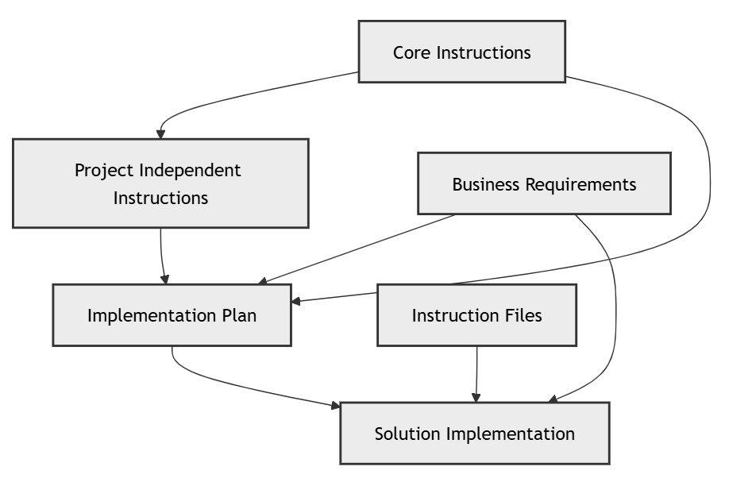

This post starts a new series on greenfield software development. The goal is to show the development of a solution starting with the initial context and adding to the solution incrementally. Hopefully you'll get a sense for what it's like to build real-world solutions with the assistance of Copilot.

In this first installment we'll look at the initial context provided to Copilot. This will include the initial instructions and the first prompts submitted to Copilot.

<!--more-->


In this series we'll start with a conceptual model of an academic system. The academic system is a standin for any complex enterprise scale system. I'm using it because it's a familiar domain and a publicly available model.

We'll use the conceptual model to generate a domain glossary and a set of instructions for Copilot. We'll then use those instructions to create implementation prompts and the implementation prompts will create the solution. Here is a flowchart that illustrates the process.



I'll cover each of these steps, in detail, in subsequent posts. In this post I'll cover the initial context, the conceptual model, and the instructions prompt.

## The Academia Conceptual Model

I'll start this project with a conceptual model. The benefit of starting with a conceptual model is that it is implementation agnostic. It describes the concepts that the solution must implement, not how they should be implemented. It allows us to consider the correctness of the concepts without burdening ourselves with implementation details.

The image below is the conceptual model for the academic system I'm intending to build.


This notation is Object Role Modeling (ORM). FWIW, ORM preceded Object Relational Mapping by decades. ORM is offers a compelling set of benefits, especially for conceptual data modeling and communication between technical and non-technical stakeholders.

- **Conceptual Clarity & Expressiveness:** ORM offers several advantages over traditional modeling approaches like ER or UML. By aligning with natural language, ORM represents facts using full sentences, making models more intuitive and easier for business users to understand and validate. It also adopts an attribute-free approach, emphasizing roles and relationships rather than attributes, which enhances model stability and adaptability. Furthermore, ORM diagrams provide greater graphical richness, allowing for the clear representation of complex constraints and business rules that might be difficult to capture in ER or UML class diagrams.
- **Data Quality & Governance:** ORM enhances data quality and governance by enabling early detection of inconsistencies and modeling errors, which helps prevent issues before they propagate. Its structured and transparent approach also supports the enforcement of data governance policies, making it easier to maintain compliance across systems and teams.
- **Flexibility & Transformation:** ORM offers powerful flexibility through model transformation, allowing seamless mapping to and from formats such as ER, UML, XML, OWL, and even logic-based languages like Datalog. This interoperability makes ORM a versatile choice for diverse technical environments. Additionally, ORM excels at capturing a broader range of business rules compared to other modeling approaches, making it particularly well-suited for systems that need to evolve and adapt over time.
- **Validation & Collaboration:** ORM enhances collaborative validation by supporting verbalization and example population, allowing stakeholders to review and confirm models using familiar language and concrete instances. Its intuitive structure makes it accessible to both technical and non-technical participants, fostering clearer communication and stronger engagement among developers, analysts, and domain experts throughout the modeling process.

You can create ORM models in Visual Studio with the <a href="https://marketplace.visualstudio.com/items?itemName=ORMSolutions.NORMA2019" target="_blank">NORMA</a> (Natural Object-Role Modeling Architect) extension. NORMA ORM models provide natural feedback during model validation.

For our purposes, an ORM model can be verbalized as text that can be used as context for Copilot. This provides Copilot with a rich "understanding" of the problem domain that it can use to assist us in implementing a solution.

Here is the verbalization of the Academia model:

<head>
	<title>ORM2 Verbalization</title>
	<style type="text/css">
		table.hidden, tr.hidden, td.hidden { margin: 0em; padding: 0em; border-collapse: collapse;}
		td.hidden { vertical-align: top; }
		table.hidden { display:inline; }
		a {text-decoration:none; }
		a:hover {background-color:infobackground; }
		.objectType { color: Purple; font-weight: normal; }
		.objectTypeMissing { color: Purple; font-weight: normal; }
		.referenceMode { color: Brown; font-weight: normal; }
		.predicateText { color: DarkGreen; font-weight: normal; }
		.quantifier { color: MediumBlue; font-weight: bold; }
		.primaryErrorReport { color: red; font-weight: bolder; }
		.secondaryErrorReport { color: red; }
		.verbalization { }
		.indent { left: 20px; position: relative; }
		.smallIndent { left: 8px; position: relative;}
		.listSeparator { color: windowtext; font-weight: 200;}
		.logicalOperator { color: MediumBlue; font-weight: bold;}
		.note { color: Black; font-style: italic; font-weight: normal; }
		.definition { color: Black; font-style: italic; font-weight: normal; }
		.notAvailable { font-style: italic; }
		.instance { color: Brown; font-weight: normal; }
	</style>
</head>
<body><div class="verbalization"><a class="objectType" href="elementid:3dbb3feb-7b0f-4a17-a741-3c7e705c4c49">EmpName</a> <span class="quantifier">is a value type<span class="listSeparator">.</span></span><br/><span class="smallIndent"><span class="quantifier">Data Type:</span> Text: Variable Length <span class="listSeparator">(</span><span class="instance">15</span><span class="listSeparator">)<span class="listSeparator">.</span></span></span><br/><br/><span class="indent"><span class="quantifier">Fact Types:</span><span class="smallIndent"><br/><a class="objectType" href="elementid:8823654f-8922-438e-8b34-2153dfac9b5d">Academic</a><a class="predicateText" href="elementid:9608b6f4-5f1d-4938-930a-7a2aeb2f0913"> has </a><a class="objectType" href="elementid:3dbb3feb-7b0f-4a17-a741-3c7e705c4c49">EmpName<span class="listSeparator">.</span></a></span></span></div><div class="verbalization"><a class="objectType" href="elementid:8823654f-8922-438e-8b34-2153dfac9b5d">Academic</a><a class="predicateText" href="elementid:9608b6f4-5f1d-4938-930a-7a2aeb2f0913"> has </a><a class="objectType" href="elementid:3dbb3feb-7b0f-4a17-a741-3c7e705c4c49">EmpName<span class="listSeparator">.</span></a><br/><span class="indent"><span class="quantifier">Each</span> <a class="objectType" href="elementid:8823654f-8922-438e-8b34-2153dfac9b5d">Academic</a><a class="predicateText" href="elementid:9608b6f4-5f1d-4938-930a-7a2aeb2f0913"> has </a><span class="quantifier">exactly one</span> <a class="objectType" href="elementid:3dbb3feb-7b0f-4a17-a741-3c7e705c4c49">EmpName<span class="listSeparator">.</span></a><br/><span class="quantifier">It is possible that</span> <span class="quantifier">more than one</span> <a class="objectType" href="elementid:8823654f-8922-438e-8b34-2153dfac9b5d">Academic</a><a class="predicateText" href="elementid:9608b6f4-5f1d-4938-930a-7a2aeb2f0913"> has </a><span class="quantifier">the same</span> <a class="objectType" href="elementid:3dbb3feb-7b0f-4a17-a741-3c7e705c4c49">EmpName<span class="listSeparator">.</span></a></span></div><div class="verbalization"><a class="objectType" href="elementid:a1a9370e-966f-4bda-9c51-7eac84ebd3ad">Dept</a> <span class="quantifier">is an entity type<span class="listSeparator">.</span></span><br/><span class="smallIndent"><span class="quantifier">Reference Scheme:</span> <a class="objectType" href="elementid:a1a9370e-966f-4bda-9c51-7eac84ebd3ad">Dept</a><a class="predicateText" href="elementid:d7608058-c93b-4f45-9635-502f0a5eb149"> has </a><a class="objectType" href="elementid:fb937e97-3dfb-408a-a8b6-38a0b6874757">Dept_name<span class="listSeparator">.</span></a></span><br/><span class="smallIndent"><span class="quantifier">Reference Mode:</span> <span class="referenceMode">.name<span class="listSeparator">.</span></span></span><br/><span class="smallIndent"><span class="quantifier">Data Type:</span> Text: Variable Length <span class="listSeparator">(</span><span class="instance">15</span><span class="listSeparator">)<span class="listSeparator">.</span></span></span><br/><br/><span class="indent"><span class="quantifier">Fact Types:</span><span class="smallIndent"><br/><a class="objectType" href="elementid:a1a9370e-966f-4bda-9c51-7eac84ebd3ad">Dept</a><a class="predicateText" href="elementid:d7608058-c93b-4f45-9635-502f0a5eb149"> has </a><a class="objectType" href="elementid:fb937e97-3dfb-408a-a8b6-38a0b6874757">Dept_name<span class="listSeparator">.</span></a><br/><a class="objectType" href="elementid:8823654f-8922-438e-8b34-2153dfac9b5d">Academic</a><a class="predicateText" href="elementid:bad8ae4b-fe7c-4003-8d4d-04e846094ec3"> works for </a><a class="objectType" href="elementid:a1a9370e-966f-4bda-9c51-7eac84ebd3ad">Dept<span class="listSeparator">.</span></a><br/><a class="objectType" href="elementid:a1a9370e-966f-4bda-9c51-7eac84ebd3ad">Dept</a><a class="predicateText" href="elementid:2624a41b-7b47-4df1-8baf-7f3302483d36"> has head with home </a><a class="objectType" href="elementid:56e1d5ea-969a-4ca5-b82f-d1a025030ce5">PhoneNr<span class="listSeparator">.</span></a><br/><a class="objectType" href="elementid:a1a9370e-966f-4bda-9c51-7eac84ebd3ad">Dept</a><a class="predicateText" href="elementid:4fe72a3c-6b47-438c-b6e9-33c53c7b3637"> has teaching budget of </a><a class="objectType" href="elementid:50231f71-3607-4989-aabf-f2bc9b61df9d">MoneyAmt<span class="listSeparator">.</span></a><br/><a class="objectType" href="elementid:a1a9370e-966f-4bda-9c51-7eac84ebd3ad">Dept</a><a class="predicateText" href="elementid:798f9785-930e-4b14-8701-bfcaf399dc2f"> has research budget of </a><a class="objectType" href="elementid:50231f71-3607-4989-aabf-f2bc9b61df9d">MoneyAmt<span class="listSeparator">.</span></a><br/><a class="objectType" href="elementid:992ae0fc-e67e-43f9-9220-e0da1a5cf736">Professor</a><a class="predicateText" href="elementid:c06061f2-d7e2-420b-82cc-98e9d20d6465"> heads </a><a class="objectType" href="elementid:a1a9370e-966f-4bda-9c51-7eac84ebd3ad">Dept<span class="listSeparator">.</span></a></span></span></div><div class="verbalization"><a class="objectType" href="elementid:8823654f-8922-438e-8b34-2153dfac9b5d">Academic</a><a class="predicateText" href="elementid:bad8ae4b-fe7c-4003-8d4d-04e846094ec3"> works for </a><a class="objectType" href="elementid:a1a9370e-966f-4bda-9c51-7eac84ebd3ad">Dept<span class="listSeparator">.</span></a><br/><span class="indent"><span class="quantifier">Each</span> <a class="objectType" href="elementid:8823654f-8922-438e-8b34-2153dfac9b5d">Academic</a><a class="predicateText" href="elementid:bad8ae4b-fe7c-4003-8d4d-04e846094ec3"> works for </a><span class="quantifier">exactly one</span> <a class="objectType" href="elementid:a1a9370e-966f-4bda-9c51-7eac84ebd3ad">Dept<span class="listSeparator">.</span></a><br/><span class="quantifier">It is possible that</span> <span class="quantifier">more than one</span> <a class="objectType" href="elementid:8823654f-8922-438e-8b34-2153dfac9b5d">Academic</a><a class="predicateText" href="elementid:bad8ae4b-fe7c-4003-8d4d-04e846094ec3"> works for </a><span class="quantifier">the same</span> <a class="objectType" href="elementid:a1a9370e-966f-4bda-9c51-7eac84ebd3ad">Dept<span class="listSeparator">.</span></a></span></div><div class="verbalization"><span class="quantifier">For each</span> <a class="objectType" href="elementid:a1a9370e-966f-4bda-9c51-7eac84ebd3ad">Dept</a><span class="logicalOperator"> and </span><a class="objectType" href="elementid:3dbb3feb-7b0f-4a17-a741-3c7e705c4c49">EmpName</a>, <br/><span class="smallIndent"><span class="quantifier">at most one</span> <a class="objectType" href="elementid:8823654f-8922-438e-8b34-2153dfac9b5d">Academic</a><a class="predicateText" href="elementid:bad8ae4b-fe7c-4003-8d4d-04e846094ec3"> works for </a><span class="quantifier">that</span> <a class="objectType" href="elementid:a1a9370e-966f-4bda-9c51-7eac84ebd3ad">Dept</a><span class="logicalOperator"> and </span><br/><a class="predicateText" href="elementid:9608b6f4-5f1d-4938-930a-7a2aeb2f0913"> has </a><span class="quantifier">that</span> <a class="objectType" href="elementid:3dbb3feb-7b0f-4a17-a741-3c7e705c4c49">EmpName<span class="listSeparator">.</span></a></span></div><div class="verbalization"><a class="objectType" href="elementid:8823654f-8922-438e-8b34-2153dfac9b5d">Academic</a><a class="predicateText" href="elementid:7cd651d9-b2b7-4695-97a7-e8cc6b1046ee"> is tenured<span class="listSeparator">.</span></a><br/><span class="indent"><span class="quantifier">In each population of</span> <a class="objectType" href="elementid:8823654f-8922-438e-8b34-2153dfac9b5d">Academic</a><a class="predicateText" href="elementid:7cd651d9-b2b7-4695-97a7-e8cc6b1046ee"> is tenured</a><span class="listSeparator">, </span><span class="quantifier">each</span> <a class="objectType" href="elementid:8823654f-8922-438e-8b34-2153dfac9b5d">Academic</a> <span class="quantifier">occurs at most once<span class="listSeparator">.</span></span></span></div><div class="verbalization"><a class="objectType" href="elementid:e51df7b9-2044-4ab4-9eb6-996bddee2213">Date</a> <span class="quantifier">is an entity type<span class="listSeparator">.</span></span><br/><span class="smallIndent"><span class="quantifier">Reference Scheme:</span> <a class="objectType" href="elementid:e51df7b9-2044-4ab4-9eb6-996bddee2213">Date</a><a class="predicateText" href="elementid:90b443bb-1a00-4008-8fa1-c49e10030ca3"> has </a><a class="objectType" href="elementid:41526136-c409-4a58-9b8e-5167a7d36f50">mdy<span class="listSeparator">.</span></a></span><br/><span class="smallIndent"><span class="quantifier">Reference Mode:</span> <span class="referenceMode">mdy<span class="listSeparator">.</span></span></span><br/><span class="smallIndent"><span class="quantifier">Data Type:</span> Temporal: Date<span class="listSeparator">.</span></span><br/><br/><span class="indent"><span class="quantifier">Fact Types:</span><span class="smallIndent"><br/><a class="objectType" href="elementid:e51df7b9-2044-4ab4-9eb6-996bddee2213">Date</a><a class="predicateText" href="elementid:90b443bb-1a00-4008-8fa1-c49e10030ca3"> has </a><a class="objectType" href="elementid:41526136-c409-4a58-9b8e-5167a7d36f50">mdy<span class="listSeparator">.</span></a><br/><a class="objectType" href="elementid:8823654f-8922-438e-8b34-2153dfac9b5d">Academic</a><a class="predicateText" href="elementid:2a2ea4df-93b6-4293-ab71-74a31ad86b9d"> is contracted until </a><a class="objectType" href="elementid:e51df7b9-2044-4ab4-9eb6-996bddee2213">Date<span class="listSeparator">.</span></a></span></span></div><div class="verbalization"><a class="objectType" href="elementid:8823654f-8922-438e-8b34-2153dfac9b5d">Academic</a><a class="predicateText" href="elementid:2a2ea4df-93b6-4293-ab71-74a31ad86b9d"> is contracted until </a><a class="objectType" href="elementid:e51df7b9-2044-4ab4-9eb6-996bddee2213">Date<span class="listSeparator">.</span></a><br/><span class="indent"><span class="quantifier">Each</span> <a class="objectType" href="elementid:8823654f-8922-438e-8b34-2153dfac9b5d">Academic</a><a class="predicateText" href="elementid:2a2ea4df-93b6-4293-ab71-74a31ad86b9d"> is contracted until </a><span class="quantifier">at most one</span> <a class="objectType" href="elementid:e51df7b9-2044-4ab4-9eb6-996bddee2213">Date<span class="listSeparator">.</span></a><br/><span class="quantifier">It is possible that</span> <span class="quantifier">more than one</span> <a class="objectType" href="elementid:8823654f-8922-438e-8b34-2153dfac9b5d">Academic</a><a class="predicateText" href="elementid:2a2ea4df-93b6-4293-ab71-74a31ad86b9d"> is contracted until </a><span class="quantifier">the same</span> <a class="objectType" href="elementid:e51df7b9-2044-4ab4-9eb6-996bddee2213">Date<span class="listSeparator">.</span></a></span></div><div class="verbalization"><span class="quantifier">For each</span> <a class="objectType" href="elementid:8823654f-8922-438e-8b34-2153dfac9b5d">Academic</a>, <span class="quantifier">at most one of the following holds:</span><br/><span class="smallIndent"><span class="quantifier">that</span> <a class="objectType" href="elementid:8823654f-8922-438e-8b34-2153dfac9b5d">Academic</a><a class="predicateText" href="elementid:7cd651d9-b2b7-4695-97a7-e8cc6b1046ee"> is tenured</a><span class="listSeparator">;</span><br/><span class="quantifier">that</span> <a class="objectType" href="elementid:8823654f-8922-438e-8b34-2153dfac9b5d">Academic</a><a class="predicateText" href="elementid:2a2ea4df-93b6-4293-ab71-74a31ad86b9d"> is contracted until </a><span class="quantifier">some</span> <a class="objectType" href="elementid:e51df7b9-2044-4ab4-9eb6-996bddee2213">Date<span class="listSeparator">.</span></a></span></div><div class="verbalization"><a class="objectType" href="elementid:992ae0fc-e67e-43f9-9220-e0da1a5cf736">Professor</a> <span class="quantifier">is an entity type<span class="listSeparator">.</span></span><br/><span class="smallIndent"><span class="quantifier">Reference Scheme:</span> <a class="objectType" href="elementid:8823654f-8922-438e-8b34-2153dfac9b5d">Academic</a><a class="predicateText" href="elementid:17079c55-d8f5-45ca-a7b4-5c40b8cdb06b"> has </a><a class="objectType" href="elementid:86108812-dd41-4a9d-9288-2ff0ab238a4f">empNr<span class="listSeparator">.</span></a></span><br/><span class="smallIndent"><span class="quantifier">Reference Mode:</span> <span class="referenceMode">empNr<span class="listSeparator">.</span></span></span><br/><span class="smallIndent"><span class="quantifier">Data Type:</span> Text: Fixed Length <span class="listSeparator">(</span><span class="instance">6</span><span class="listSeparator">)<span class="listSeparator">.</span></span></span><br/><br/><span class="indent"><span class="quantifier">Fact Types:</span><span class="smallIndent"><br/><span class="quantifier">Each </span><a class="objectType" href="elementid:992ae0fc-e67e-43f9-9220-e0da1a5cf736">Professor</a> <a class="predicateText" href="elementid:1f3a7171-69a3-4525-9afe-f4716dfc1dad">is an instance of</a> <a class="objectType" href="elementid:8823654f-8922-438e-8b34-2153dfac9b5d">Academic<span class="listSeparator">.</span></a><br/><a class="objectType" href="elementid:992ae0fc-e67e-43f9-9220-e0da1a5cf736">Professor</a><a class="predicateText" href="elementid:c06061f2-d7e2-420b-82cc-98e9d20d6465"> heads </a><a class="objectType" href="elementid:a1a9370e-966f-4bda-9c51-7eac84ebd3ad">Dept<span class="listSeparator">.</span></a><br/><a class="objectType" href="elementid:992ae0fc-e67e-43f9-9220-e0da1a5cf736">Professor</a><a class="predicateText" href="elementid:24da7820-06e8-4e9b-bb0f-2cd9da4c4c82"> holds </a><a class="objectType" href="elementid:4d0a267b-d905-4de7-b47f-471ca92dbcca">Chair<span class="listSeparator">.</span></a><br/><span class="quantifier">Each </span><a class="objectType" href="elementid:0ab190b6-fa3e-4bdc-8120-6c82dd290f76">Teaching Prof</a> <a class="predicateText" href="elementid:e44cc734-4930-4014-91dd-c3ccbfcc49d0">is an instance of</a> <a class="objectType" href="elementid:992ae0fc-e67e-43f9-9220-e0da1a5cf736">Professor<span class="listSeparator">.</span></a></span></span></div><div class="verbalization"><a class="objectType" href="elementid:987531ae-b760-470e-9817-5af9cb65e813">Rank</a> <span class="quantifier">is an entity type<span class="listSeparator">.</span></span><br/><span class="smallIndent"><span class="quantifier">Reference Scheme:</span> <a class="objectType" href="elementid:987531ae-b760-470e-9817-5af9cb65e813">Rank</a><a class="predicateText" href="elementid:e2de312c-f4b4-4faf-a2a5-fc498671cf38"> has </a><a class="objectType" href="elementid:229dfd98-faab-4fea-bb72-8583f809fe32">Rank_code<span class="listSeparator">.</span></a></span><br/><span class="smallIndent"><span class="quantifier">Reference Mode:</span> <span class="referenceMode">.code<span class="listSeparator">.</span></span></span><br/><span class="smallIndent"><span class="quantifier">Data Type:</span> Text: Fixed Length <span class="listSeparator">(</span><span class="instance">0</span><span class="listSeparator">)<span class="listSeparator">.</span></span></span><br/><br/><span class="indent"><span class="quantifier">Fact Types:</span><span class="smallIndent"><br/><a class="objectType" href="elementid:987531ae-b760-470e-9817-5af9cb65e813">Rank</a><a class="predicateText" href="elementid:e2de312c-f4b4-4faf-a2a5-fc498671cf38"> has </a><a class="objectType" href="elementid:229dfd98-faab-4fea-bb72-8583f809fe32">Rank_code<span class="listSeparator">.</span></a><br/><a class="objectType" href="elementid:8823654f-8922-438e-8b34-2153dfac9b5d">Academic</a><a class="predicateText" href="elementid:cbf96877-8c3d-4b8a-a029-4c22147b7d66"> has </a><a class="objectType" href="elementid:987531ae-b760-470e-9817-5af9cb65e813">Rank<span class="listSeparator">.</span></a><br/><a class="objectType" href="elementid:987531ae-b760-470e-9817-5af9cb65e813">Rank</a><a class="predicateText" href="elementid:85a9baac-6de3-4bd9-867b-4d3fd7fac693"> ensures </a><a class="objectType" href="elementid:cd2bc3ce-2703-4009-b526-219e481f3f7b">AccessLevel<span class="listSeparator">.</span></a></span></span><br/><span class="indent"><span class="quantifier">The possible values of</span> <a class="objectType" href="elementid:987531ae-b760-470e-9817-5af9cb65e813">Rank</a> <span class="quantifier">are</span> <span class="instance">'P'</span><span class="listSeparator">, </span><span class="instance">'SL'</span><span class="listSeparator">, </span><span class="instance">'L'<span class="listSeparator">.</span></span></span></div><div class="verbalization"><a class="objectType" href="elementid:8823654f-8922-438e-8b34-2153dfac9b5d">Academic</a><a class="predicateText" href="elementid:cbf96877-8c3d-4b8a-a029-4c22147b7d66"> has </a><a class="objectType" href="elementid:987531ae-b760-470e-9817-5af9cb65e813">Rank<span class="listSeparator">.</span></a><br/><span class="indent"><span class="quantifier">Each</span> <a class="objectType" href="elementid:8823654f-8922-438e-8b34-2153dfac9b5d">Academic</a><a class="predicateText" href="elementid:cbf96877-8c3d-4b8a-a029-4c22147b7d66"> has </a><span class="quantifier">exactly one</span> <a class="objectType" href="elementid:987531ae-b760-470e-9817-5af9cb65e813">Rank<span class="listSeparator">.</span></a><br/><span class="quantifier">It is possible that</span> <span class="quantifier">more than one</span> <a class="objectType" href="elementid:8823654f-8922-438e-8b34-2153dfac9b5d">Academic</a><a class="predicateText" href="elementid:cbf96877-8c3d-4b8a-a029-4c22147b7d66"> has </a><span class="quantifier">the same</span> <a class="objectType" href="elementid:987531ae-b760-470e-9817-5af9cb65e813">Rank<span class="listSeparator">.</span></a></span></div><div class="verbalization"><a class="objectType" href="elementid:466f743e-7f2c-4001-82cf-c7bab8da9cb2">Degree</a> <span class="quantifier">is an entity type<span class="listSeparator">.</span></span><br/><span class="smallIndent"><span class="quantifier">Reference Scheme:</span> <a class="objectType" href="elementid:466f743e-7f2c-4001-82cf-c7bab8da9cb2">Degree</a><a class="predicateText" href="elementid:c68b50b9-f077-41ef-8716-2a66ee0a9fff"> has </a><a class="objectType" href="elementid:62b6a3db-14fa-42ed-8659-cb5fd72755d6">Degree_code<span class="listSeparator">.</span></a></span><br/><span class="smallIndent"><span class="quantifier">Reference Mode:</span> <span class="referenceMode">.code<span class="listSeparator">.</span></span></span><br/><span class="smallIndent"><span class="quantifier">Data Type:</span> Text: Fixed Length <span class="listSeparator">(</span><span class="instance">0</span><span class="listSeparator">)<span class="listSeparator">.</span></span></span><br/><br/><span class="indent"><span class="quantifier">Fact Types:</span><span class="smallIndent"><br/><a class="objectType" href="elementid:466f743e-7f2c-4001-82cf-c7bab8da9cb2">Degree</a><a class="predicateText" href="elementid:c68b50b9-f077-41ef-8716-2a66ee0a9fff"> has </a><a class="objectType" href="elementid:62b6a3db-14fa-42ed-8659-cb5fd72755d6">Degree_code<span class="listSeparator">.</span></a><br/><a class="objectType" href="elementid:8823654f-8922-438e-8b34-2153dfac9b5d">Academic</a><a class="predicateText" href="elementid:2b581dd4-ea93-4a91-bbd9-94936ec2cb46"> obtained </a><a class="objectType" href="elementid:466f743e-7f2c-4001-82cf-c7bab8da9cb2">Degree</a><a class="predicateText" href="elementid:2b581dd4-ea93-4a91-bbd9-94936ec2cb46"> from </a><a class="objectType" href="elementid:ba37d452-9af8-478e-b41f-d2f39dfe2046">University<span class="listSeparator">.</span></a></span></span></div><div class="verbalization"><a class="objectType" href="elementid:ba37d452-9af8-478e-b41f-d2f39dfe2046">University</a> <span class="quantifier">is an entity type<span class="listSeparator">.</span></span><br/><span class="smallIndent"><span class="quantifier">Reference Scheme:</span> <a class="objectType" href="elementid:ba37d452-9af8-478e-b41f-d2f39dfe2046">University</a><a class="predicateText" href="elementid:ea814a83-f59c-4f79-afa7-14b097e49e61"> has </a><a class="objectType" href="elementid:b62d142d-6cac-4cbe-af26-fc5e938b7011">University_code<span class="listSeparator">.</span></a></span><br/><span class="smallIndent"><span class="quantifier">Reference Mode:</span> <span class="referenceMode">.code<span class="listSeparator">.</span></span></span><br/><span class="smallIndent"><span class="quantifier">Data Type:</span> Text: Fixed Length <span class="listSeparator">(</span><span class="instance">0</span><span class="listSeparator">)<span class="listSeparator">.</span></span></span><br/><br/><span class="indent"><span class="quantifier">Fact Types:</span><span class="smallIndent"><br/><a class="objectType" href="elementid:ba37d452-9af8-478e-b41f-d2f39dfe2046">University</a><a class="predicateText" href="elementid:ea814a83-f59c-4f79-afa7-14b097e49e61"> has </a><a class="objectType" href="elementid:b62d142d-6cac-4cbe-af26-fc5e938b7011">University_code<span class="listSeparator">.</span></a><br/><a class="objectType" href="elementid:8823654f-8922-438e-8b34-2153dfac9b5d">Academic</a><a class="predicateText" href="elementid:2b581dd4-ea93-4a91-bbd9-94936ec2cb46"> obtained </a><a class="objectType" href="elementid:466f743e-7f2c-4001-82cf-c7bab8da9cb2">Degree</a><a class="predicateText" href="elementid:2b581dd4-ea93-4a91-bbd9-94936ec2cb46"> from </a><a class="objectType" href="elementid:ba37d452-9af8-478e-b41f-d2f39dfe2046">University<span class="listSeparator">.</span></a></span></span></div><div class="verbalization"><a class="objectType" href="elementid:8823654f-8922-438e-8b34-2153dfac9b5d">Academic</a><a class="predicateText" href="elementid:2b581dd4-ea93-4a91-bbd9-94936ec2cb46"> obtained </a><a class="objectType" href="elementid:466f743e-7f2c-4001-82cf-c7bab8da9cb2">Degree</a><a class="predicateText" href="elementid:2b581dd4-ea93-4a91-bbd9-94936ec2cb46"> from </a><a class="objectType" href="elementid:ba37d452-9af8-478e-b41f-d2f39dfe2046">University<span class="listSeparator">.</span></a><br/><span class="indent"><span class="quantifier">For each</span> <a class="objectType" href="elementid:8823654f-8922-438e-8b34-2153dfac9b5d">Academic</a><span class="logicalOperator"> and </span><a class="objectType" href="elementid:466f743e-7f2c-4001-82cf-c7bab8da9cb2">Degree</a>,<br/><span class="smallIndent"><span class="quantifier">that</span> <a class="objectType" href="elementid:8823654f-8922-438e-8b34-2153dfac9b5d">Academic</a><a class="predicateText" href="elementid:2b581dd4-ea93-4a91-bbd9-94936ec2cb46"> obtained </a><span class="quantifier">that</span> <a class="objectType" href="elementid:466f743e-7f2c-4001-82cf-c7bab8da9cb2">Degree</a><a class="predicateText" href="elementid:2b581dd4-ea93-4a91-bbd9-94936ec2cb46"> from </a><span class="quantifier">at most one</span> <a class="objectType" href="elementid:ba37d452-9af8-478e-b41f-d2f39dfe2046">University<span class="listSeparator">.</span></a></span><br/><span class="smallIndent"><span class="quantifier">This association with</span> <a class="objectType" href="elementid:8823654f-8922-438e-8b34-2153dfac9b5d">Academic</a><span class="listSeparator">, </span><a class="objectType" href="elementid:466f743e-7f2c-4001-82cf-c7bab8da9cb2">Degree</a> <span class="quantifier">provides the preferred identification scheme for</span> <a class="objectType" href="elementid:2edb3bc0-ad17-4ad7-96ec-969fde4f6ca8">AcademicObtainedDegreeFromUniversity<span class="listSeparator">.</span></a></span><br/><span class="quantifier">Each</span> <a class="objectType" href="elementid:8823654f-8922-438e-8b34-2153dfac9b5d">Academic</a><a class="predicateText" href="elementid:2b581dd4-ea93-4a91-bbd9-94936ec2cb46"> obtained </a><span class="quantifier">some</span> <a class="objectType" href="elementid:466f743e-7f2c-4001-82cf-c7bab8da9cb2">Degree</a><a class="predicateText" href="elementid:2b581dd4-ea93-4a91-bbd9-94936ec2cb46"> from </a><span class="quantifier">some</span> <a class="objectType" href="elementid:ba37d452-9af8-478e-b41f-d2f39dfe2046">University<span class="listSeparator">.</span></a></span></div><div class="verbalization"><a class="objectType" href="elementid:f4fda40a-106f-43bc-9cd0-576074c1af8f">Subject</a> <span class="quantifier">is an entity type<span class="listSeparator">.</span></span><br/><span class="smallIndent"><span class="quantifier">Reference Scheme:</span> <a class="objectType" href="elementid:f4fda40a-106f-43bc-9cd0-576074c1af8f">Subject</a><a class="predicateText" href="elementid:1d2cf3ca-e50c-4abf-95c5-b1daedefdb39"> has </a><a class="objectType" href="elementid:5b6eb566-dc72-4546-83e4-5510cf620427">Subject_code<span class="listSeparator">.</span></a></span><br/><span class="smallIndent"><span class="quantifier">Reference Mode:</span> <span class="referenceMode">.code<span class="listSeparator">.</span></span></span><br/><span class="smallIndent"><span class="quantifier">Data Type:</span> Text: Fixed Length <span class="listSeparator">(</span><span class="instance">0</span><span class="listSeparator">)<span class="listSeparator">.</span></span></span><br/><br/><span class="indent"><span class="quantifier">Fact Types:</span><span class="smallIndent"><br/><a class="objectType" href="elementid:f4fda40a-106f-43bc-9cd0-576074c1af8f">Subject</a><a class="predicateText" href="elementid:1d2cf3ca-e50c-4abf-95c5-b1daedefdb39"> has </a><a class="objectType" href="elementid:5b6eb566-dc72-4546-83e4-5510cf620427">Subject_code<span class="listSeparator">.</span></a><br/><a class="objectType" href="elementid:8823654f-8922-438e-8b34-2153dfac9b5d">Academic</a><a class="predicateText" href="elementid:052925df-3294-40b9-9eac-2c98f1c71491"> teaches </a><a class="objectType" href="elementid:f4fda40a-106f-43bc-9cd0-576074c1af8f">Subject<span class="listSeparator">.</span></a></span></span></div><div class="verbalization"><a class="objectType" href="elementid:8823654f-8922-438e-8b34-2153dfac9b5d">Academic</a><a class="predicateText" href="elementid:052925df-3294-40b9-9eac-2c98f1c71491"> teaches </a><a class="objectType" href="elementid:f4fda40a-106f-43bc-9cd0-576074c1af8f">Subject<span class="listSeparator">.</span></a><br/><span class="indent"><span class="quantifier">It is possible that</span> <span><span class="quantifier">some</span> <a class="objectType" href="elementid:8823654f-8922-438e-8b34-2153dfac9b5d">Academic</a><a class="predicateText" href="elementid:052925df-3294-40b9-9eac-2c98f1c71491"> teaches </a><span class="quantifier">more than one</span> <a class="objectType" href="elementid:f4fda40a-106f-43bc-9cd0-576074c1af8f">Subject</a></span><span class="smallIndent"><br/><span class="logicalOperator">and that </span><span class="quantifier">for some</span> <a class="objectType" href="elementid:f4fda40a-106f-43bc-9cd0-576074c1af8f">Subject</a>, <span class="quantifier">more than one</span> <a class="objectType" href="elementid:8823654f-8922-438e-8b34-2153dfac9b5d">Academic</a><a class="predicateText" href="elementid:052925df-3294-40b9-9eac-2c98f1c71491"> teaches </a><span class="quantifier">that</span> <a class="objectType" href="elementid:f4fda40a-106f-43bc-9cd0-576074c1af8f">Subject<span class="listSeparator">.</span></a></span><br/><span class="quantifier">In each population of</span> <a class="objectType" href="elementid:8823654f-8922-438e-8b34-2153dfac9b5d">Academic</a><a class="predicateText" href="elementid:052925df-3294-40b9-9eac-2c98f1c71491"> teaches </a><a class="objectType" href="elementid:f4fda40a-106f-43bc-9cd0-576074c1af8f">Subject</a><span class="listSeparator">, </span><span class="quantifier">each</span> <a class="objectType" href="elementid:8823654f-8922-438e-8b34-2153dfac9b5d">Academic</a><span class="listSeparator">, </span><a class="objectType" href="elementid:f4fda40a-106f-43bc-9cd0-576074c1af8f">Subject</a> <span class="quantifier">combination</span> <span class="quantifier">occurs at most once<span class="listSeparator">.</span></span><br/><span class="smallIndent"><span class="quantifier">This association with</span> <a class="objectType" href="elementid:8823654f-8922-438e-8b34-2153dfac9b5d">Academic</a><span class="listSeparator">, </span><a class="objectType" href="elementid:f4fda40a-106f-43bc-9cd0-576074c1af8f">Subject</a> <span class="quantifier">provides the preferred identification scheme for</span> <a class="objectType" href="elementid:cf73903d-7982-43f0-ac59-05d6ff2271b7">Teaching<span class="listSeparator">.</span></a></span></span></div><div class="verbalization"><a class="objectType" href="elementid:f8f0131e-6473-4c01-aa7f-a4bef67ed334">Rating</a> <span class="quantifier">is an entity type<span class="listSeparator">.</span></span><br/><span class="smallIndent"><span class="quantifier">Reference Scheme:</span> <a class="objectType" href="elementid:f8f0131e-6473-4c01-aa7f-a4bef67ed334">Rating</a><a class="predicateText" href="elementid:c31b6551-8faa-428f-b54f-a64789a6cd45"> has </a><a class="objectType" href="elementid:71eaf1b5-a7e7-480f-990f-fd88f92f3b0f">Rating_nr<span class="listSeparator">.</span></a></span><br/><span class="smallIndent"><span class="quantifier">Reference Mode:</span> <span class="referenceMode">.nr<span class="listSeparator">.</span></span></span><br/><span class="smallIndent"><span class="quantifier">Data Type:</span> Numeric: Signed Integer<span class="listSeparator">.</span></span><br/><br/><span class="indent"><span class="quantifier">Fact Types:</span><span class="smallIndent"><br/><a class="objectType" href="elementid:f8f0131e-6473-4c01-aa7f-a4bef67ed334">Rating</a><a class="predicateText" href="elementid:c31b6551-8faa-428f-b54f-a64789a6cd45"> has </a><a class="objectType" href="elementid:71eaf1b5-a7e7-480f-990f-fd88f92f3b0f">Rating_nr<span class="listSeparator">.</span></a><br/><a class="objectType" href="elementid:cf73903d-7982-43f0-ac59-05d6ff2271b7">Teaching</a><a class="predicateText" href="elementid:dadbefb4-38d0-4f99-9240-5159700c8de1"> gets </a><a class="objectType" href="elementid:f8f0131e-6473-4c01-aa7f-a4bef67ed334">Rating<span class="listSeparator">.</span></a></span></span><br/><span class="indent"><span class="quantifier">The possible values of</span> <a class="objectType" href="elementid:f8f0131e-6473-4c01-aa7f-a4bef67ed334">Rating</a> <span class="quantifier">are</span> <span class="quantifier">at least <span class="instance">1</span> to at most <span class="instance">7<span class="listSeparator">.</span></span></span></span></div><div class="verbalization"><a class="objectType" href="elementid:cf73903d-7982-43f0-ac59-05d6ff2271b7">Teaching</a><a class="predicateText" href="elementid:dadbefb4-38d0-4f99-9240-5159700c8de1"> gets </a><a class="objectType" href="elementid:f8f0131e-6473-4c01-aa7f-a4bef67ed334">Rating<span class="listSeparator">.</span></a><br/><span class="indent"><span class="quantifier">Each</span> <a class="objectType" href="elementid:cf73903d-7982-43f0-ac59-05d6ff2271b7">Teaching</a><a class="predicateText" href="elementid:dadbefb4-38d0-4f99-9240-5159700c8de1"> gets </a><span class="quantifier">at most one</span> <a class="objectType" href="elementid:f8f0131e-6473-4c01-aa7f-a4bef67ed334">Rating<span class="listSeparator">.</span></a><br/><span class="quantifier">It is possible that</span> <span class="quantifier">more than one</span> <a class="objectType" href="elementid:cf73903d-7982-43f0-ac59-05d6ff2271b7">Teaching</a><a class="predicateText" href="elementid:dadbefb4-38d0-4f99-9240-5159700c8de1"> gets </a><span class="quantifier">the same</span> <a class="objectType" href="elementid:f8f0131e-6473-4c01-aa7f-a4bef67ed334">Rating<span class="listSeparator">.</span></a></span></div><div class="verbalization"><a class="objectType" href="elementid:56e1d5ea-969a-4ca5-b82f-d1a025030ce5">PhoneNr</a> <span class="quantifier">is a value type<span class="listSeparator">.</span></span><br/><span class="smallIndent"><span class="quantifier">Data Type:</span> Numeric: Decimal<span class="listSeparator">.</span></span><br/><br/><span class="indent"><span class="quantifier">Fact Types:</span><span class="smallIndent"><br/><a class="objectType" href="elementid:a1a9370e-966f-4bda-9c51-7eac84ebd3ad">Dept</a><a class="predicateText" href="elementid:2624a41b-7b47-4df1-8baf-7f3302483d36"> has head with home </a><a class="objectType" href="elementid:56e1d5ea-969a-4ca5-b82f-d1a025030ce5">PhoneNr<span class="listSeparator">.</span></a></span></span></div><div class="verbalization"><a class="objectType" href="elementid:a1a9370e-966f-4bda-9c51-7eac84ebd3ad">Dept</a><a class="predicateText" href="elementid:2624a41b-7b47-4df1-8baf-7f3302483d36"> has head with home </a><a class="objectType" href="elementid:56e1d5ea-969a-4ca5-b82f-d1a025030ce5">PhoneNr<span class="listSeparator">.</span></a><br/><span class="indent"><span class="quantifier">Each</span> <a class="objectType" href="elementid:a1a9370e-966f-4bda-9c51-7eac84ebd3ad">Dept</a><a class="predicateText" href="elementid:2624a41b-7b47-4df1-8baf-7f3302483d36"> has head with home </a><span class="quantifier">exactly one</span> <a class="objectType" href="elementid:56e1d5ea-969a-4ca5-b82f-d1a025030ce5">PhoneNr<span class="listSeparator">.</span></a><br/><span class="quantifier">It is possible that</span> <span class="quantifier">more than one</span> <a class="objectType" href="elementid:a1a9370e-966f-4bda-9c51-7eac84ebd3ad">Dept</a><a class="predicateText" href="elementid:2624a41b-7b47-4df1-8baf-7f3302483d36"> has head with home </a><span class="quantifier">the same</span> <a class="objectType" href="elementid:56e1d5ea-969a-4ca5-b82f-d1a025030ce5">PhoneNr<span class="listSeparator">.</span></a></span></div><div class="verbalization"><a class="objectType" href="elementid:50231f71-3607-4989-aabf-f2bc9b61df9d">MoneyAmt</a> <span class="quantifier">is an entity type<span class="listSeparator">.</span></span><br/><span class="smallIndent"><span class="quantifier">Reference Scheme:</span> <a class="objectType" href="elementid:50231f71-3607-4989-aabf-f2bc9b61df9d">MoneyAmt</a><a class="predicateText" href="elementid:0d551e04-408d-48d6-8d45-fbf1aba879e1"> has </a><a class="objectType" href="elementid:180f6ae2-d719-4b30-976f-6edfcb4ef56b">usd<span class="listSeparator">.</span></a></span><br/><span class="smallIndent"><span class="quantifier">Reference Mode:</span> <span class="referenceMode">usd<span class="listSeparator">.</span></span></span><br/><span class="smallIndent"><span class="quantifier">Data Type:</span> Numeric: Money<span class="listSeparator">.</span></span><br/><br/><span class="indent"><span class="quantifier">Fact Types:</span><span class="smallIndent"><br/><a class="objectType" href="elementid:50231f71-3607-4989-aabf-f2bc9b61df9d">MoneyAmt</a><a class="predicateText" href="elementid:0d551e04-408d-48d6-8d45-fbf1aba879e1"> has </a><a class="objectType" href="elementid:180f6ae2-d719-4b30-976f-6edfcb4ef56b">usd<span class="listSeparator">.</span></a><br/><a class="objectType" href="elementid:a1a9370e-966f-4bda-9c51-7eac84ebd3ad">Dept</a><a class="predicateText" href="elementid:4fe72a3c-6b47-438c-b6e9-33c53c7b3637"> has teaching budget of </a><a class="objectType" href="elementid:50231f71-3607-4989-aabf-f2bc9b61df9d">MoneyAmt<span class="listSeparator">.</span></a><br/><a class="objectType" href="elementid:a1a9370e-966f-4bda-9c51-7eac84ebd3ad">Dept</a><a class="predicateText" href="elementid:798f9785-930e-4b14-8701-bfcaf399dc2f"> has research budget of </a><a class="objectType" href="elementid:50231f71-3607-4989-aabf-f2bc9b61df9d">MoneyAmt<span class="listSeparator">.</span></a></span></span></div><div class="verbalization"><a class="objectType" href="elementid:a1a9370e-966f-4bda-9c51-7eac84ebd3ad">Dept</a><a class="predicateText" href="elementid:4fe72a3c-6b47-438c-b6e9-33c53c7b3637"> has teaching budget of </a><a class="objectType" href="elementid:50231f71-3607-4989-aabf-f2bc9b61df9d">MoneyAmt<span class="listSeparator">.</span></a><br/><span class="indent"><span class="quantifier">Each</span> <a class="objectType" href="elementid:a1a9370e-966f-4bda-9c51-7eac84ebd3ad">Dept</a><a class="predicateText" href="elementid:4fe72a3c-6b47-438c-b6e9-33c53c7b3637"> has teaching budget of </a><span class="quantifier">exactly one</span> <a class="objectType" href="elementid:50231f71-3607-4989-aabf-f2bc9b61df9d">MoneyAmt<span class="listSeparator">.</span></a><br/><span class="quantifier">It is possible that</span> <span class="quantifier">more than one</span> <a class="objectType" href="elementid:a1a9370e-966f-4bda-9c51-7eac84ebd3ad">Dept</a><a class="predicateText" href="elementid:4fe72a3c-6b47-438c-b6e9-33c53c7b3637"> has teaching budget of </a><span class="quantifier">the same</span> <a class="objectType" href="elementid:50231f71-3607-4989-aabf-f2bc9b61df9d">MoneyAmt<span class="listSeparator">.</span></a></span></div><div class="verbalization"><a class="objectType" href="elementid:a1a9370e-966f-4bda-9c51-7eac84ebd3ad">Dept</a><a class="predicateText" href="elementid:798f9785-930e-4b14-8701-bfcaf399dc2f"> has research budget of </a><a class="objectType" href="elementid:50231f71-3607-4989-aabf-f2bc9b61df9d">MoneyAmt<span class="listSeparator">.</span></a><br/><span class="indent"><span class="quantifier">Each</span> <a class="objectType" href="elementid:a1a9370e-966f-4bda-9c51-7eac84ebd3ad">Dept</a><a class="predicateText" href="elementid:798f9785-930e-4b14-8701-bfcaf399dc2f"> has research budget of </a><span class="quantifier">exactly one</span> <a class="objectType" href="elementid:50231f71-3607-4989-aabf-f2bc9b61df9d">MoneyAmt<span class="listSeparator">.</span></a><br/><span class="quantifier">It is possible that</span> <span class="quantifier">more than one</span> <a class="objectType" href="elementid:a1a9370e-966f-4bda-9c51-7eac84ebd3ad">Dept</a><a class="predicateText" href="elementid:798f9785-930e-4b14-8701-bfcaf399dc2f"> has research budget of </a><span class="quantifier">the same</span> <a class="objectType" href="elementid:50231f71-3607-4989-aabf-f2bc9b61df9d">MoneyAmt<span class="listSeparator">.</span></a></span></div><div class="verbalization"><a class="objectType" href="elementid:992ae0fc-e67e-43f9-9220-e0da1a5cf736">Professor</a><a class="predicateText" href="elementid:c06061f2-d7e2-420b-82cc-98e9d20d6465"> heads </a><a class="objectType" href="elementid:a1a9370e-966f-4bda-9c51-7eac84ebd3ad">Dept<span class="listSeparator">.</span></a><br/><span class="indent"><span class="quantifier">Each</span> <a class="objectType" href="elementid:992ae0fc-e67e-43f9-9220-e0da1a5cf736">Professor</a><a class="predicateText" href="elementid:c06061f2-d7e2-420b-82cc-98e9d20d6465"> heads </a><span class="quantifier">at most one</span> <a class="objectType" href="elementid:a1a9370e-966f-4bda-9c51-7eac84ebd3ad">Dept<span class="listSeparator">.</span></a><br/><span class="quantifier">For each</span> <a class="objectType" href="elementid:a1a9370e-966f-4bda-9c51-7eac84ebd3ad">Dept</a>, <span class="quantifier">at most one</span> <a class="objectType" href="elementid:992ae0fc-e67e-43f9-9220-e0da1a5cf736">Professor</a><a class="predicateText" href="elementid:c06061f2-d7e2-420b-82cc-98e9d20d6465"> heads </a><span class="quantifier">that</span> <a class="objectType" href="elementid:a1a9370e-966f-4bda-9c51-7eac84ebd3ad">Dept<span class="listSeparator">.</span></a></span></div><div class="verbalization"><a class="objectType" href="elementid:4d0a267b-d905-4de7-b47f-471ca92dbcca">Chair</a> <span class="quantifier">is an entity type<span class="listSeparator">.</span></span><br/><span class="smallIndent"><span class="quantifier">Reference Scheme:</span> <a class="objectType" href="elementid:4d0a267b-d905-4de7-b47f-471ca92dbcca">Chair</a><a class="predicateText" href="elementid:b91d5b80-4d37-4214-872b-1743db873e4f"> has </a><a class="objectType" href="elementid:eac94c1c-f55b-4527-bfa9-19fafda42622">Chair_name<span class="listSeparator">.</span></a></span><br/><span class="smallIndent"><span class="quantifier">Reference Mode:</span> <span class="referenceMode">.name<span class="listSeparator">.</span></span></span><br/><span class="smallIndent"><span class="quantifier">Data Type:</span> Text: Variable Length <span class="listSeparator">(</span><span class="instance">0</span><span class="listSeparator">)<span class="listSeparator">.</span></span></span><br/><br/><span class="indent"><span class="quantifier">Fact Types:</span><span class="smallIndent"><br/><a class="objectType" href="elementid:4d0a267b-d905-4de7-b47f-471ca92dbcca">Chair</a><a class="predicateText" href="elementid:b91d5b80-4d37-4214-872b-1743db873e4f"> has </a><a class="objectType" href="elementid:eac94c1c-f55b-4527-bfa9-19fafda42622">Chair_name<span class="listSeparator">.</span></a><br/><a class="objectType" href="elementid:992ae0fc-e67e-43f9-9220-e0da1a5cf736">Professor</a><a class="predicateText" href="elementid:24da7820-06e8-4e9b-bb0f-2cd9da4c4c82"> holds </a><a class="objectType" href="elementid:4d0a267b-d905-4de7-b47f-471ca92dbcca">Chair<span class="listSeparator">.</span></a></span></span></div><div class="verbalization"><a class="objectType" href="elementid:992ae0fc-e67e-43f9-9220-e0da1a5cf736">Professor</a><a class="predicateText" href="elementid:24da7820-06e8-4e9b-bb0f-2cd9da4c4c82"> holds </a><a class="objectType" href="elementid:4d0a267b-d905-4de7-b47f-471ca92dbcca">Chair<span class="listSeparator">.</span></a><br/><span class="indent"><span class="quantifier">Each</span> <a class="objectType" href="elementid:992ae0fc-e67e-43f9-9220-e0da1a5cf736">Professor</a><a class="predicateText" href="elementid:24da7820-06e8-4e9b-bb0f-2cd9da4c4c82"> holds </a><span class="quantifier">exactly one</span> <a class="objectType" href="elementid:4d0a267b-d905-4de7-b47f-471ca92dbcca">Chair<span class="listSeparator">.</span></a><br/><span class="quantifier">For each</span> <a class="objectType" href="elementid:4d0a267b-d905-4de7-b47f-471ca92dbcca">Chair</a>, <span class="quantifier">at most one</span> <a class="objectType" href="elementid:992ae0fc-e67e-43f9-9220-e0da1a5cf736">Professor</a><a class="predicateText" href="elementid:24da7820-06e8-4e9b-bb0f-2cd9da4c4c82"> holds </a><span class="quantifier">that</span> <a class="objectType" href="elementid:4d0a267b-d905-4de7-b47f-471ca92dbcca">Chair<span class="listSeparator">.</span></a></span></div><div class="verbalization"><a class="objectType" href="elementid:1569bc19-1ed8-405f-bcfe-e774ce7de31d">Teacher</a> <span class="quantifier">is an entity type<span class="listSeparator">.</span></span><br/><span class="smallIndent"><span class="quantifier">Reference Scheme:</span> <a class="objectType" href="elementid:8823654f-8922-438e-8b34-2153dfac9b5d">Academic</a><a class="predicateText" href="elementid:17079c55-d8f5-45ca-a7b4-5c40b8cdb06b"> has </a><a class="objectType" href="elementid:86108812-dd41-4a9d-9288-2ff0ab238a4f">empNr<span class="listSeparator">.</span></a></span><br/><span class="smallIndent"><span class="quantifier">Reference Mode:</span> <span class="referenceMode">empNr<span class="listSeparator">.</span></span></span><br/><span class="smallIndent"><span class="quantifier">Data Type:</span> Text: Fixed Length <span class="listSeparator">(</span><span class="instance">6</span><span class="listSeparator">)<span class="listSeparator">.</span></span></span><br/><br/><span class="indent"><span class="quantifier">Fact Types:</span><span class="smallIndent"><br/><a class="objectType" href="elementid:1569bc19-1ed8-405f-bcfe-e774ce7de31d">Teacher</a><a class="predicateText" href="elementid:157f5ff4-e981-435e-8603-aae8cfe6d277"> is audited by </a><a class="objectType" href="elementid:1569bc19-1ed8-405f-bcfe-e774ce7de31d">Teacher<span class="listSeparator">.</span></a><br/><span class="quantifier">Each </span><a class="objectType" href="elementid:1569bc19-1ed8-405f-bcfe-e774ce7de31d">Teacher</a> <a class="predicateText" href="elementid:a5d52ada-6eb8-4475-b4a2-972eb2ccaded">is an instance of</a> <a class="objectType" href="elementid:8823654f-8922-438e-8b34-2153dfac9b5d">Academic<span class="listSeparator">.</span></a><br/><span class="quantifier">Each </span><a class="objectType" href="elementid:0ab190b6-fa3e-4bdc-8120-6c82dd290f76">Teaching Prof</a> <a class="predicateText" href="elementid:934de7f0-2610-4d27-bae2-a1c7f25da814">is an instance of</a> <a class="objectType" href="elementid:1569bc19-1ed8-405f-bcfe-e774ce7de31d">Teacher<span class="listSeparator">.</span></a></span></span></div><div class="verbalization"><a class="objectType" href="elementid:1569bc19-1ed8-405f-bcfe-e774ce7de31d">Teacher</a><a class="predicateText" href="elementid:157f5ff4-e981-435e-8603-aae8cfe6d277"> is audited by </a><a class="objectType" href="elementid:1569bc19-1ed8-405f-bcfe-e774ce7de31d">Teacher<span class="listSeparator">.</span></a><br/><span class="indent"><span class="quantifier">Each</span> <a class="objectType" href="elementid:1569bc19-1ed8-405f-bcfe-e774ce7de31d">Teacher</a><a class="predicateText" href="elementid:157f5ff4-e981-435e-8603-aae8cfe6d277"> is audited by </a><span class="quantifier">at most one</span> <a class="objectType" href="elementid:1569bc19-1ed8-405f-bcfe-e774ce7de31d">Teacher<span class="listSeparator">.</span></a><br/><span class="quantifier">It is possible that</span> <span class="quantifier">some</span> <a class="objectType" href="elementid:1569bc19-1ed8-405f-bcfe-e774ce7de31d">Teacher</a><a class="predicateText" href="elementid:157f5ff4-e981-435e-8603-aae8cfe6d277"> audits </a><span class="quantifier">more than one</span> <a class="objectType" href="elementid:1569bc19-1ed8-405f-bcfe-e774ce7de31d">Teacher<span class="listSeparator">.</span></a><br/><span class="quantifier">No</span> <a class="objectType" href="elementid:1569bc19-1ed8-405f-bcfe-e774ce7de31d">Teacher</a><a class="predicateText" href="elementid:157f5ff4-e981-435e-8603-aae8cfe6d277"> is audited by </a><span class="quantifier">the same</span> <a class="objectType" href="elementid:1569bc19-1ed8-405f-bcfe-e774ce7de31d">Teacher<span class="listSeparator">.</span></a></span></div><div class="verbalization"><span class="quantifier">No</span> <a class="objectType" href="elementid:1569bc19-1ed8-405f-bcfe-e774ce7de31d">Teacher</a><a class="predicateText" href="elementid:157f5ff4-e981-435e-8603-aae8cfe6d277"> is audited by </a><span class="quantifier">the same</span> <a class="objectType" href="elementid:1569bc19-1ed8-405f-bcfe-e774ce7de31d">Teacher<span class="listSeparator">.</span></a></div><div class="verbalization"><a class="objectType" href="elementid:dc4831f7-fafb-4881-bff1-53b5bff375f3">Commitee</a> <span class="quantifier">is an entity type<span class="listSeparator">.</span></span><br/><span class="smallIndent"><span class="quantifier">Reference Scheme:</span> <a class="objectType" href="elementid:dc4831f7-fafb-4881-bff1-53b5bff375f3">Commitee</a><a class="predicateText" href="elementid:829f97db-b0c7-4df8-afca-eaa0c2b1fec8"> has </a><a class="objectType" href="elementid:7c13d1e6-7eff-4f2e-8913-4be54c78192b">Commitee_name<span class="listSeparator">.</span></a></span><br/><span class="smallIndent"><span class="quantifier">Reference Mode:</span> <span class="referenceMode">.name<span class="listSeparator">.</span></span></span><br/><span class="smallIndent"><span class="quantifier">Data Type:</span> Text: Variable Length <span class="listSeparator">(</span><span class="instance">0</span><span class="listSeparator">)<span class="listSeparator">.</span></span></span><br/><br/><span class="indent"><span class="quantifier">Fact Types:</span><span class="smallIndent"><br/><a class="objectType" href="elementid:dc4831f7-fafb-4881-bff1-53b5bff375f3">Commitee</a><a class="predicateText" href="elementid:829f97db-b0c7-4df8-afca-eaa0c2b1fec8"> has </a><a class="objectType" href="elementid:7c13d1e6-7eff-4f2e-8913-4be54c78192b">Commitee_name<span class="listSeparator">.</span></a><br/><a class="objectType" href="elementid:0ab190b6-fa3e-4bdc-8120-6c82dd290f76">Teaching Prof</a><a class="predicateText" href="elementid:25782dbb-c47f-446f-89f9-f7ddbe75192b"> serves on </a><a class="objectType" href="elementid:dc4831f7-fafb-4881-bff1-53b5bff375f3">Commitee<span class="listSeparator">.</span></a></span></span></div><div class="verbalization"><a class="objectType" href="elementid:0ab190b6-fa3e-4bdc-8120-6c82dd290f76">Teaching Prof</a> <span class="quantifier">is an entity type<span class="listSeparator">.</span></span><br/><span class="smallIndent"><span class="quantifier">Reference Scheme:</span> <a class="objectType" href="elementid:8823654f-8922-438e-8b34-2153dfac9b5d">Academic</a><a class="predicateText" href="elementid:17079c55-d8f5-45ca-a7b4-5c40b8cdb06b"> has </a><a class="objectType" href="elementid:86108812-dd41-4a9d-9288-2ff0ab238a4f">empNr<span class="listSeparator">.</span></a></span><br/><span class="smallIndent"><span class="quantifier">Reference Mode:</span> <span class="referenceMode">empNr<span class="listSeparator">.</span></span></span><br/><span class="smallIndent"><span class="quantifier">Data Type:</span> Text: Fixed Length <span class="listSeparator">(</span><span class="instance">6</span><span class="listSeparator">)<span class="listSeparator">.</span></span></span><br/><br/><span class="indent"><span class="quantifier">Fact Types:</span><span class="smallIndent"><br/><a class="objectType" href="elementid:0ab190b6-fa3e-4bdc-8120-6c82dd290f76">Teaching Prof</a><a class="predicateText" href="elementid:25782dbb-c47f-446f-89f9-f7ddbe75192b"> serves on </a><a class="objectType" href="elementid:dc4831f7-fafb-4881-bff1-53b5bff375f3">Commitee<span class="listSeparator">.</span></a><br/><span class="quantifier">Each </span><a class="objectType" href="elementid:0ab190b6-fa3e-4bdc-8120-6c82dd290f76">Teaching Prof</a> <a class="predicateText" href="elementid:934de7f0-2610-4d27-bae2-a1c7f25da814">is an instance of</a> <a class="objectType" href="elementid:1569bc19-1ed8-405f-bcfe-e774ce7de31d">Teacher<span class="listSeparator">.</span></a><br/><span class="quantifier">Each </span><a class="objectType" href="elementid:0ab190b6-fa3e-4bdc-8120-6c82dd290f76">Teaching Prof</a> <a class="predicateText" href="elementid:e44cc734-4930-4014-91dd-c3ccbfcc49d0">is an instance of</a> <a class="objectType" href="elementid:992ae0fc-e67e-43f9-9220-e0da1a5cf736">Professor<span class="listSeparator">.</span></a></span></span></div><div class="verbalization"><a class="objectType" href="elementid:0ab190b6-fa3e-4bdc-8120-6c82dd290f76">Teaching Prof</a><a class="predicateText" href="elementid:25782dbb-c47f-446f-89f9-f7ddbe75192b"> serves on </a><a class="objectType" href="elementid:dc4831f7-fafb-4881-bff1-53b5bff375f3">Commitee<span class="listSeparator">.</span></a><br/><span class="indent"><span class="quantifier">It is possible that</span> <span><span class="quantifier">some</span> <a class="objectType" href="elementid:0ab190b6-fa3e-4bdc-8120-6c82dd290f76">Teaching Prof</a><a class="predicateText" href="elementid:25782dbb-c47f-446f-89f9-f7ddbe75192b"> serves on </a><span class="quantifier">more than one</span> <a class="objectType" href="elementid:dc4831f7-fafb-4881-bff1-53b5bff375f3">Commitee</a></span><span class="smallIndent"><br/><span class="logicalOperator">and that </span><span class="quantifier">for some</span> <a class="objectType" href="elementid:dc4831f7-fafb-4881-bff1-53b5bff375f3">Commitee</a>, <span class="quantifier">more than one</span> <a class="objectType" href="elementid:0ab190b6-fa3e-4bdc-8120-6c82dd290f76">Teaching Prof</a><a class="predicateText" href="elementid:25782dbb-c47f-446f-89f9-f7ddbe75192b"> serves on </a><span class="quantifier">that</span> <a class="objectType" href="elementid:dc4831f7-fafb-4881-bff1-53b5bff375f3">Commitee<span class="listSeparator">.</span></a></span><br/><span class="quantifier">In each population of</span> <a class="objectType" href="elementid:0ab190b6-fa3e-4bdc-8120-6c82dd290f76">Teaching Prof</a><a class="predicateText" href="elementid:25782dbb-c47f-446f-89f9-f7ddbe75192b"> serves on </a><a class="objectType" href="elementid:dc4831f7-fafb-4881-bff1-53b5bff375f3">Commitee</a><span class="listSeparator">, </span><span class="quantifier">each</span> <a class="objectType" href="elementid:0ab190b6-fa3e-4bdc-8120-6c82dd290f76">Teaching Prof</a><span class="listSeparator">, </span><a class="objectType" href="elementid:dc4831f7-fafb-4881-bff1-53b5bff375f3">Commitee</a> <span class="quantifier">combination</span> <span class="quantifier">occurs at most once<span class="listSeparator">.</span></span><br/><span class="smallIndent"><span class="quantifier">This association with</span> <a class="objectType" href="elementid:0ab190b6-fa3e-4bdc-8120-6c82dd290f76">Teaching Prof</a><span class="listSeparator">, </span><a class="objectType" href="elementid:dc4831f7-fafb-4881-bff1-53b5bff375f3">Commitee</a> <span class="quantifier">provides the preferred identification scheme for</span> <a class="objectType" href="elementid:b4b59356-a742-4e84-94ef-d0c38e2ae887">TeachingProfServesOnCommitee<span class="listSeparator">.</span></a></span></span></div><div class="verbalization"><a class="objectType" href="elementid:cd2bc3ce-2703-4009-b526-219e481f3f7b">AccessLevel</a> <span class="quantifier">is an entity type<span class="listSeparator">.</span></span><br/><span class="smallIndent"><span class="quantifier">Reference Scheme:</span> <a class="objectType" href="elementid:cd2bc3ce-2703-4009-b526-219e481f3f7b">AccessLevel</a><a class="predicateText" href="elementid:f0a1a695-f5e5-464e-bbba-9c82c8ad0813"> has </a><a class="objectType" href="elementid:2a95dec5-9326-4958-a5fc-4f8c10dd5bbd">AccessLevel_code<span class="listSeparator">.</span></a></span><br/><span class="smallIndent"><span class="quantifier">Reference Mode:</span> <span class="referenceMode">.code<span class="listSeparator">.</span></span></span><br/><span class="smallIndent"><span class="quantifier">Data Type:</span> Text: Fixed Length <span class="listSeparator">(</span><span class="instance">0</span><span class="listSeparator">)<span class="listSeparator">.</span></span></span><br/><br/><span class="indent"><span class="quantifier">Fact Types:</span><span class="smallIndent"><br/><a class="objectType" href="elementid:987531ae-b760-470e-9817-5af9cb65e813">Rank</a><a class="predicateText" href="elementid:85a9baac-6de3-4bd9-867b-4d3fd7fac693"> ensures </a><a class="objectType" href="elementid:cd2bc3ce-2703-4009-b526-219e481f3f7b">AccessLevel<span class="listSeparator">.</span></a><br/><a class="objectType" href="elementid:cd2bc3ce-2703-4009-b526-219e481f3f7b">AccessLevel</a><a class="predicateText" href="elementid:f0a1a695-f5e5-464e-bbba-9c82c8ad0813"> has </a><a class="objectType" href="elementid:2a95dec5-9326-4958-a5fc-4f8c10dd5bbd">AccessLevel_code<span class="listSeparator">.</span></a></span></span><br/><span class="indent"><span class="quantifier">The possible values of</span> <a class="objectType" href="elementid:cd2bc3ce-2703-4009-b526-219e481f3f7b">AccessLevel</a> <span class="quantifier">are</span> <span class="instance">'INT'</span><span class="listSeparator">, </span><span class="instance">'NAT'</span><span class="listSeparator">, </span><span class="instance">'LOC'<span class="listSeparator">.</span></span></span></div><div class="verbalization"><a class="objectType" href="elementid:987531ae-b760-470e-9817-5af9cb65e813">Rank</a><a class="predicateText" href="elementid:85a9baac-6de3-4bd9-867b-4d3fd7fac693"> ensures </a><a class="objectType" href="elementid:cd2bc3ce-2703-4009-b526-219e481f3f7b">AccessLevel<span class="listSeparator">.</span></a><br/><span class="indent"><span class="quantifier">Each</span> <a class="objectType" href="elementid:987531ae-b760-470e-9817-5af9cb65e813">Rank</a><a class="predicateText" href="elementid:85a9baac-6de3-4bd9-867b-4d3fd7fac693"> ensures </a><span class="quantifier">exactly one</span> <a class="objectType" href="elementid:cd2bc3ce-2703-4009-b526-219e481f3f7b">AccessLevel<span class="listSeparator">.</span></a><br/><span class="quantifier">It is possible that</span> <span class="quantifier">more than one</span> <a class="objectType" href="elementid:987531ae-b760-470e-9817-5af9cb65e813">Rank</a><a class="predicateText" href="elementid:85a9baac-6de3-4bd9-867b-4d3fd7fac693"> ensures </a><span class="quantifier">the same</span> <a class="objectType" href="elementid:cd2bc3ce-2703-4009-b526-219e481f3f7b">AccessLevel<span class="listSeparator">.</span></a></span></div><div class="verbalization"><a class="objectType" href="elementid:c19f6707-9c11-4fb8-a1d2-6803e8ec58fd">Extension</a> <span class="quantifier">is an entity type<span class="listSeparator">.</span></span><br/><span class="smallIndent"><span class="quantifier">Reference Scheme:</span> <a class="objectType" href="elementid:c19f6707-9c11-4fb8-a1d2-6803e8ec58fd">Extension</a><a class="predicateText" href="elementid:0593f0d0-f05c-405d-916c-87687fc88e60"> has </a><a class="objectType" href="elementid:691b358b-5f08-48d0-b67c-0cb266519d8f">extNr<span class="listSeparator">.</span></a></span><br/><span class="smallIndent"><span class="quantifier">Reference Mode:</span> <span class="referenceMode">extNr<span class="listSeparator">.</span></span></span><br/><span class="smallIndent"><span class="quantifier">Data Type:</span> Numeric: Decimal<span class="listSeparator">.</span></span><br/><br/><span class="indent"><span class="quantifier">Fact Types:</span><span class="smallIndent"><br/><a class="objectType" href="elementid:c19f6707-9c11-4fb8-a1d2-6803e8ec58fd">Extension</a><a class="predicateText" href="elementid:0593f0d0-f05c-405d-916c-87687fc88e60"> has </a><a class="objectType" href="elementid:691b358b-5f08-48d0-b67c-0cb266519d8f">extNr<span class="listSeparator">.</span></a><br/><a class="objectType" href="elementid:8823654f-8922-438e-8b34-2153dfac9b5d">Academic</a><a class="predicateText" href="elementid:efdce1ac-2262-42ec-8d6a-1c16d0251e76">  uses </a><a class="objectType" href="elementid:c19f6707-9c11-4fb8-a1d2-6803e8ec58fd">Extension<span class="listSeparator">.</span></a></span></span></div><div class="verbalization"><a class="objectType" href="elementid:8823654f-8922-438e-8b34-2153dfac9b5d">Academic</a><a class="predicateText" href="elementid:efdce1ac-2262-42ec-8d6a-1c16d0251e76">  uses </a><a class="objectType" href="elementid:c19f6707-9c11-4fb8-a1d2-6803e8ec58fd">Extension<span class="listSeparator">.</span></a><br/><span class="indent"><span class="quantifier">Each</span> <a class="objectType" href="elementid:8823654f-8922-438e-8b34-2153dfac9b5d">Academic</a><a class="predicateText" href="elementid:efdce1ac-2262-42ec-8d6a-1c16d0251e76">  uses </a><span class="quantifier">exactly one</span> <a class="objectType" href="elementid:c19f6707-9c11-4fb8-a1d2-6803e8ec58fd">Extension<span class="listSeparator">.</span></a><br/><span class="quantifier">Each</span> <a class="objectType" href="elementid:c19f6707-9c11-4fb8-a1d2-6803e8ec58fd">Extension</a><a class="predicateText" href="elementid:efdce1ac-2262-42ec-8d6a-1c16d0251e76"> is used by </a><span class="quantifier">at most one</span> <a class="objectType" href="elementid:8823654f-8922-438e-8b34-2153dfac9b5d">Academic<span class="listSeparator">.</span></a></span></div><div class="verbalization"><a class="objectType" href="elementid:45e8cf3d-4908-4388-9f2d-3cab19bb34e8">Room</a> <span class="quantifier">is an entity type<span class="listSeparator">.</span></span><br/><span class="smallIndent"><span class="quantifier">Reference Scheme:</span> <a class="objectType" href="elementid:45e8cf3d-4908-4388-9f2d-3cab19bb34e8">Room</a><a class="predicateText" href="elementid:2c331b6b-644a-476e-aeaa-68add8d9af13"> is in </a><a class="objectType" href="elementid:c6843296-0ea2-45e0-8a28-9a5d01f6ef9c">Building</a>; <a class="objectType" href="elementid:45e8cf3d-4908-4388-9f2d-3cab19bb34e8">Room</a><a class="predicateText" href="elementid:0b004805-b5e2-4bfb-94d1-2379d8bf0281"> has </a><a class="objectType" href="elementid:c7548eb0-6308-46e5-836c-8e004c583acc">RoomNr<span class="listSeparator">.</span></a></span><br/><br/><span class="indent"><span class="quantifier">Fact Types:</span><span class="smallIndent"><br/><a class="objectType" href="elementid:8823654f-8922-438e-8b34-2153dfac9b5d">Academic</a><a class="predicateText" href="elementid:c6e1985c-36d7-4ffd-86a4-d01c4da10726"> occupies </a><a class="objectType" href="elementid:45e8cf3d-4908-4388-9f2d-3cab19bb34e8">Room<span class="listSeparator">.</span></a><br/><a class="objectType" href="elementid:45e8cf3d-4908-4388-9f2d-3cab19bb34e8">Room</a><a class="predicateText" href="elementid:0b004805-b5e2-4bfb-94d1-2379d8bf0281"> has </a><a class="objectType" href="elementid:c7548eb0-6308-46e5-836c-8e004c583acc">RoomNr<span class="listSeparator">.</span></a><br/><a class="objectType" href="elementid:45e8cf3d-4908-4388-9f2d-3cab19bb34e8">Room</a><a class="predicateText" href="elementid:2c331b6b-644a-476e-aeaa-68add8d9af13"> is in </a><a class="objectType" href="elementid:c6843296-0ea2-45e0-8a28-9a5d01f6ef9c">Building<span class="listSeparator">.</span></a></span></span></div><div class="verbalization"><a class="objectType" href="elementid:8823654f-8922-438e-8b34-2153dfac9b5d">Academic</a><a class="predicateText" href="elementid:c6e1985c-36d7-4ffd-86a4-d01c4da10726"> occupies </a><a class="objectType" href="elementid:45e8cf3d-4908-4388-9f2d-3cab19bb34e8">Room<span class="listSeparator">.</span></a><br/><span class="indent"><span class="quantifier">Each</span> <a class="objectType" href="elementid:8823654f-8922-438e-8b34-2153dfac9b5d">Academic</a><a class="predicateText" href="elementid:c6e1985c-36d7-4ffd-86a4-d01c4da10726"> occupies </a><span class="quantifier">exactly one</span> <a class="objectType" href="elementid:45e8cf3d-4908-4388-9f2d-3cab19bb34e8">Room<span class="listSeparator">.</span></a><br/><span class="quantifier">It is possible that</span> <span class="quantifier">more than one</span> <a class="objectType" href="elementid:8823654f-8922-438e-8b34-2153dfac9b5d">Academic</a><a class="predicateText" href="elementid:c6e1985c-36d7-4ffd-86a4-d01c4da10726"> occupies </a><span class="quantifier">the same</span> <a class="objectType" href="elementid:45e8cf3d-4908-4388-9f2d-3cab19bb34e8">Room<span class="listSeparator">.</span></a></span></div><div class="verbalization"><a class="objectType" href="elementid:c7548eb0-6308-46e5-836c-8e004c583acc">RoomNr</a> <span class="quantifier">is a value type<span class="listSeparator">.</span></span><br/><span class="smallIndent"><span class="quantifier">Data Type:</span> Numeric: Decimal<span class="listSeparator">.</span></span><br/><br/><span class="indent"><span class="quantifier">Fact Types:</span><span class="smallIndent"><br/><a class="objectType" href="elementid:45e8cf3d-4908-4388-9f2d-3cab19bb34e8">Room</a><a class="predicateText" href="elementid:0b004805-b5e2-4bfb-94d1-2379d8bf0281"> has </a><a class="objectType" href="elementid:c7548eb0-6308-46e5-836c-8e004c583acc">RoomNr<span class="listSeparator">.</span></a></span></span></div><div class="verbalization"><a class="objectType" href="elementid:45e8cf3d-4908-4388-9f2d-3cab19bb34e8">Room</a><a class="predicateText" href="elementid:0b004805-b5e2-4bfb-94d1-2379d8bf0281"> has </a><a class="objectType" href="elementid:c7548eb0-6308-46e5-836c-8e004c583acc">RoomNr<span class="listSeparator">.</span></a><br/><span class="indent"><span class="quantifier">Each</span> <a class="objectType" href="elementid:45e8cf3d-4908-4388-9f2d-3cab19bb34e8">Room</a><a class="predicateText" href="elementid:0b004805-b5e2-4bfb-94d1-2379d8bf0281"> has </a><span class="quantifier">exactly one</span> <a class="objectType" href="elementid:c7548eb0-6308-46e5-836c-8e004c583acc">RoomNr<span class="listSeparator">.</span></a><br/><span class="quantifier">It is possible that</span> <span class="quantifier">more than one</span> <a class="objectType" href="elementid:45e8cf3d-4908-4388-9f2d-3cab19bb34e8">Room</a><a class="predicateText" href="elementid:0b004805-b5e2-4bfb-94d1-2379d8bf0281"> has </a><span class="quantifier">the same</span> <a class="objectType" href="elementid:c7548eb0-6308-46e5-836c-8e004c583acc">RoomNr<span class="listSeparator">.</span></a></span></div><div class="verbalization"><a class="objectType" href="elementid:c6843296-0ea2-45e0-8a28-9a5d01f6ef9c">Building</a> <span class="quantifier">is an entity type<span class="listSeparator">.</span></span><br/><span class="smallIndent"><span class="quantifier">Reference Scheme:</span> <a class="objectType" href="elementid:c6843296-0ea2-45e0-8a28-9a5d01f6ef9c">Building</a><a class="predicateText" href="elementid:52a0ca59-ab4d-40f3-87b7-24bdf74f3923"> has </a><a class="objectType" href="elementid:b5b50357-309d-41cc-99e6-6018d057bc09">bldgNr<span class="listSeparator">.</span></a></span><br/><span class="smallIndent"><span class="quantifier">Reference Mode:</span> <span class="referenceMode">bldgNr<span class="listSeparator">.</span></span></span><br/><span class="smallIndent"><span class="quantifier">Data Type:</span> Numeric: Decimal<span class="listSeparator">.</span></span><br/><br/><span class="indent"><span class="quantifier">Fact Types:</span><span class="smallIndent"><br/><a class="objectType" href="elementid:c6843296-0ea2-45e0-8a28-9a5d01f6ef9c">Building</a><a class="predicateText" href="elementid:52a0ca59-ab4d-40f3-87b7-24bdf74f3923"> has </a><a class="objectType" href="elementid:b5b50357-309d-41cc-99e6-6018d057bc09">bldgNr<span class="listSeparator">.</span></a><br/><a class="objectType" href="elementid:45e8cf3d-4908-4388-9f2d-3cab19bb34e8">Room</a><a class="predicateText" href="elementid:2c331b6b-644a-476e-aeaa-68add8d9af13"> is in </a><a class="objectType" href="elementid:c6843296-0ea2-45e0-8a28-9a5d01f6ef9c">Building<span class="listSeparator">.</span></a><br/><a class="objectType" href="elementid:c6843296-0ea2-45e0-8a28-9a5d01f6ef9c">Building</a><a class="predicateText" href="elementid:5518a38d-f435-401a-ac7a-f3d3cd56661b"> has </a><a class="objectType" href="elementid:24d608cd-5d00-4146-b67a-6fb4df2d488d">BldgName<span class="listSeparator">.</span></a></span></span></div><div class="verbalization"><a class="objectType" href="elementid:45e8cf3d-4908-4388-9f2d-3cab19bb34e8">Room</a><a class="predicateText" href="elementid:2c331b6b-644a-476e-aeaa-68add8d9af13"> is in </a><a class="objectType" href="elementid:c6843296-0ea2-45e0-8a28-9a5d01f6ef9c">Building<span class="listSeparator">.</span></a><br/><span class="indent"><span class="quantifier">Each</span> <a class="objectType" href="elementid:45e8cf3d-4908-4388-9f2d-3cab19bb34e8">Room</a><a class="predicateText" href="elementid:2c331b6b-644a-476e-aeaa-68add8d9af13"> is in </a><span class="quantifier">exactly one</span> <a class="objectType" href="elementid:c6843296-0ea2-45e0-8a28-9a5d01f6ef9c">Building<span class="listSeparator">.</span></a><br/><span class="quantifier">It is possible that</span> <span class="quantifier">more than one</span> <a class="objectType" href="elementid:45e8cf3d-4908-4388-9f2d-3cab19bb34e8">Room</a><a class="predicateText" href="elementid:2c331b6b-644a-476e-aeaa-68add8d9af13"> is in </a><span class="quantifier">the same</span> <a class="objectType" href="elementid:c6843296-0ea2-45e0-8a28-9a5d01f6ef9c">Building<span class="listSeparator">.</span></a></span></div><div class="verbalization"><span class="quantifier">For each</span> <a class="objectType" href="elementid:c6843296-0ea2-45e0-8a28-9a5d01f6ef9c">Building</a><span class="logicalOperator"> and </span><a class="objectType" href="elementid:c7548eb0-6308-46e5-836c-8e004c583acc">RoomNr</a>, <br/><span class="smallIndent"><span class="quantifier">at most one</span> <a class="objectType" href="elementid:45e8cf3d-4908-4388-9f2d-3cab19bb34e8">Room</a><a class="predicateText" href="elementid:2c331b6b-644a-476e-aeaa-68add8d9af13"> is in </a><span class="quantifier">that</span> <a class="objectType" href="elementid:c6843296-0ea2-45e0-8a28-9a5d01f6ef9c">Building</a><span class="logicalOperator"> and </span><br/><a class="predicateText" href="elementid:0b004805-b5e2-4bfb-94d1-2379d8bf0281"> has </a><span class="quantifier">that</span> <a class="objectType" href="elementid:c7548eb0-6308-46e5-836c-8e004c583acc">RoomNr<span class="listSeparator">.</span></a></span><br/><span class="smallIndent"><span class="quantifier">This association with</span> <a class="objectType" href="elementid:c6843296-0ea2-45e0-8a28-9a5d01f6ef9c">Building</a><span class="listSeparator">, </span><a class="objectType" href="elementid:c7548eb0-6308-46e5-836c-8e004c583acc">RoomNr</a> <span class="quantifier">provides the preferred identification scheme for</span> <a class="objectType" href="elementid:45e8cf3d-4908-4388-9f2d-3cab19bb34e8">Room<span class="listSeparator">.</span></a></span></div><div class="verbalization"><a class="objectType" href="elementid:24d608cd-5d00-4146-b67a-6fb4df2d488d">BldgName</a> <span class="quantifier">is a value type<span class="listSeparator">.</span></span><br/><span class="smallIndent"><span class="quantifier">Data Type:</span> Text: Variable Length <span class="listSeparator">(</span><span class="instance">15</span><span class="listSeparator">)<span class="listSeparator">.</span></span></span><br/><br/><span class="indent"><span class="quantifier">Fact Types:</span><span class="smallIndent"><br/><a class="objectType" href="elementid:c6843296-0ea2-45e0-8a28-9a5d01f6ef9c">Building</a><a class="predicateText" href="elementid:5518a38d-f435-401a-ac7a-f3d3cd56661b"> has </a><a class="objectType" href="elementid:24d608cd-5d00-4146-b67a-6fb4df2d488d">BldgName<span class="listSeparator">.</span></a></span></span></div><div class="verbalization"><a class="objectType" href="elementid:c6843296-0ea2-45e0-8a28-9a5d01f6ef9c">Building</a><a class="predicateText" href="elementid:5518a38d-f435-401a-ac7a-f3d3cd56661b"> has </a><a class="objectType" href="elementid:24d608cd-5d00-4146-b67a-6fb4df2d488d">BldgName<span class="listSeparator">.</span></a><br/><span class="indent"><span class="quantifier">Each</span> <a class="objectType" href="elementid:c6843296-0ea2-45e0-8a28-9a5d01f6ef9c">Building</a><a class="predicateText" href="elementid:5518a38d-f435-401a-ac7a-f3d3cd56661b"> has </a><span class="quantifier">exactly one</span> <a class="objectType" href="elementid:24d608cd-5d00-4146-b67a-6fb4df2d488d">BldgName<span class="listSeparator">.</span></a><br/><span class="quantifier">For each</span> <a class="objectType" href="elementid:24d608cd-5d00-4146-b67a-6fb4df2d488d">BldgName</a>, <span class="quantifier">at most one</span> <a class="objectType" href="elementid:c6843296-0ea2-45e0-8a28-9a5d01f6ef9c">Building</a><a class="predicateText" href="elementid:5518a38d-f435-401a-ac7a-f3d3cd56661b"> has </a><span class="quantifier">that</span> <a class="objectType" href="elementid:24d608cd-5d00-4146-b67a-6fb4df2d488d">BldgName<span class="listSeparator">.</span></a></span></div><div class="verbalization"><span class="quantifier">If </span><span class="quantifier">some</span> <a class="objectType" href="elementid:992ae0fc-e67e-43f9-9220-e0da1a5cf736">Professor</a><a class="predicateText" href="elementid:c06061f2-d7e2-420b-82cc-98e9d20d6465"> heads </a><span class="quantifier">some</span> <a class="objectType" href="elementid:a1a9370e-966f-4bda-9c51-7eac84ebd3ad">Dept</a><span class="quantifier"> then </span><span class="quantifier">some</span> <a class="objectType" href="elementid:8823654f-8922-438e-8b34-2153dfac9b5d">Academic</a> <span class="quantifier">that is</span> <span class="quantifier">that</span> <a class="objectType" href="elementid:992ae0fc-e67e-43f9-9220-e0da1a5cf736">Professor</a><a class="predicateText" href="elementid:bad8ae4b-fe7c-4003-8d4d-04e846094ec3"> works for </a><span class="quantifier">that</span> <a class="objectType" href="elementid:a1a9370e-966f-4bda-9c51-7eac84ebd3ad">Dept<span class="listSeparator">.</span></a></div><div class="verbalization"><a class="objectType" href="elementid:8823654f-8922-438e-8b34-2153dfac9b5d">Academic</a> <span class="quantifier">is an entity type<span class="listSeparator">.</span></span><br/><span class="smallIndent"><span class="quantifier">Reference Scheme:</span> <a class="objectType" href="elementid:8823654f-8922-438e-8b34-2153dfac9b5d">Academic</a><a class="predicateText" href="elementid:17079c55-d8f5-45ca-a7b4-5c40b8cdb06b"> has </a><a class="objectType" href="elementid:86108812-dd41-4a9d-9288-2ff0ab238a4f">empNr<span class="listSeparator">.</span></a></span><br/><span class="smallIndent"><span class="quantifier">Reference Mode:</span> <span class="referenceMode">empNr<span class="listSeparator">.</span></span></span><br/><span class="smallIndent"><span class="quantifier">Data Type:</span> Text: Fixed Length <span class="listSeparator">(</span><span class="instance">6</span><span class="listSeparator">)<span class="listSeparator">.</span></span></span><br/><br/><span class="indent"><span class="quantifier">Fact Types:</span><span class="smallIndent"><br/><a class="objectType" href="elementid:8823654f-8922-438e-8b34-2153dfac9b5d">Academic</a><a class="predicateText" href="elementid:17079c55-d8f5-45ca-a7b4-5c40b8cdb06b"> has </a><a class="objectType" href="elementid:86108812-dd41-4a9d-9288-2ff0ab238a4f">empNr<span class="listSeparator">.</span></a><br/><a class="objectType" href="elementid:8823654f-8922-438e-8b34-2153dfac9b5d">Academic</a><a class="predicateText" href="elementid:9608b6f4-5f1d-4938-930a-7a2aeb2f0913"> has </a><a class="objectType" href="elementid:3dbb3feb-7b0f-4a17-a741-3c7e705c4c49">EmpName<span class="listSeparator">.</span></a><br/><a class="objectType" href="elementid:8823654f-8922-438e-8b34-2153dfac9b5d">Academic</a><a class="predicateText" href="elementid:bad8ae4b-fe7c-4003-8d4d-04e846094ec3"> works for </a><a class="objectType" href="elementid:a1a9370e-966f-4bda-9c51-7eac84ebd3ad">Dept<span class="listSeparator">.</span></a><br/><a class="objectType" href="elementid:8823654f-8922-438e-8b34-2153dfac9b5d">Academic</a><a class="predicateText" href="elementid:7cd651d9-b2b7-4695-97a7-e8cc6b1046ee"> is tenured<span class="listSeparator">.</span></a><br/><a class="objectType" href="elementid:8823654f-8922-438e-8b34-2153dfac9b5d">Academic</a><a class="predicateText" href="elementid:2a2ea4df-93b6-4293-ab71-74a31ad86b9d"> is contracted until </a><a class="objectType" href="elementid:e51df7b9-2044-4ab4-9eb6-996bddee2213">Date<span class="listSeparator">.</span></a><br/><span class="quantifier">Each </span><a class="objectType" href="elementid:992ae0fc-e67e-43f9-9220-e0da1a5cf736">Professor</a> <a class="predicateText" href="elementid:1f3a7171-69a3-4525-9afe-f4716dfc1dad">is an instance of</a> <a class="objectType" href="elementid:8823654f-8922-438e-8b34-2153dfac9b5d">Academic<span class="listSeparator">.</span></a><br/><a class="objectType" href="elementid:8823654f-8922-438e-8b34-2153dfac9b5d">Academic</a><a class="predicateText" href="elementid:cbf96877-8c3d-4b8a-a029-4c22147b7d66"> has </a><a class="objectType" href="elementid:987531ae-b760-470e-9817-5af9cb65e813">Rank<span class="listSeparator">.</span></a><br/><a class="objectType" href="elementid:8823654f-8922-438e-8b34-2153dfac9b5d">Academic</a><a class="predicateText" href="elementid:2b581dd4-ea93-4a91-bbd9-94936ec2cb46"> obtained </a><a class="objectType" href="elementid:466f743e-7f2c-4001-82cf-c7bab8da9cb2">Degree</a><a class="predicateText" href="elementid:2b581dd4-ea93-4a91-bbd9-94936ec2cb46"> from </a><a class="objectType" href="elementid:ba37d452-9af8-478e-b41f-d2f39dfe2046">University<span class="listSeparator">.</span></a><br/><a class="objectType" href="elementid:8823654f-8922-438e-8b34-2153dfac9b5d">Academic</a><a class="predicateText" href="elementid:052925df-3294-40b9-9eac-2c98f1c71491"> teaches </a><a class="objectType" href="elementid:f4fda40a-106f-43bc-9cd0-576074c1af8f">Subject<span class="listSeparator">.</span></a><br/><span class="quantifier">Each </span><a class="objectType" href="elementid:1569bc19-1ed8-405f-bcfe-e774ce7de31d">Teacher</a> <a class="predicateText" href="elementid:a5d52ada-6eb8-4475-b4a2-972eb2ccaded">is an instance of</a> <a class="objectType" href="elementid:8823654f-8922-438e-8b34-2153dfac9b5d">Academic<span class="listSeparator">.</span></a><br/><a class="objectType" href="elementid:8823654f-8922-438e-8b34-2153dfac9b5d">Academic</a><a class="predicateText" href="elementid:efdce1ac-2262-42ec-8d6a-1c16d0251e76">  uses </a><a class="objectType" href="elementid:c19f6707-9c11-4fb8-a1d2-6803e8ec58fd">Extension<span class="listSeparator">.</span></a><br/><a class="objectType" href="elementid:8823654f-8922-438e-8b34-2153dfac9b5d">Academic</a><a class="predicateText" href="elementid:c6e1985c-36d7-4ffd-86a4-d01c4da10726"> occupies </a><a class="objectType" href="elementid:45e8cf3d-4908-4388-9f2d-3cab19bb34e8">Room<span class="listSeparator">.</span></a></span></span></div></body></html>

I'm not going to elaborate on the entire model as this is out scope for this post, but you see that the verbalization is understandable by people not familiar with the notation. We'll assume that the model is correct and has been vetted by the stakeholders. If you're interested in how the model was created, see this <a href="https://orm.net/pdf/ORMwhitePaper.pdf" target="_blank">ORM White Paper</a>.

By utilizing an existing model, we bypass much of the requirements gathering process. For other problem domains (like yours) you'll want to assemble the requirements in order to provide context to the NLM. You don't have to use ORM, but I've found it to be well suited to the task.

Let's take a look a few of the more interesting constraints in the Academia models.

```txt
Teacher is audited by Teacher.
Each Teacher is audited by at most one Teacher.
It is possible that some Teacher audits more than one Teacher.
No Teacher is audited by the same Teacher.
```

The fact that no teacher is audited by the same teacher is an ir-refexive ring constraint. This constraint prevents a teacher from auditing themselves. This is an important business rule that we want to make sure the solution enforces.

```txt
If some Professor heads some Dept then some Academic that is that Professor works for that Dept.
```

This is a sub-type constraint that requires that department heads work for the department they head. A professor is a type of academic. Academics work for departments and professors head departments. This constraint ensures that you can't assign a department head to an academic that doesn't work for the department.

```txt
Academic is contracted until Date.
Each Academic is contracted until at most one Date.
It is possible that more than one Academic is contracted until the same Date.
For each Academic, at most one of the following holds:
   that Academic is tenured;
   that Academic is contracted until some Date.
```

The fact that an academic is either tenured or is under contract is an exclusion constraint. Under an exclusion constraint an entity can play either role but not both. When an academic becomes tenured, we'd expect that any contract date be removed.

In addition to these, ORM has a rich set of constraints, uniqueness, equality, inclusive or, exclusive or, frequency, and value comparison.

## Workflows

While ORM is very good a expressing facts and constraints, It's also helpful to describe the expected workflows that should be implemented. Workflows are use cases that guide data capture and processing in the application. Below are some expected workflows that should be implemented. The expectation is that in the execution of these workflows the constraints on the facts will be enforced.

```txt
Promote a Lecturer to Senior Lecturer
Promote a Senior Lecturer to Associate Professor
Promote an Associate Professor to Professor
Assign a Class to an Academic
Add a new Academic to the faculty capturing all required information and allowing the capture of optional
information.
Demote a Professor to Associate Professor
Demote an Associate Professor to Senior Lecturer
Demote a Senior Lecturer to Lecturer
Remove an Academic from the faculty.
Transfer an Academic between departments, validating eligibility and updating all related information
Update an Academic's personal or professional information.
Assign administrative roles (e.g., Head of Department) to eligible Academics.
```

This is the primary context of the problem domain we are going to implement. In subsequent posts I'll add context for the expected architecture, tech stack, and standards. I'll then proceed to systematically implement a solution guided by this context. Next up I'll add a prompt to create instruction files and a custom chat mode in preparation for the implementation.

If you're interested is seeing the files you can find them in the <a href="https://github.com/johnmillerATcodemag-com/zeus.academia" target="_blank">Academia repository</a>. If you want to follow along with your own implementation, fork this repo and use the fork to build you own implementation.

## Feedback Loop

Feedback is always welcome. Please direct it to <a href="mailto:AIP@pdata.com" target="_blank">AIP@pdata.com</a>

### Disclaimer

AI contributed to the writing to this blog post, but humans reviewed it, refined it, enhanced it and gave it soul.

Prompts:

- What are benefits of Object Role Modeling?

<small><small><small>Original [post](https://www.codemag.com/blog/AIPractitioner/AIAGSD1)</small></small></small>
