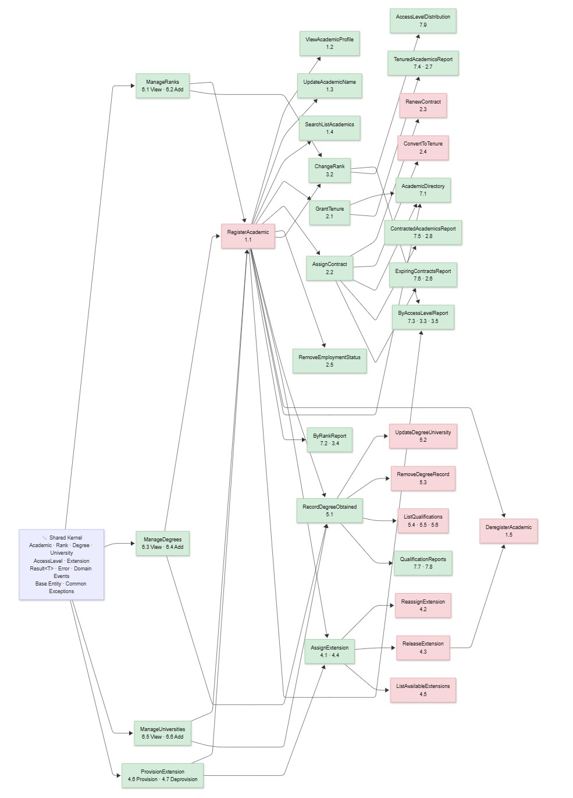

and---
layout: post
title: "AI-Assisted Greenfield Software Development, Part 6: Vertical Slices and Implementation Planning"
date: 2026-03-01
categories: AIAGSD
tags: [vertical-slice, agents, planning, meta-prompts, workflow-modeling, implementation-planning]
excerpt: "Learn how to generate planning artifacts—vertical-slice definitions, workflow models, and dependency diagrams—that guide coordinated slice-by-slice delivery using AI and meta-prompts."
description: "Part 6 of the AIAGSD series shows how to use meta-prompts, custom agents, and AI to generate planning artifacts that bridge architecture into implementation. Includes custom-agent standards, PRD prompts, workflow models, and implementation plans."
image:

---

**TL;DR:** This post defines a vertical-slice implementation pattern and shows how to use meta-prompts and AI agents to generate planning artifacts—custom-agent standards, PRDs, workflow models, and dependency diagrams—that guide slice-by-slice delivery. Read this if you're building a greenfield project and need a structured handoff from planning into execution.

We're moving from architecture into implementation, but first we need a plan that defines tasks, dependencies, and execution order. This post shows how to generate planning artifacts — vertical-slice definitions, Product Requirements Documents (PRDs), workflow models, and dependency diagrams — that create a roadmap for coordinated, predictable slice-by-slice delivery. [See earlier posts in the AIAGSD series for context.](https://blog.pdata.com/AIAGSD1/)

<!--more-->

<figure>
  
  <figcaption>Part 6 bridges planning artifacts into implementation: custom agents guide planning decisions; vertical slices package those decisions into executable, testable increments.</figcaption>
</figure>

To create an implementation plan we need to define tasks, dependencies, and execution order. In a greenfield project, that often starts with vertical-slice definitions: narrow, end-to-end features that can be built and tested independently. To make those slices effective, we need planning artifacts that reduce ambiguity before coding starts: custom-agent standards to guide planning decisions, Product Requirements Document (PRD) prompts to structure requirements, workflow models to identify dependencies, and implementation instructions to govern execution. In this post, I show how to generate those artifacts using meta-prompts and AI agents, creating a clear handoff from architecture into implementation. Along the way we'll create the following artifacts:

| File                                                          | Purpose                                                                                                  |
| ------------------------------------------------------------- | -------------------------------------------------------------------------------------------------------- |
| `create-custom-agents-instructions.prompt.md`                 | Generates custom-agent instruction-file prompts from official GitHub docs                                |
| `custom-agents.instructions.md`                               | Defines repository standards for authoring `.agent.md` profiles                                          |
| `create-product-manager-agent.prompt.md`                      | Generates a Product Manager (PM) persona agent profile with explicit boundaries and evidence standards   |
| `product-manager.agent.md`                                    | Provides the planning-focused PM persona agent used in slice definition workflows                        |
| `create-prd.prompt.md`                                        | Standardizes Product Requirements Document (PRD) generation (problem, goals, non-goals, success metrics) |
| `create-vertical-slice-implementation-instructions.prompt.md` | Generates vertical-slice implementation guidance prompts/instructions                                    |
| `vertical-slice-implementation.instructions.md`               | Encodes practical execution guidance for slice-by-slice implementation                                   |
| `academia-workflows.md`                                       | Captures domain workflows to drive slice coverage and dependency planning                                |
| `academia-implementation-plan.md`                             | Defines implementation sequencing and dependencies with a slice diagram                                  |

In the end we'll have a clear, AI-generated roadmap for vertical-slice delivery that reduces ambiguity, improves consistency, and creates a stronger bridge from planning into execution. Let's dive in.

---

## What are vertical slices?

A vertical slice is a narrow, end-to-end feature that delivers user value and can be built, tested, and deployed independently. Instead of building horizontally (e.g., database → API → UI for the entire system), you build vertically through all layers but only for a small piece of functionality. For example, a "Course Discovery" slice in an academia management system might include:

- A database query to list active courses
- An API endpoint to serve that data
- A UI component to display the course list
- Tests that validate the entire flow

Vertical slices are powerful because they create small, testable increments that can be delivered independently. They also help manage complexity by reducing the scope of each implementation chunk and making dependencies explicit. However, they only work when planning artifacts are precise enough to reduce ambiguity before implementation starts. In this phase, I used prompts to generate role-specific standards and agent definitions so each slice can move from intent to code with fewer interpretation gaps.

### Concrete Example: "Course Discovery" Slice

Here's a minimal vertical slice from the academia system to illustrate the pattern:

**Slice**: Course Discovery (Read-Only)

**Problem**: Registrars need to search for and view active courses before enrollment opens; stakeholders need visibility into what's offered.

**Acceptance Criteria**:

- List all active courses (paginated, 10 per page)
- Filter by department and term
- Show course code, title, instructor, and capacity
- No edit or enrollment; read-only views only

**Minimal Tasks**:

1. Add course search endpoint (filter by department, term, status)
2. Create course list UI component
3. Add course detail modal
4. Wire endpoints to UI
5. Add tests for list, filter, and detail views

**Test**: User can search courses by department "Mathematics", see 5 results, click one, and view full details including instructor and capacity.

This slice is narrow (read-only), end-to-end (DB → API → UI), and testable. It has zero external dependencies and can ship in 2-3 days. It also unblocks downstream slices (e.g., enrollment) that depend on course visibility.

---

## Governance Checkpoint: Planning Artifact Coherence

Before diving into artifact generation, it's worth pausing to validate that the planning artifacts we're about to create work together as a coherent system. A strong planning system requires alignment across four dimensions: governance standards, role boundaries, requirement structure, and implementation guidance.

**The Planning Artifact Stack:**

1. **Agent governance standards** (`custom-agents.instructions.md`) define how planning agents must be scoped, what tools they can access, and what escalation triggers protect against over-automation.
2. **PM agent profile** (`product-manager.agent.md`) applies those standards to a specific planning persona, with explicit boundaries around domain authority (e.g., "Academia Management"), tool constraints (e.g., no `execute`), and evidence standards for prioritization decisions.
3. **Structured PRD prompt** (`create-prd.prompt.md`) ensures every vertical-slice requirement follows a consistent template: problem framing, goals, non-goals, and measurable success metrics.
4. **Implementation instructions** (`vertical-slice-implementation.instructions.md`) translate planning artifacts into executable slice definitions with task breakdown, dependency mapping, and estimation guardrails.

These four layers create a self-reinforcing cycle: standards make agents predictable, the PM agent applies those standards consistently, the PRD prompt ensures requirements are structured, and implementation instructions enforce slicing discipline. Without this coherence, individual slices can drift in scope, priority, and execution rhythm.

**Validation checks before implementation:**

- Does the PM agent govern its own scope? (Yes — the agent profile explicitly constrains it to Academia Management and disables `execute`.)
- Does the PRD structure enforce clarity without over-specification? (Yes — problem, goals, non-goals, metrics require trade-off thinking but allow implementation flexibility.)
- Can implementation instructions reference both governance and PRD artifacts? (Yes — they cite standards and validation checklists tied to both layers.)
- Are escalation triggers clear? (Yes — standards define when to flag political, security, or architectural concerns for human review.)

With these checks in place, we're ready to generate the artifacts themselves.

---

## Creating the Custom-Agents Instruction Prompt

To build a reusable prompt for agent-governance instructions, I submitted this prompt:

```text
using https://docs.github.com/en/copilot/reference/custom-agents-configuration, https://docs.github.com/en/copilot/concepts/agents/coding-agent/about-custom-agents, https://docs.github.com/en/copilot/how-tos/use-copilot-agents/coding-agent/create-custom-agents create a prompt that will create an instruction file for creating agents.
```

[create-custom-agents-instructions.prompt.md](https://github.com/j0hnnymiller/zeus.academia.3b/blob/Part-Six/.github/prompts/create-custom-agents-instructions.prompt.md)

This is a meta-prompt: instead of directly generating an agent profile, it generates a reusable prompt that can produce a full instruction file for agent authors. In practice, we're creating a repeatable tool, not a one-off output.

The meta-prompt is grounded in three official GitHub sources:

- **[Custom agents configuration](https://docs.github.com/en/copilot/reference/custom-agents-configuration)** (property-level reference)
- **[About custom agents](https://docs.github.com/en/copilot/concepts/agents/coding-agent/about-custom-agents)** (conceptual model and where agents run)
- **[Create custom agents](https://docs.github.com/en/copilot/how-tos/use-copilot-agents/coding-agent/create-custom-agents)** (end-to-end creation workflow across GitHub and IDEs)

By anchoring to these docs, the generated output stays aligned with current capabilities and avoids unsupported or environment-specific assumptions. Also, since GitHub is transitioning from chatmodes to agents, specifically referencing the latest agent-focused docs keeps the AI from making outdated assumptions based on outdated training data.

What this prompt produces:

- A parameterized prompt file designed to generate token-optimized `.instructions.md` content
- Input controls for `instruction_filename`, `apply_to`, `agent_scope`, and `include_ide_notes`
- A repeatable workflow for creating agent-governance guidance across repositories

Architecture/workflow impact: this creates a stable generation pattern for agent standards, which improves consistency across slices and reduces prompt drift. Prompt drift is the gradual shift of AI outputs away from the intended scope, constraints, or style over repeated prompt iterations.

### What the generated instruction file should contain

The prompt enforces a practical instruction file structure focused on real authoring tasks:

1. **Purpose and scope** for custom agents and where they run (GitHub.com, IDEs, CLI)
2. **Placement and naming rules** for repository vs organization/enterprise usage
3. **Agent profile schema guidance** for YAML frontmatter (`description`, `tools`, `target`, `mcp-servers`, and related fields)
4. **Tools and Model Context Protocol (MCP) guidance** with least-privilege defaults and namespaced tool examples
5. **Prompt authoring guidance** including role boundaries, constraints, and anti-patterns
6. **Behavior testing guidance** with representative prompts and expected response patterns
7. **Processing and precedence rules** for conflicts, tool behavior, and versioning semantics
8. **Validation checklist** to verify completeness and safety before use
9. **Example profiles** (minimal and scoped) to accelerate adoption

### Why this matters in the vertical-slice workflow

Vertical slices succeed when implementation agents are narrowly scoped, predictable, and testable. This meta-prompt helps enforce those qualities by requiring explicit tool boundaries, escalation triggers, and environment-specific notes. The result is a stronger handoff between planning and implementation: less prompt drift, safer automation, and more consistent outcomes across slices.

---

## Generating the Custom-Agents Instruction File

With the meta-prompt in place, I executed it with repository-specific arguments:

```text
submit the prompt #file:create-custom-agents-instructions.prompt.md with these arguments:
instruction_filename: custom-agents.instructions.md
apply_to: .github/agents/**/*.agent.md
agent_scope: repository
include_ide_notes: true
```

Submitting the prompt with these arguments generates the actual instruction file that defines repository standards for authoring `.agent.md` profiles. The prior step created the generator; this step produces the generated artifact [custom-agents.instructions.md](https://github.com/j0hnnymiller/zeus.academia.3b/blob/Part-Six/.github/instructions/custom-agents.instructions.md)

This is the execution step where the reusable prompt is run with concrete project settings. The first step produced the tool; this step applies it to generate repository-ready standards.

Here is what each argument does in practice:

- `instruction_filename: custom-agents.instructions.md` creates a dedicated standards file focused on custom agent authoring.
- `apply_to: .github/agents/**/*.agent.md` scopes guidance to agent profiles in the repository's agent folder hierarchy.
- `agent_scope: repository` tells the instruction to prioritize repository-level usage and naming conventions.
- `include_ide_notes: true` forces explicit GitHub.com vs IDE behavior notes so authors avoid portability mistakes.

What this prompt produces:

- A concrete repository-scoped instruction file for `.github/agents/**/*.agent.md`
- A standardized authoring contract for custom-agent fields, behavior, and safety
- Explicit environment-difference guidance to prevent GitHub.com/IDE confusion

Architecture/workflow impact: this turns planning guidance into enforceable authoring rules that keep implementation agents consistent across vertical slices.

### What the generated `custom-agents.instructions.md` file adds

The generated instruction file becomes the operational contract for anyone creating `.agent.md` files in the repo, encoding enforced patterns that keep planning agents consistent and safe across vertical slices.

The file is structured around two core enforced patterns. First, **governance and boundaries**: it defines placement rules (`.github/agents/<name>.agent.md`), required YAML fields (`description`, `tools`, `target`, `disable-model-invocation`, `user-invocable`, `mcp-servers`, `metadata`), and least-privilege tool defaults that prevent agents from accessing more authority than their scope requires. Second, **persona integrity**: it specifies how planning agents must declare their skills, escalation triggers (political, security, architectural), and evidence standards so authors, reviewers, and users understand agent limitations before deployment.

The anti-patterns section prevents common drift: agents that claim broad competence without explicit scope notes, agents that attempt to execute code or modify systems without governance approval, profiles missing behavior-test examples, and environment assumptions that don't distinguish GitHub.com from IDE behavior. Integration points include direct references to prior instruction files (so agents follow repository-wide standards), validation checklists that must pass before merge, and example profiles (minimal, scoped persona) that accelerate adoption for new contributors.

### Why this execution step matters

Without this second step, you only have a meta-prompt blueprint. Running it with repository-specific arguments produces the enforceable instruction layer that implementation agents and contributors can follow consistently. That reduces variance between slices and improves reliability as coding work scales.

This execution step moves us closer to an implementation plan by establishing the governance foundation that all subsequent slice work must follow. With clear, enforceable custom-agent standards in place, we can now generate persona agents (like our Product Manager agent) that make slice-definition decisions consistently and predictably. Those governance standards create trust in the planning artifacts—PRDs, workflows, and dependency diagrams—that follow. In other words, without enforcing how planning agents behave, we can't trust the planning outputs they produce. By running the meta-prompt with concrete repository settings, we transform abstract guidance into operational rules that downstream slices can depend on, making the entire planning-to-implementation handoff more reliable and auditable.

---

## Creating the Product-Manager Agent Prompt File

After establishing custom-agent standards, I created a dedicated prompt file for generating a product manager persona agent:

```text
create a prompt file that creates an agent for the product manager persona
```

This generates the [create-product-manager-agent.prompt.md](https://github.com/j0hnnymiller/zeus.academia.3b/blob/Part-Six/.github/prompts/create-product-manager-agent.prompt.md) prompt file. This is a prompt-generation step, not an agent-generation step. The purpose is to produce a reusable authoring prompt that can consistently generate or refine a PM persona agent as requirements evolve.

What this prompt produces:

- A reusable prompt file dedicated to product-manager persona agent creation
- A standardized structure for role scope, behavior boundaries, and expected outputs
- Repeatable generation logic for skills, actions, escalation triggers, and evidence standards

Architecture/workflow impact: this adds a stable bridge between custom-agent governance and persona-specific implementation. Instead of hand-authoring PM agents each time, we can reuse a single prompt artifact to create consistent planning agents across slices.

This meta-prompt moves us closer to a detailed implementation plan by ensuring that requirements and priorities are framed consistently across all slices. When every vertical slice goes through the same PM agent with the same boundaries and evidence standards, the resulting PRDs are comparable, dependencies become clearer, and sequencing decisions gain more confidence. The PM agent becomes the filter that converts domain facts and workflows into requirement statements that follow a predictable structure—one that implementation agents can parse reliably during coding tasks. Without this standardized persona layer, each slice's requirements would be slightly different in shape and rigor, making it harder to build sequencing logic and harder to trust dependencies between slices.

---

## Generating the Product-Manager Agent File

With the PM-agent prompt file in place, I submitted it with concrete arguments to generate the actual agent profile:

```text
submit the #file:create-product-manager-agent.prompt.md prompt file with these arguments:
agent_filename: product-manager.agent.md
target: omit
include_execute_tool: false
scope_note: The universe of discourse is Academia Management
```

The generates the [product-manager.agent.md](https://github.com/j0hnnymiller/zeus.academia.3b/blob/Part-Six/.github/agents/product-manager.agent.md) custom agent.

This is the execution step that converts the reusable PM-agent prompt into a concrete, repository-ready persona agent file. In other words, the prior step created the generator, and this step produced the generated artifact.

What this prompt produces:

- A concrete `product-manager.agent.md` profile file for planning and requirement definition workflows
- A scoped agent configuration that omits `target` so it remains broadly usable
- A safer default tool posture by explicitly disabling `execute`
- Domain-constrained behavior through the scope note: "The universe of discourse is Academia Management"

Architecture/workflow impact: this generated agent creates a reliable planning handoff artifact for vertical slices. It improves consistency in requirement framing, prioritization rationale, and acceptance-criteria definition before implementation starts.

With the PM agent in place, we now have a governance-compliant persona that can drive slice definition decisions predictably. This moves us closer to an implementation plan because every vertical slice will be evaluated through the same lens—the same persona, with the same boundaries, and the same evidence standards for prioritization and acceptance criteria. Instead of each slice being defined ad hoc or with different planning rigor, the PM agent becomes the quality filter that translates domain workflows into structured requirement documents (PRDs) that implementation agents can parse reliably. This consistency is critical for sequencing: when slices use a common planning format and persona, dependencies become clearer, handoff quality improves, and we can build a dependency diagram that reflects actual task sequencing rather than guesses. The PM agent is the bridge that connects governance standards (from our instruction files) into executable slice definitions that implementation can depend on.

---

## Creating the Structured PRD Prompt File

To support repeatable requirements definition, I used the Product Manager custom agent to generate a dedicated PRD prompt file with this request:

```text
create a new prompt file containing the steps to create a structured PRD with problem, goals, non-goals, and success metrics
```

The is is another prompt-generation step that strengthens planning quality before implementation begins. Instead of drafting PRDs ad hoc, we now have a reusable prompt artifact that drives a consistent PRD structure across slices.

This prompt generates the [create-prd.prompt.md](https://github.com/j0hnnymiller/zeus.academia.3b/blob/Part-Six/.github/prompts/create-prd.prompt.md) file :

- A reusable PRD prompt file with explicit section requirements
- A repeatable structure for problem framing, goals, non-goals, and measurable success criteria
- A stronger planning handoff artifact that can be reviewed before coding starts

Architecture/workflow impact: this improves requirement clarity and alignment at the slice level. By standardizing PRD output shape, it reduces ambiguity for downstream implementation prompts and makes acceptance discussions more concrete.

A structured PRD prompt ensures that every vertical slice—regardless of complexity or domain—follows the same requirement format. This consistency is essential for building an implementation plan because sequencing and dependency decisions depend on comparable requirement definitions. When slices define problems, goals, non-goals, and success metrics in the same shape, the implementation plan can reliably identify which slices block others (through non-goals or success criteria constraints), estimate relative effort more fairly, and sequence work with higher confidence. Without this standardization, slices would have inconsistent requirement depth, making dependencies ambiguous and forcing implementation teams to re-interpret requirements slice-by-slice. The structured PRD becomes the input layer for sequencing logic: clearer, more comparable requirements lead to more accurate dependency maps, which lead to more predictable implementation schedules.

---

## Creating the Vertical-Slice Instruction-Prompt Generator

I also generated a refined meta-prompt focused on producing instruction-file prompts for vertical-slice implementation:

```text
create a new prompt file, that creates an instruction file, that provides guidance for implementing applications in vertical slices
```

[create-vertical-slice-implementation-instructions.prompt.md](https://github.com/j0hnnymiller/zeus.academia.3b/blob/Part-Six/.github/prompts/create-vertical-slice-implementation-instructions.prompt.md)

This request is one level more specific than a general implementation prompt: it creates a prompt artifact whose job is to generate instruction files for vertical-slice execution. That distinction helps keep planning guidance and implementation governance synchronized as the project grows.

What this prompt produces:

- A reusable prompt file that can generate vertical-slice implementation instruction files
- A repeatable pattern for defining slice boundaries, sequencing, and execution constraints
- A governance-friendly path for scaling slice guidance without rewriting rules by hand

Architecture/workflow impact: this improves consistency at the instruction-file layer, not just the prompt layer. It makes vertical-slice implementation guidance easier to regenerate, version, and apply across teams.

By creating a meta-prompt that generates instruction files for vertical-slice execution, we establish a reusable governance artifact that can guide coding work across all slices consistently. Instead of hand-authoring implementation guidance for each slice from scratch, this prompt factory ensures every slice follows the same execution discipline—the same boundary definitions, sequencing rules, and guard rails. That consistency is essential for building a reliable implementation plan: when all slices share the same instruction-file standards, dependencies become clearer, handoff quality improves, and the overall timeline becomes more predictable. This meta-prompt layer bridges the gap between planning (which defines what to build) and execution (which defines how to build it), creating the enforcement mechanism that keeps implementation work aligned with the workflows and PRDs we've already defined.

---

## Generating the Vertical-Slice Implementation Instruction File

With the vertical-slice instruction-prompt generator in place, I submitted it directly:

```text
submit #file:create-vertical-slice-implementation-instructions.prompt.md
```

[vertical-slice-implementation.instructions.md](https://github.com/j0hnnymiller/zeus.academia.3b/blob/Part-Six/.github/instructions/vertical-slice-implementation.instructions.md)

This is the execution step that produces the instruction file used to guide slice-by-slice implementation work. The previous step created the generator prompt; this step produced the concrete implementation-governance artifact.

What this prompt produces:

- A concrete `vertical-slice-implementation.instructions.md` standards file
- Practical guidance for sequencing, slice boundaries, and implementation guardrails
- A reusable instruction artifact that can be loaded during coding tasks

Architecture/workflow impact: this makes vertical-slice execution rules explicit and reusable during implementation. It reduces interpretation drift between planning and coding phases and improves consistency across slices.

With this instruction file in place, we now have the enforcement layer that bridges planning decisions into coding discipline. The file defines how slices are bounded, sequenced, and executed consistently across all implementation work. Instead of letting teams interpret slice requirements differently, these instructions establish a shared execution contract that keeps all coding work aligned. This is critical for predictable delivery: when every implementation team follows the same guidance for slice boundaries, dependency handling, and task breakdown, the overall timeline becomes more reliable and the actual delivery sequence matches the planned sequence. The instruction file becomes the quality gate that prevents implementation drift—the mechanism that ensures that the workflows, PRDs, and dependency diagrams we generated earlier actually translate into executable code in the right order, with the right boundaries, and at predictable velocity.

---

## Generating the Workflow Model Inventory

To make slice planning concrete, I generated a workflow inventory from the domain facts:

```text
given these #file:academia.txt facts create a comprehensive list, in markdown, of the workflows needed for the zeus.academia management system. put the file in the models/workflows folder
```

[academia-workflows.md](https://github.com/j0hnnymiller/zeus.academia.3b/blob/Part-Six/.github/models/workflows/academia-workflows.md)

This step converts domain facts into an implementation-facing workflow catalog. Instead of inferring workflows ad hoc during coding, the team gets an explicit markdown inventory that can be mapped to vertical slices and prioritized systematically.

What this prompt produces:

- A comprehensive workflow list in markdown format
- A shared modeling artifact that ties domain facts to implementation planning
- A slice-planning reference that helps identify dependencies, handoffs, and coverage gaps

Architecture/workflow impact: this improves planning fidelity before coding begins. By grounding slices in an explicit workflow model, it reduces missed paths, strengthens sequencing decisions, and improves end-to-end completeness.

This workflow inventory is a critical input to building the implementation plan because it establishes the complete picture of what the system must do, independent of how it's sliced or sequenced. Instead of guessing at coverage or accidentally omitting a workflow because it wasn't top-of-mind, the team now has a definitive artifact that shows every user interaction pattern, data transformation, and cross-system handoff. When we map these workflows to vertical slices in the next step, this inventory becomes the reference layer that ensures no work falls through the cracks and every slice contributes meaningfully to system completeness. It also clarifies which slices can be built independently and which have hidden dependencies—dependencies that will show up in our final dependency diagram and inform execution sequencing. Without this workflow catalog, the implementation plan would be based on intuition; with it, the plan is grounded in observable, reviewable domain facts that the entire team can agree on before any code is written.

---

## Generating the Workflow-Based Implementation Plan

With workflow and rules artifacts in place, I generated the implementation plan with this request:

```text
create an implementation plan that implements the workflows #file:academia-workflows.md and the business rules #file:academia.txt. include a portrait mermaid diagram that shows the slices and their dependencies
```

[academia-implementation-plan.md](https://github.com/j0hnnymiller/zeus.academia.3b/blob/Part-Six/.github/models/workflows/academia-implementation-plan.md)

This step converts workflow modeling into an executable delivery plan. Instead of planning slices from memory, it uses explicit workflow and rule inputs and adds a visual dependency model to make sequencing decisions easier to review.

What this prompt produces:

- A markdown implementation plan grounded in `academia-workflows.md` and `academia.txt`
- A slice-oriented execution roadmap with dependencies and ordering guidance
- A portrait Mermaid diagram showing slice dependencies for planning clarity

Architecture/workflow impact: this creates a concrete bridge from domain workflows to implementation sequencing. It improves handoff quality, makes dependencies explicit, and supports more predictable vertical-slice delivery.

### Reading the Slice Dependency Diagram

The generated implementation plan includes a visual diagram showing how slices depend on each other. Here's an example:

<figure>
  
  <figcaption>Slice dependency diagram: boxes are slices, arrows point to dependencies. Build bottom-up (no-dependency slices first) so each new slice can be integrated and tested immediately.</figcaption>
</figure>

**How to read it:**

- **Boxes** = vertical slices
- **Arrows** = "depends on" relationships (arrow points to the slice being depended upon)
- **Top-to-bottom flow** = suggested build order (start with slices that have no dependencies, build downward)

In the example:

1. "Course Discovery" has no dependencies → build first
2. "Enrollment", "Waitlist", and "Cancellation" all depend on "Course Discovery" → build after
3. "Grade Posting" and "Transcript" depend on "Enrollment" → build last

This ordering ensures each slice can run tests end-to-end and be deployed (or held for later) without waiting for unrelated work.

---

## Checking the Context

Because these changes expand `.github` governance artifacts (prompts and agent standards), I run a context review pass before moving forward. This helps catch overlaps, contradictions, and scope conflicts before they leak into implementation prompts.

## What's Next?

We'll finish this phase by creating implementation prompts that guide AI agents through coding work while keeping generated output aligned with our technology-specific instruction files and architectural vision. In the next step, I'll use the planning and persona-agent outputs to define implementation slices with clear dependencies and acceptance criteria. The goal is to move from governance-compliant planning into execution prompts that drive coding tasks with minimal ambiguity.

If you'd like to explore the files or follow along with your own implementation, everything is available in the [Academia GitHub](https://github.com/j0hnnymiller/zeus.academia.3b) repository. Fork it, experiment, and adapt it to your own workflow.

---

## Feedback Loop

Feedback is always welcome. Send your thoughts to **AIP@pdata.com**.

---

## Disclaimer

AI contributed to the writing of this post, but humans reviewed it, refined it, enhanced it, and gave it soul.

Prompts:

- Expand on this post with descriptions of this prompt: "using (https://docs.github.com/en/copilot/reference/custom-agents-configuration), https://docs.github.com/en/copilot/concepts/agents/coding-agent/about-custom-agents, https://docs.github.com/en/copilot/how-tos/use-copilot-agents/coding-agent/create-custom-agents create a prompt that will create an instruction file for creating agents" and the file "https://github.com/j0hnnymiller/zeus.academia.3b/blob/Part-Six/.github/prompts/create-custom-agents-instructions.prompt.md" created by the prompt
- Expand this post with a description of this prompt: "Prompt: submit this prompt #file:create-custom-agents-instructions.prompt.md with these arguments:
  instruction\*filename: custom-agents.instructions.md
  apply_to: .github/agents/\*\*/\_.agent.md
  agent_scope: repository
  include_ide_notes: true" and the file "https://github.com/j0hnnymiller/zeus.academia.3b/blob/Part-Six/.github/instructions/custom-agents.instructions.md" created by the prompt
- Add a section to this post with a description of this prompt: "create a prompt file that creates an agent for the product manager persona" and the file "https://github.com/j0hnnymiller/zeus.academia.3b/blob/Part-Six/.github/prompts/create-product-manager-agent.prompt.md" created by the prompt
- Add a section to this post with a description of this prompt: "submit the #file:create-product-manager-agent.prompt.md prompt file with these arguments:
  agent_filename: product-manager.agent.md
  target: omit
  include_execute_tool: false
  scope_note: The universe of discourse is Academia Management" and the file "https://github.com/j0hnnymiller/zeus.academia.3b/blob/Part-Six/.github/agents/product-manager.agent.md" created by the prompt
- Add a section to this post with a description of this prompt: "create a new prompt file containing the steps to create a structured PRD with problem, goals, non-goals, and success metrics" and the file "https://github.com/j0hnnymiller/zeus.academia.3b/blob/Part-Six/.github/prompts/create-prd.prompt.md" created by the prompt
- Add a section to this post with a description of this prompt: "create a new prompt file containing guidance for implementing applications in vertical slices" and the file "https://github.com/j0hnnymiller/zeus.academia.3b/blob/Part-Six/.github/prompts/create-vertical-slice-implementation-instructions.prompt.md" created by the prompt
- Add a section to this post with a description of this prompt: "create a new prompt file, that creates an instruction file, that provides guidance for implementing applications in vertical slices" and the file "https://github.com/j0hnnymiller/zeus.academia.3b/blob/Part-Six/.github/prompts/create-vertical-slice-implementation-instructions.prompt.md" created by the prompt
- Add a section to this post with a description of this prompt: "submit #file:create-vertical-slice-implementation-instructions.prompt.md" and the file "https://github.com/j0hnnymiller/zeus.academia.3b/blob/Part-Six/.github/instructions/vertical-slice-implementation.instructions.md" created by the prompt
- Add a section to this post with a description of this prompt: "given these #file:academia.txt facts create a comprehensive list, in markdown, of the workflows needed for the zeus.academia management system. put the file in the models/workflows folder" and the file "https://github.com/j0hnnymiller/zeus.academia.3b/blob/Part-Six/.github/models/workflows/academia-workflows.md" created by the prompt
- Add a section to this post with a description of this prompt: "create an implementation plan that implements the workflows #file:academia-workflows.md and the business rules #file:academia.txt. include a portrait mermaid diagram that shows the slices and their dependencies" and the file "https://github.com/j0hnnymiller/zeus.academia.3b/blob/Part-Six/.github/models/workflows/academia-implementation-plan.md" created by the prompt
- Insert a governance checkpoint: After the vertical-slice introduction, add a section validating that the planning artifacts (agent standards, agent profiles, PRD template, and implementation instructions) form a coherent system
- Refactor artifact summaries: Convert feature lists to thesis-first paragraphs where appropriate
- Add a definition of prompt drift
