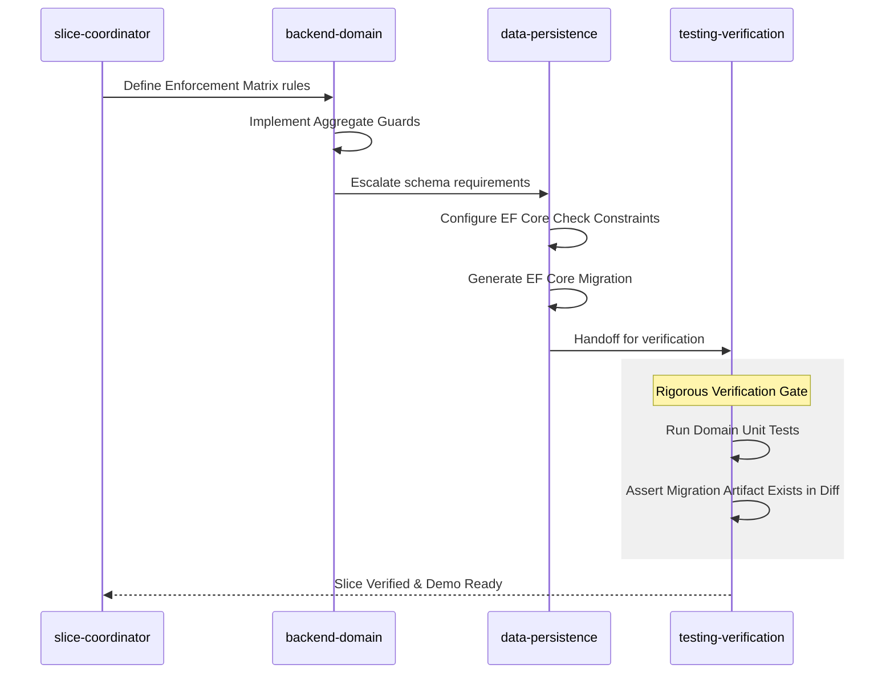

This is the point where the AIAGSD workflow has to prove it can survive contact with real implementation. Up to now, the series has focused on requirements, scaffolding, governance, architecture, workflow models, and implementation prompts. In Part 8, I move from planning artifacts into the first bounded delivery wave and show what the first real implementation work taught us: passing unit tests is not enough if the database can still accept invalid state.

<!--more-->

<figure>
  
  <figcaption>The first implementation wave should not just validate domain logic. It should prove that critical invariants survive direct writes, migrations, and downstream slice reuse.</figcaption>
</figure>

This is the eighth post in the series on AI-assisted greenfield software development. It builds on <a href="https://www.codemag.com/blog/AIPractitioner/AIAGSD1" target="_blank">Part 1: Business Requirements</a> and the subsequent posts in the series. If you have not read the earlier posts, start there first, because Part 8 assumes the repository already has prompts, instruction files, agent roles, provenance rules, and a dependency-aware implementation plan.

Part 7 ended with a full set of implementation prompts and agent handoffs, but a prompt library is only useful if it produces disciplined code when implementation begins. The first test is not a flashy feature. It is the foundation that the rest of the application will trust. That means locking down the shared domain rules and the canonical reference data before registration, lifecycle actions, reporting, or richer user workflows are allowed to build on top of them.

What changed during this first implementation wave was my standard for evidence. The early slices exposed a gap between code-level correctness and durable system integrity. An aggregate can guard state perfectly, a unit test can pass, and an AI verifier can still be wrong if the underlying schema does not enforce the same invariant. Once I hit that realization, Part 8 stopped being just about implementing foundational slices and became about enforcing them in a way that survives real-world paths through the system.

## Why the First Slices Matter

The earliest slices in a vertical-slice plan carry more architectural weight than their scope suggests. They do not usually produce the most visible business outcomes, but they define the invariants, data contracts, and canonical sources of truth that every later slice will consume. If those first slices drift, the rest of the backlog inherits that instability and the AI starts compensating with local convenience logic instead of following a shared model.

That is why I started with the Shared Kernel and the first reference-data slices instead of jumping straight to registration or profile management. The point of this wave is to reduce the number of assumptions available to the model. Once rank codes, degree catalogs, university catalogs, extension rules, and shared domain contracts are explicit and testable, the downstream slices have a much tighter path to follow.

The opening implementation wave focuses on this dependency chain:

| Slice                     | Purpose                                                                                             | Why it comes first                                                           |
| ------------------------- | --------------------------------------------------------------------------------------------------- | ---------------------------------------------------------------------------- |
| EP-0-1 Shared Kernel      | Establish shared domain primitives, invariants, result/error contracts, and domain-event boundaries | Every later slice depends on these core rules                                |
| EP-1-1 ManageRanks        | Define the canonical rank set and its access-level mapping                                          | Registration and reporting must not invent rank semantics                    |
| EP-1-2 ManageDegrees      | Create the degree catalog used by qualification workflows                                           | Registration and qualification slices depend on stable degree references     |
| EP-1-3 ManageUniversities | Create the university catalog used by qualification workflows                                       | Qualification rules need one approved source of university data              |
| EP-1-4 ProvisionExtension | Manage extension inventory and availability rules                                                   | Registration and reassignment flows depend on unique, provisioned extensions |

None of these slices is exciting on its own. Together, they turn the rest of the implementation plan from a loose sequence into a governed dependency chain.

The crucial lesson is that foundational slices do not just need correct behavior. They need durable enforcement. If a core rule can be bypassed by an administrative script, a bulk import, a direct SQL operation, or a race that avoids the intended domain path, then the system is not actually protected. It is just well-behaved under ideal conditions.

## Beyond Unit Tests: Durable Invariants or Illusions

We have all seen this failure mode. The unit tests pass, the aggregate guards its state, and the AI assistant confidently marks the slice as verified. But that confidence becomes fragile when persistence verification relies on convenience shortcuts instead of deployment-grade artifacts.

In Zeus Academia, that weakness showed up most clearly around rules such as employment XOR. An academic can be tenured or contracted, but never both. A domain model can enforce that invariant in memory, and a unit test can prove that the aggregate rejects invalid transitions. That is useful, but it is not enough.

If the database schema does not enforce the same rule, the system is still vulnerable. A bypassed code path can insert contradictory rows. A migration can fail to carry the intended constraint into an existing environment. A verifier can mark the slice complete based on code that was never backed by durable schema evidence. That is not integrity. It is optimism.

## Why Before How: The Illusion of `EnsureCreated()`

Previously, the verification flow for persistence-heavy slices was too trusting. If a slice introduced an invariant, the AI would often prove the aggregate logic, run a narrow persistence test, and treat the result as enough evidence to sign off. In many cases that meant leaning on EF Core's `EnsureCreated()` to stand up a disposable database, validate mappings, and move on.

The problem is that `EnsureCreated()` does not prove migration readiness. It does not show that a `CHECK` constraint will be generated, reviewed, committed, and applied safely to a living schema. It does not demonstrate that indexes or uniqueness constraints exist as durable deployment artifacts. It can tell you that the model maps. It cannot tell you that the rule survives reality.

That distinction forced a workflow change. For slices that introduce schema-level guarantees, the standard of evidence can no longer stop at unit tests or mapping tests. The implementation has to produce actual migration artifacts and the verification flow has to prove they exist.

## The Migration Artifact Mandate

That change now shows up directly in the agent guidance for `data-persistence`, `testing-verification`, and `slice-verifier`. These agents are no longer allowed to treat schema-changing work as complete based solely on code-level checks.

The new expectation is straightforward:

- No `EnsureCreated()` shortcuts for schema-changing slices.
- Committed migration artifacts are required when a slice adds uniqueness rules, check constraints, or meaningful index changes.
- Business rules that must survive direct writes or concurrent paths need explicit persistence backing, such as `.HasCheckConstraint()` mappings in EF Core.

This does two things. First, it forces the persistence work into the same definition of done as the domain logic. Second, it gives the verification agents something objective to inspect in the diff instead of relying on optimistic interpretation.

## The Enforcement Matrix

Once the persistence burden became explicit, the next problem was ambiguity. If a rule belongs in more than one layer, an AI agent can easily under-enforce it or assume another role will pick it up later. To remove that ambiguity, I updated the implementation-prompt guidance to require an Enforcement Matrix for non-trivial rules.

Instead of asking the model to infer where an invariant belongs, the prompt names the canonical layer, whether persistence backing is required, and what evidence counts as verification.

| Rule                 | Canonical layer                  | Persistence backing required                                     | Verification evidence                 |
| -------------------- | -------------------------------- | ---------------------------------------------------------------- | ------------------------------------- |
| Employment XOR       | Aggregate + database             | Yes, CHECK constraint                                            | Unit test + schema or migration proof |
| Extension uniqueness | Aggregate + database             | Yes, unique index/constraint                                     | Handler test + migration proof        |
| Rank code validity   | Domain + reference-data boundary | Usually no separate CHECK if canonical set is enforced elsewhere | Validator or integration proof        |

This matrix sharpens agent responsibilities. The `backend-domain` agent owns the aggregate and handler behavior. The `data-persistence` agent owns the EF Core configuration and migration implications. The verification roles know what evidence they have to demand before a slice can be closed.

## Starting With the Shared Kernel

The Shared Kernel is where the implementation plan stops being abstract. This slice is the operational contract for the domain. It defines the primitives that later commands and queries will rely on, the invariants that handlers are not allowed to bypass, and the shared error/result patterns that make behavior consistent across the solution.

For this series, the Shared Kernel matters because it gives the AI fewer places to improvise. Instead of rediscovering domain rules slice by slice, the model can rely on an explicit representation of concepts such as rank, access level, academic qualifications, employment-state constraints, and extension uniqueness. That makes the later slices smaller because they can consume stable behavior instead of recreating it.

Three principles guided this first implementation step:

- Shared rules belong in the model, not in scattered handlers or UI branches.
- Aggregate and value-object invariants must be observable in tests before dependent slices are allowed to proceed.
- Result and error contracts should be stable enough that downstream slices can compose them without redefining failure semantics.

The Shared Kernel also acts as a pressure test for the instruction files created in earlier posts. If architecture guidance, process rules, and implementation prompts are clear, the AI should be able to produce a small but rigorous first slice without leaking unrelated feature behavior into the solution. If the slice sprawls, duplicates logic, or weakens invariants, that is a sign the guidance still has holes.

## Building the Reference-Data Foundation

Once the shared model is in place, the next priority is the set of reference-data slices that make later business workflows deterministic. Registration should not be able to invent a rank. Qualification management should not accept degrees or universities from ad hoc sources. Extension assignment should not guess whether an extension exists or is available. Those concerns belong in dedicated slices with their own acceptance criteria.

This is where the vertical-slice model pays off. Each reference-data slice stays narrow, but it still covers the full delivery contract: domain rules, persistence behavior, API surface, verification, and demonstration. Instead of treating lookup tables as incidental setup, the implementation prompts make them first-class capabilities with explicit boundaries.

In practice, each of these slices protects a different part of the system from drift:

- ManageRanks protects the access-level model from becoming duplicated business logic.
- ManageDegrees and ManageUniversities establish the canonical lookup sources for qualification workflows.
- ProvisionExtension protects the one-to-one assignment model before registration and lifecycle operations begin.

This matters for AI-assisted delivery because foundational reference data is where convenience-based shortcuts often appear. A model under-specified on these points will happily hardcode values, embed translation logic in handlers, or treat seed data as an ungoverned implementation detail. By isolating these rules into bounded slices, I can make the correct behavior explicit and testable before any downstream feature has a chance to depend on the wrong assumptions.

## Smarter Agent Handoffs

The persistence changes also exposed a second weakness: vague handoffs between agents. A flat list of handoff targets tells the AI where work might go next, but not why the handoff is happening or what kind of contribution the receiving agent is supposed to make.

That is why the handoff schema was upgraded from simple lists to structured objects. Instead of saying only that a prompt may hand off to `backend-domain` or `slice-coordinator`, the handoff now carries a label, a specific agent name, and a short prompt explaining the purpose of the escalation.

This change sounds small, but it improves the execution model in two ways. It reduces hallucinated delegation by making the intent of the handoff explicit, and it gives each receiving agent better context before it starts work. In a multi-agent workflow, that is the difference between coordination and just passing responsibility around.

## Turning Implementation Prompts Into Execution Work

The implementation prompts from Part 7 were designed to do more than describe scope. They define agent roles, validation steps, handoff points, and demonstration expectations. Part 8 is where that structure becomes useful, because the first implementation wave needs coordination as much as it needs code.

The working pattern is straightforward:

1. Start with the slice prompt and confirm dependencies.
2. Identify which agent roles own the work, usually slice coordination, domain implementation, persistence support, and verification.
3. Implement only the bounded slice behavior required by the prompt.
4. Run the narrowest meaningful verification before moving to adjacent work.
5. Capture evidence and residual risks before handing the slice off.

That sequence sounds procedural, but its real purpose is architectural discipline. It prevents the AI from using a foundational slice as an excuse to reach ahead into future features. The more dependency-heavy the backlog becomes, the more important it is to prove that each slice is complete on its own terms before the next one starts to consume it.

In practical terms, the verification flow for a persistence-sensitive slice now looks more like this:

1. The slice coordinator confirms whether the prompt contains non-trivial rules that need an Enforcement Matrix.
2. The backend-domain agent implements the aggregate guards, validators, contracts, and bounded behavior.
3. The data-persistence agent decides whether the rule requires database backing and, if it does, adds the EF Core configuration and migration artifact.
4. The testing-verification role runs narrow behavioral checks and also looks for durable evidence in the diff, especially the migration artifact.
5. The slice-verifier blocks completion if the slice claims schema enforcement but only proves in-memory behavior.

That is the shift Part 8 needed to capture. The first implementation wave is where the AI workflow stopped treating persistence as a secondary detail and started treating it as part of the contract.

## What the First Implementation Wave Proves

The first implementation wave is not about maximizing visible functionality. It is about demonstrating that the delivery system created in the earlier posts can produce dependable results when the work becomes concrete. If the workflow is sound, these early slices should show several things clearly.

First, the instruction files and prompts should reduce ambiguity instead of just documenting it. The AI should have a clear place to look for architecture rules, scope boundaries, and quality expectations. Second, the agent boundaries should improve delivery rather than add ceremony. Coordinating domain work, persistence behavior, and verification as distinct concerns should make slices easier to reason about. Third, the validation loop should stay narrow and evidence-based. Foundational slices do not need broad end-to-end theatrics; they need targeted proof that their invariants hold at both the code and schema layers.

That is the real threshold for Part 8. If the Shared Kernel and reference-data slices can be implemented cleanly, verified narrowly, backed by durable persistence evidence, and consumed without reinterpretation, then the series is ready to move into the first richer business workflows. If they cannot, the right move is not to push ahead. It is to tighten the guidance until the foundation is trustworthy.

For developers, this changes the workflow in three concrete ways:

1. You should expect the AI to push for database-backed constraints on critical invariants instead of stopping at aggregate logic.
2. You should expect migration artifacts to become part of slice completion, not an optional follow-up.
3. You should expect newer implementation prompts to make enforcement ownership more explicit, especially where domain rules and persistence rules must line up.

## What's Next?

With the foundational slices in place, the next logical step is the first feature slice that consumes them end to end: academic registration. That is where the series can test whether the shared kernel, reference catalogs, extension inventory rules, migration requirements, and verification workflow actually combine into a coherent implementation path. In the next post, I'll use that dependency chain to move from foundations into the first true business-facing workflow.

If you're following along in your own repository, resist the urge to skip these early slices. They are where your AI delivery system either earns trust or accumulates debt.

## Feedback Loop

Feedback is always welcome. Send your thoughts to <a href="mailto:john.miller@codemag.com">john.miller@codemag.com</a>.

## Disclaimer

AI contributed to the writing of this post, but humans reviewed it, refined it, enhanced it, and gave it soul.

Prompts:

- Create a blog post for AIAGSD Part 8 that explains why foundational slices need durable database invariants, migration-centric verification, and explicit multi-agent handoffs.
- Summarize this file in one paragraph.
- Turn the foundational slice set into a dependency-aware implementation checklist for a human reviewer.
