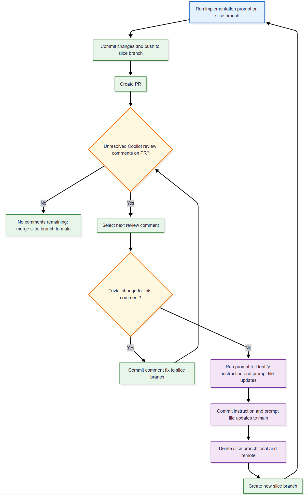

This is the tenth post in the AIAGSD series, and it focuses on a deceptively simple idea: a reference-data slice can become the contract that every later workflow depends on. I used the ManageDegrees implementation prompt as a guide for that contract, and the lesson is clear. If the catalog is not defined carefully, registration, qualification, and reporting all inherit ambiguity.

This post continues the series from [Part 9](https://blog.pdata.com/AIAGSD9/), and it assumes the repository already has the shared-kernel and foundational-slice patterns from earlier posts. It explains how the prompt structures the slice, why its sequence matters, and what makes the implementation durable rather than merely functional.

<!--more-->


## But first, rework.

In review the implementation of the ManageRanks slice, I noticed that the folder structure did not conform to the vertical-slice pattern. Files were organized by layers and not features with the Shared Kernel and Manage Ranks implementations in a `backend` folder. That was a minor oversight, but it was enough to make the slice harder to reason about. I added instructions to emphasize the vertical-slice implementation instructions.

I then deleted the Part-Eight (Shared Kernel) and Part-Nine (Manage Ranks) slices from the repository and proceeded to re-implement using the following rework process. The goal was to minimize the review comments by having Copilot generate code that would pass a review.

The rework loop below shows how I handle implementation, pull request review, and branch hygiene for each slice.



The prompt I used to update the instruction files and prompt files is something like:

> Review the comments on PR nn and propose changes to the .github files to keep from generating code that fails review. If implementation prompt generation instructions are changed, review the implementation prompts for needed changes as well.

For the Shared Kernel slice, this required many iterations of the rework loop to get the instructions to a point where the implementation prompts would produce code that passed the Copilot review. These were mostly to fill in gaps in the instructions and to clarify the prompt. If you look at the closed pull requests, you'll see review findings and if you look at the instruction and prompt file changes committed to main, you'll see how the instructions and prompt files evolved to produce code that passed review.

The ManageRanks slice was simpler, but it still required a few iterations to get the implementation to pass review. The ManageDegrees slice was the simplest of all, and it passed review on the first attempt. This demonstrates that value of updating the instructions and prompt files to produce code that passes review rather than making the changes directly to the slice implementation.

## Why The `ManageDegrees` Slice Matters

The `ep-1-2-manage-degrees-implementation.prompt.md` prompt treats `ManageDegrees` as infrastructure rather than a feature-rich business workflow. That distinction matters because academic systems become brittle when degree values are allowed to drift across screens, APIs, and reports.

When degree values are entered as free text, teams usually end up with duplicate variants of the same concept, inconsistent filters, and validation rules that are impossible to enforce consistently. By introducing a canonical degree catalog first, later slices can validate against known values instead of treating degrees as user-authored strings.

## What the Prompt Keeps in Scope

The implementation prompt keeps the slice intentionally narrow. That is a strength, not a limitation.

In scope:

- add degree records,
- list degree records,
- enforce uniqueness at both application and persistence layers,
- verify behavior end to end.

Out of scope:

- assigning qualifications to academics,
- university relationships,
- reporting.

That boundary protects delivery speed and prevents this slice from becoming a dumping ground for adjacent concerns. I would treat that scope discipline as one of the most important design lessons in the prompt.

## How the Workflow Is Sequenced

The prompt enforces a sequence that mirrors good vertical-slice discipline. It does not jump straight into persistence or endpoint wiring. Instead, it starts by clarifying where the canonical catalog lives and how the slice will expose it.

### 1. Confirm storage and route shape first

Before coding, the prompt asks for one canonical storage location and one consistent route shape. That prevents the implementation from accidentally building handlers around the wrong aggregate, the wrong table, or a temporary fixture.

### 2. Implement add behavior

The second step builds the `AddDegree` flow: validator, handler, response contract, endpoint, and mapping. The acceptance gate is simple and useful. Valid records persist, and duplicates do not.

### 3. Implement list behavior

The third step adds the `ListDegrees` query flow and returns stable, predictable records for downstream lookup scenarios. "Stable" here means deterministic ordering and shape so that later slices and tests do not break because the returned payload changed unexpectedly.

### 4. Verify end to end

The final step requires validator, handler, and integration coverage. If the uniqueness schema changes, a migration artifact is part of the implementation contract. That keeps the persistence guarantee visible and reviewable.

## Why Uniqueness Is the Real Quality Gate

One of the best parts of this prompt is that it treats validation and persistence as separate enforcement layers rather than interchangeable ones.

It requires both application-level duplicate prevention and database-level uniqueness constraints. The first gives fast feedback to the caller. The second protects the system even when a future code path bypasses the endpoint or a retry causes duplicate work to be attempted.

That combination is what makes the slice trustworthy for later workflows. A canonical catalog is only valuable if it is impossible to corrupt silently.

The implementation strategy is easiest to understand when you split the responsibilities across layers:

| Layer       | Responsibility                              | Why it matters                                                 |
| ----------- | ------------------------------------------- | -------------------------------------------------------------- |
| Application | Reject duplicates before they reach storage | Gives users immediate feedback and avoids unnecessary writes   |
| Persistence | Enforce uniqueness in the database          | Protects the system against bypasses, retries, and bad imports |
| Tests       | Prove both behaviors end to end             | Makes the invariant visible to future contributors             |

That layered approach is what turns a small CRUD-style slice into a durable architectural foundation.

## What the Acceptance Criteria Promise

The acceptance criteria are practical and integration-oriented. They define what the slice must guarantee for downstream features:

- a single canonical record per degree code,
- duplicate inserts that fail cleanly,
- list output that remains stable for downstream resolution,
- validation and persistence rules that align,
- tests that cover success, duplicate, and listing behavior.

Those criteria are not just testing goals. They are compatibility promises for future registration and qualification slices. In other words, the slice is not only proving that it works once; it is proving that the contract will remain dependable as the system grows.

## Implementation Takeaways

The most useful lesson from this prompt is that a reference-data slice should be built like a contract, not like an isolated feature. The implementation should preserve a single source of truth, keep the scope narrow, and make the invariant obvious to anyone who touches the code later.

That means a few practical habits matter:

- keep degree management focused on catalog behavior and not on qualification rules,
- use validation to protect the user experience and the database to protect the system,
- expose stable list responses so downstream slices can depend on them without reinterpreting the shape,
- treat migration artifacts as part of the implementation, not as a side note,
- prove the rules with tests that describe the business behavior, not just the happy path.

Those habits are what make the slice reusable. Without them, later features inherit hidden assumptions and the architecture becomes harder to reason about.

## Why the Demo Flow Matters

The prompt also includes a simple human demo path, which is easy to overlook but highly valuable. It asks for a flow that seeds baseline codes, queries the catalog, and shows how later workflows can consume controlled values.

That makes the slice more than a CRUD routine. It turns a reference-data capability into visible platform functionality that other features can build on without inventing their own definitions.

## What I Would Carry Forward

If I were implementing this slice, I would keep the same discipline the prompt teaches. The biggest anti-pattern to avoid is blending qualification behavior into `ManageDegrees`. This slice should stay focused on the canonical degree catalog, and dependent slices should build on top of that clean contract.

The broader takeaway is straightforward. Reference-data work is rarely glamorous, but it is often the difference between a system that grows coherently and one that accumulates hidden coupling.

## What's Next?

I will continue the sequence by using the implementation pattern from this slice to shape the next reference-data work in the series, with an eye on how each slice contributes to a stronger architectural backbone for the overall system.

## Feedback Loop

Feedback is always welcome. Send your thoughts to **AIPractitioner@pdata.com**.

## Disclaimer

AI contributed to the writing of this post, but humans reviewed it, refined it, enhanced it, and gave it soul.

## Prompts

- Draft a blog post that explains the ManageDegrees implementation prompt and its architectural implications.
- Expand the post with the slice workflow, uniqueness strategy, acceptance criteria, and implementation takeaways.

```text
Create a new blog post, 2026-07-27-AIAGSD10, that explains the implementation of slice .github\prompts\academia-implementation\ep-1-2-manage-degrees-implementation.prompt.md
```
