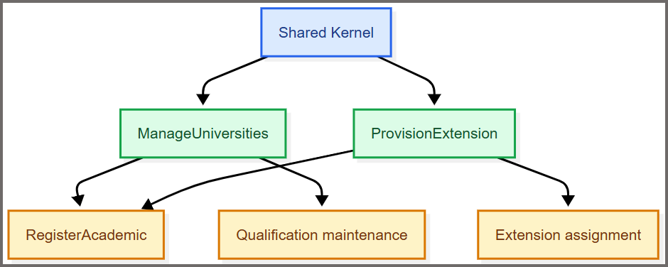

This is the eleventh post in the AIAGSD series. [Part 9](https://blog.pdata.com/AIAGSD9/) and [Part 10](https://blog.pdata.com/AIAGSD10/) of this series established the reference-data foundations that Zeus Academia depends on. This post closes that sequence by showing how the remaining `ManageUniversities` and `ProvisionExtension` slices were delegated to specialized subagents and executed in parallel.

The [ManageUniversities implementation prompt](https://github.com/JohnMichaelMiller/zeus.academia.3b/blob/5d42d3d50b14dcf0103b0b47462f905aedacab22/.github/prompts/academia-implementation/ep-1-3-manage-universities-implementation.prompt.md) and [ProvisionExtension implementation prompt](https://github.com/JohnMichaelMiller/zeus.academia.3b/blob/5d42d3d50b14dcf0103b0b47462f905aedacab22/.github/prompts/academia-implementation/ep-1-4-provision-extension-implementation.prompt.md) divided the remaining work into two clearly bounded vertical slices. Together, they demonstrate how specialized AI subagents could implement separate parts of the repository without assigning the entire feature to one general-purpose agent.

<!--more-->


## Why These Two Slices Mattered

Both prompts followed the Shared Kernel and prepared inputs for `RegisterAcademic`, but neither owned the later assignment, qualification, release, or reporting workflows. Their independence made them good candidates for parallel delivery, while their invariants made careless parallel edits risky.

|Prompt|Owned|Did not own|Key invariant|
|---|---|---|---|
|`ManageUniversities`|Add/list university catalog|Qualification assignment and reporting|Canonical, unique university codes|
|`ProvisionExtension`|Provision/deprovision extension pool|Assignment, reassignment, release, and reporting|Unique numeric extensions; assigned extensions cannot be removed|

## What Each Prompt Required

The prompts were deliberately narrow. Each one described the implementation surface, the evidence required, and the boundary to preserve.

### ManageUniversities

The prompt required an `AddUniversity` command and a `ListUniversities` query with validation, handlers, responses, endpoints, mappings, and tests in the feature/use-case structure. Code trimming, casing, uniqueness, and error messages had to derive from one canonical definition. Invalid input had to identify the `Code` property, duplicates had to fail without partial persistence, and listing had to remain stable. The scope described add/list behavior rather than full CRUD.

### ProvisionExtension

The prompt required provision and deprovision commands. Provisioning accepted only valid numeric values and rejected duplicates. Deprovisioning removed a free extension but protected an assigned one. Tests covered the valid paths and both guard conditions. Assignment, reassignment, release, and reporting remained separate slices for later implementation.



The scheduling rule was simple: confirm the Shared Kernel and the ownership boundaries, then run the two tracks concurrently. Each subagent inspected the existing models, persistence roots, fixtures, and neighboring conventions before changing code.

## How Both Prompts Were Submitted in Parallel

The two slices shared the Shared Kernel but did not depend on each other's data. That made them good candidates for parallel execution, provided the slice coordinator confirmed the prerequisites first and each implementation agent worked in an isolated branch, worktree, or clearly separated change set. Parallel submission reduced waiting time without creating two agents that edited the same files or made incompatible shared-model decisions.

### The prerequisite check was submitted once

Before either prompt was launched, I submitted a short coordination request. Its response became the shared context for both parallel tracks:

```text
Prepare parallel execution for these prompts:
- .github/prompts/academia-implementation/ep-1-3-manage-universities-implementation.prompt.md
- .github/prompts/academia-implementation/ep-1-4-provision-extension-implementation.prompt.md

Act as slice-coordinator. Confirm that Shared Kernel is available, identify each slice's feature and persistence targets, and verify that the university catalog and extension pool do not already have conflicting models. Return one artifact map per prompt, the route and schema decisions, known blockers, and the files each track may change.

Do not implement either slice yet. The two tracks must remain independently reviewable and must not edit the same file without an explicit coordination decision.
```

What this prompt produced:

- A feature map for each slice, including routes, migration ownership, and persistence targets
- Shared-Kernel validation for conflicting university or extension models
- A clear rule that each track would remain independently reviewable and would not edit the same file without escalation

Why this mattered: it prevented the two agents from introducing conflicting schema or model assumptions before the implementation itself began.

If this check found a conflict in the Shared Kernel, persistence root, or existing fixtures, we resolved it before parallel implementation started. If one track was blocked, we paused only that track, recorded the blocker and affected files, and allowed the independent track to continue only when it did not depend on the unresolved decision.

## Issues Discovered

The prerequisite check showed that the project had several architectural issues. Earlier reference-data slices had been self-contained, so the cross-slice coordination problem had not been visible yet. The extension slice exposed those hidden dependencies and coordination needs.

- Application host ownership was unclear. There was no single, explicit owner for endpoint registration, dependency injection, SQL Server configuration, or migration execution.
- Persistence boundaries were not explicit. `ProvisionExtension` was being directed toward the Shared Kernel DbContext even though the project used feature-local persistence boundaries.
- University identity was ambiguous. `University.Name` was being confused with the canonical university catalog code, which was represented as `University_code` in the domain model.
- The distinction between shared domain rules and feature-owned persistence was not clearly defined.

## Changes Made

To resolve those issues, I added an application-host and persistence-composition prompt and clarified that hosting, endpoint registration, dependency injection, authentication, and migration execution belonged outside the Shared Kernel. The updated guidance defined feature-local DbContexts with one migration owner per table, assigning `ProvisionExtensionDbContext` sole ownership of the `Extensions` migration while keeping the `Extension` entity and its reusable mapping semantics in the Shared Kernel. It also clarified that `ManageUniversities` uses a feature-local catalog keyed by `Code` rather than treating `University.Name` as the catalog identifier.

The decision was whether to restart the implementation from scratch with the clarified architecture or continue with the existing tracks while carefully managing the identified conflicts and ownership boundaries. I chose to continue with the existing work and create a [refactoring plan](https://github.com/JohnMichaelMiller/zeus.academia.3b/blob/f07376eb56049bd077d471296f5a7e1e79b5ec0b/.github/prompts/academia-implementation/application-host-and-persistence-composition-implementation.prompt.md) to address the gaps before proceeding with the `ManageUniversities` and `ProvisionExtension` slices.

## Executing the Refactoring Plan

The refactoring plan consisted of the following steps:

1. Establish the application host and persistence composition boundary so endpoint registration, dependency injection, authentication, and migration execution were owned in the correct layer.
2. Isolate reference-data persistence by creating feature-local DbContexts for `ManageUniversities` and `ProvisionExtension`, ensuring each slice had its own migration ownership and that the `Extensions` table was managed only by `ProvisionExtensionDbContext`.
3. Assign migration ownership explicitly so each feature-local DbContext owned its own schema while Shared Kernel rules stayed in the Shared Kernel.
4. Reconcile Shared Kernel persistence by separating shared domain rules from feature-owned persistence responsibilities.
5. Reconcile university identity by clarifying that `University.Name` was not the canonical university catalog code and that the domain model's canonical code should be used instead.
6. Update downstream consumers so any components or services relying on the university catalog used the canonical identifier rather than the display name.

This plan addressed the architectural issues systematically, reduced the risk of double ownership, and maintained clear boundaries across the different slices. You can find the implementation in commit `9fe5dc30d927d3bc7b3568dee01044f4d1b4213a`.

### The two implementation tracks were launched

I launched the tracks in two separate VS Code agent chats:

1. I opened an isolated worktree for each track so the agents could work independently. In VS Code, I opened the **Source Control** view, selected the **...** menu, and chose **Worktrees** > **Create Worktree**. I created one worktree from a dedicated branch for `ManageUniversities` and another from a dedicated branch for `ProvisionExtension`. VS Code opened each worktree in its own window, which made the file boundaries and branch being modified visible before I started either agent. I verified the active branch in the status bar and confirmed that both worktrees were based on the same up-to-date commit.
2. I attached the appropriate implementation prompt to each chat. In each VS Code worktree window, I opened **Chat**, started a new agent chat, and used the attachment button to add that track's implementation prompt from the repository's `.github/prompts/academia-implementation` folder. I pasted the coordinator's handoff after the prompt and stated the approved scope, worktree branch, and requirement to report changed files, decisions, tests, and unresolved risks. I then checked the chat context before selecting **Run** so the `ManageUniversities` agent received only its prompt and the `ProvisionExtension` agent received only its prompt.
3. I selected the custom agent or agents authorized by that prompt.
4. I pasted the coordinator's handoff into the initial message for each agent.
5. I instructed each agent to remain within its approved scope and to report changed files, decisions, tests, and unresolved risks.

The `ManageUniversities` prompt explicitly assigned the `data-persistence` role. The `ProvisionExtension` track used the `backend-domain` role, with persistence work coordinated by the `slice-coordinator`. If either track revealed schema-heavy work outside its approved scope, the agent had to stop and escalate before making those changes.

|Parallel track|Agent and scope|Handoff returned|
|---|---|---|
|ManageUniversities|`backend-domain` plus `data-persistence`; add/list behavior, canonical code normalization, and uniqueness|Changed files, API contract, canonical-rule decision, tests, and persistence evidence|
|ProvisionExtension|`backend-domain`; numeric provision/deprovision behavior and the assigned-extension guard|Changed files, API contract, guard decision, tests, and unresolved risks|

Each track had to change only its approved files and artifacts. If an agent needed to modify a shared file, alter another track's model, or make a decision that affected both slices, it had to stop, document the conflict and its evidence, and escalate to the coordinator. It could resume only after the coordinator approved the change and assigned ownership.

As with prior reference-data slices, Copilot code reviews identified potential issues and areas for improvement in the implementation, and, as with the prior slices, that feedback was used to improve both the implementation and the prompts for future slice iterations.

### The tracks were synchronized before final verification

When both agents reported completion, the changes existed only in their own worktrees and branches. Before verification could run against a single view of the work, I merged both branches into a shared integration branch. I reviewed each branch's diff individually, merged `ManageUniversities` first, then merged `ProvisionExtension` on top, and resolved any trivial conflicts in shared files such as project references or DI registration. I ran a full build and the existing test suite on the integration branch to confirm both merges compiled together before submitting anything to a verifier. Only after that merged branch was in a known-good state did I collect the changed-file lists, contracts, migrations or mapping evidence, test output, and unresolved risks from both tracks. I did not ask a verifier to inspect two vague “done” messages. I submitted one combined verification request after both tracks were available:

```text
Verify these two completed tracks against their source prompts:
- .github/prompts/academia-implementation/ep-1-3-manage-universities-implementation.prompt.md
- .github/prompts/academia-implementation/ep-1-4-provision-extension-implementation.prompt.md

ManageUniversities handoff:
[paste changed files, API contract, persistence evidence, and test output]

ProvisionExtension handoff:
[paste changed files, API contract, persistence evidence, and test output]

Act as testing-verification. Run focused checks for university add, duplicate rejection, stable listing, numeric extension validation, duplicate provision, free-extension deprovision, and assigned-extension protection. Check that the two tracks do not introduce conflicting shared models, that persistence evidence matches the target provider, and that integration-test cleanup is best effort in finally blocks. Return separate evidence and blockers for each slice, plus any cross-slice issue that must be resolved before RegisterAcademic.
```

This verification prompt also identified gaps in the implementation that needed to be addressed before final integration could be considered reliable. As with the code-review feedback, that input was used to refine both the implementation and the prompts for future slices. This emphasized the importance of a verification step to ensure that implementations meet their requirements and do not introduce conflicts.

## How Subagents Executed the Prompts

Specialized agents kept each track focused. The coordinator resolved scope and dependencies, the implementation agents changed only approved artifacts, persistence support protected the durable rules, and verification agents returned evidence. The prompts provided the handoff contract; humans still resolved boundary decisions and reviewed the final result.

## What Good Escalation Looked Like

The prompts included escalation triggers because specialized agents had to stop when a decision changed the slice boundary. Examples included competing university catalogs, unclear extension identity semantics, and an inability to determine whether an extension was assigned.

Escalation had to produce a specific question and the evidence behind it: which files conflicted, which rule was ambiguous, and which implementation choices were affected. A coordinator or human could then decide without reviewing an entire speculative implementation. This was where subagents improved engineering throughput: they reduced mechanical work while preserving a deliberate decision point for the choices that needed judgment.

## Final Parallel-Execution Checklist

Before completion, AI confirmed:

- [ ] Shared Kernel dependency had been confirmed
- [ ] Track ownership and file boundaries had been agreed
- [ ] No overlapping edits had remained between tracks
- [ ] Both implementation handoffs had been received
- [ ] Slice-specific tests had passed
- [ ] Cross-slice model conflicts had been checked
- [ ] Human showcase had been completed
- [ ] README and provenance links had been updated

## What's Next?

This post concludes the reference-data implementations. Now that `ManageUniversities` and `ProvisionExtension` have been verified, `RegisterAcademic` can consume canonical university codes and a protected extension pool, while later slices own assignment, reassignment, release, and qualification behavior.

The larger lesson was that subagents work best when prompts describe collaboration rather than output alone. These two prompts made that operating model concrete: bounded slices were delegated, independent work was run in parallel, and evidence was required before the next phase could proceed.

## Feedback Loop

Feedback is welcome at [AIPractitioner@pdata.com](mailto:AIPractitioner@pdata.com).

## Disclaimer

AI contributed to this post, but humans reviewed and refined it.

Authoring prompts used for this post:

- "write a blog post explaining the #file:ep-1-3-manage-universities-implementation.prompt.md prompt and the #file:ep-1-4-provision-extension-implementation.prompt.md prompt. include an explanation for using subagents to execute both prompts"
- "add to the blog post the instructions for submitting the prompts so that the execute in parallel"
- "The prompts that blog instructions are referring to are the prompts used to create and modify the blog posts, not the implementation prompts that are the subject of the blog post. Update the blog post instructions to make this clear."
- "Keep How to Submit Both Prompts in Parallel as the primary operational section. Reduce How Subagents Execute the Prompts to one short paragraph explaining the role of specialized agents."
