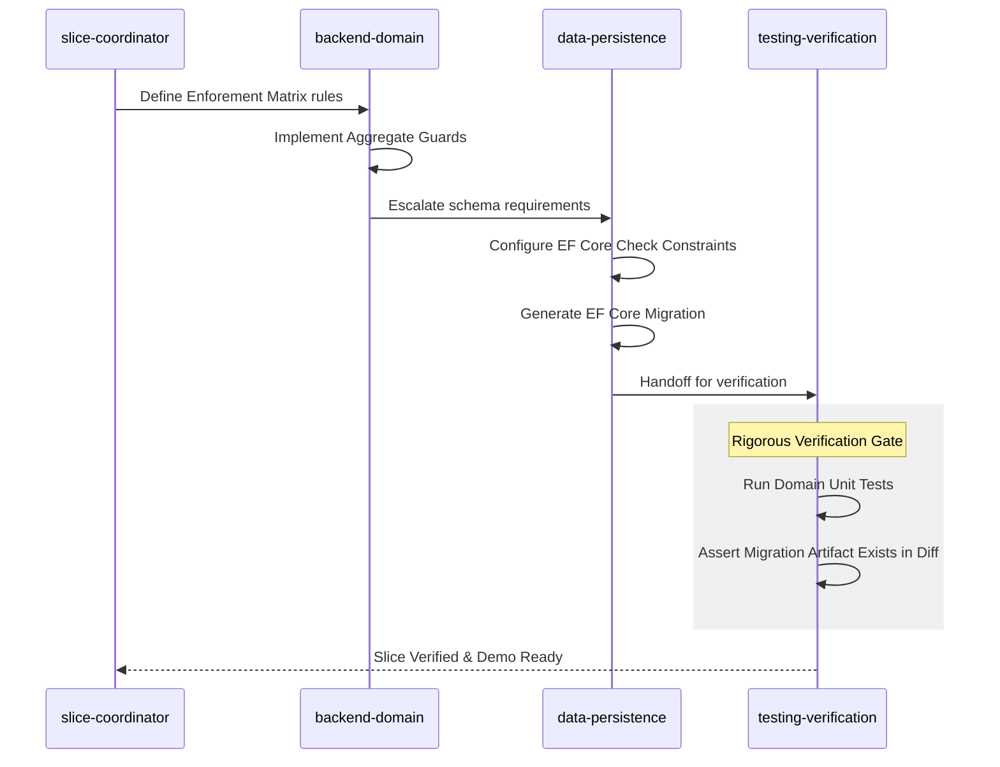

I'll draft a blog post that explains these uncommitted changes, focusing on the shift toward rigorous database constraints, migration-centric verification, and improved agent handoffs.

***

# Beyond Unit Tests: Enforcing Durable Database Invariants with AI Assistants

We’ve all been there: the unit tests pass, the domain aggregate guards its state perfectly, and the AI assistant confidently marks the implementation slice as "Verified." But what happens when an administrative script, a bulk import, or a concurrent operation bypasses the domain layer?

If your core business rules aren't backed by durable database schema constraints, your data integrity is hanging by a very thin thread.

In our latest updates to the **Zeus Academia** repository, we've fundamentally changed how our AI agents handle data persistence, migrations, and cross-agent communication. We are moving away from optimistic, code-level verification and mandating hard evidence of schema-level enforcement.

Here is why we made these changes, how they work, and what it means for your implementation workflow.

## Why Before How: The Illusion of `EnsureCreated()`

Previously, our AI testing agents (`testing-verification` and `slice-verifier`) were too trusting. If an implementation slice required an Exclusive-OR (XOR) rule—such as an Academic being either Tenured *or* Contracted, but never both—the AI would write an xUnit test, verify the aggregate threw an exception on invalid state, and mark the slice complete.

When testing persistence, the AI would often rely on EF Core's `EnsureCreated()` to spin up an in-memory database, run a mapping test, and declare victory.

**The problem?** `EnsureCreated()` doesn't generate migrations. It doesn't prove that a `CHECK` constraint can be safely applied to an aging production schema. It provided the *illusion* of database integrity without the actual artifacts required for deployment.

We needed a systematic way to force our AI agents to produce, verify, and commit actual migration artifacts.

## Concept and Implementation Details

### 1. The Migration Artifact Mandate

We’ve updated our agent personas—specifically `data-persistence`, `testing-verification`, and `slice-verifier`—with strict escalation triggers and evidence standards.

These agents are now explicitly instructed:
* **No `EnsureCreated()` Shortcuts:** Marking a schema-changing slice as complete based solely on unit tests or mapping tests is now prohibited.
* **Committed Artifacts Required:** If a slice introduces uniqueness rules, `CHECK` constraints, or index modifications, the verification process *must* locate a committed migration artifact in the diff.
* **Durable Invariants:** Business rules that must survive direct writes or concurrent paths are now explicitly required to have database `.HasCheckConstraint()` mappings in EF Core.

### 2. The Enforcement Matrix

To prevent ambiguity during implementation, we updated our `implementation-prompt.instructions.md`. Implementation prompts must now define an **Enforcement Matrix** for non-trivial business rules.

Instead of an agent guessing where a rule belongs, the prompt explicitly delegates the layer of enforcement. For example:

| Rule | Canonical layer | Persistence backing required | Verification evidence |
| :--- | :--- | :--- | :--- |
| Employment XOR | Aggregate + database | Yes, CHECK constraint | Unit test + schema or migration proof |

This ensures that the `backend-domain` agent writes the C# aggregate logic, while the `data-persistence` agent knows it must generate the corresponding EF Core configuration and database migration.

### 3. Smarter Agent Handoffs

Alongside the persistence changes, we significantly upgraded our custom agent schemas. Previously, agent `handoffs` were defined as simple lists. We've transitioned these to structured objects.

**Old approach:**
```yaml
handoffs:
  - backend-domain
  - slice-coordinator
```

**New approach:**
```yaml
handoffs:
  - label: "Backend Domain"
    agent: "backend-domain"
    prompt: "Implement and clarify backend rules, contracts, and domain behavior"
  - label: "Slice Coordinator"
    agent: "slice-coordinator"
    prompt: "Coordinate scope, dependencies, and blockers"
```
This gives each agent explicit context on *why* it should hand a task over to a peer, reducing hallucinated delegations and sharpening the focus of multi-agent workflows.

## Practical Example: The Slice Verification Flow

With these changes, the vertical slice delivery flow for Zeus Academia now looks like this:



If the `data-persistence` agent "forgets" to create the migration, the `testing-verification` agent will block the completion of the slice, citing the new hard boundaries in its instructions.

## Summary and Next Steps

By updating our .github workflow files, prompts, and agent personas, we are baking architectural rigor directly into the AI's operating model.

For developers, this means:
1. **Less babysitting:** The AI will automatically push for database-level constraints on critical rules.
2. **True demo-readiness:** Verification now guarantees that migration artifacts are genuinely ready for deployment, not just faked in-memory.
3. **Clearer prompts:** You will see the Enforcement Matrix appearing in new `ep-*.prompt.md` files, giving you an immediate view of exactly how and where an invariant is protected.

Our AI agents just leveled up their approach to data integrity. Review the updated `ai-assisted-output` and `git-workflow` instructions, and let's get building!
